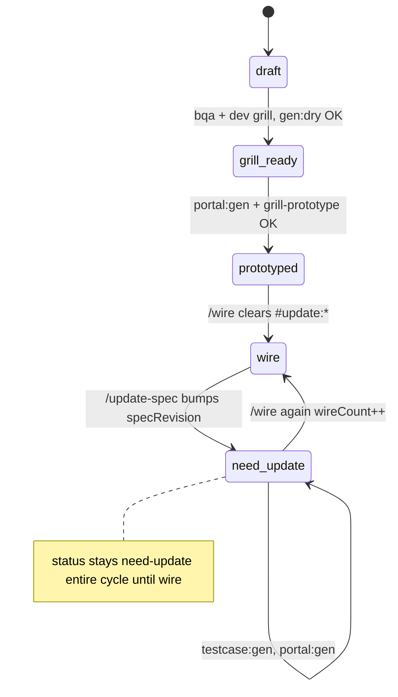

# Feature lifecycle status (no backward transitions)

Forward-only status on each `*.spec.yaml`. Integer `specRevision` + `#update:*` tags track delta; status tracks **phase gate** for the team.

`portal:gen` / `testcase:gen` below are lifecycle events reported from FE/tests
lanes. Bundlekit never executes them in the docs hub.

## featureStatus values

| Status | Meaning |
|--------|---------|
| `draft` | design v1 — spec/testcase in progress |
| `grill-ready` | portal-gen:dry passed, ready for prototype |
| `prototyped` | prototype + mock API done (portal:gen) |
| `wire` | Real API integrated; `#update:*` cleared; `lastSynced.wire = specRevision` |
| `need-update` | Spec changed **after** was `wire` (or beyond) — must run full sync cycle again |

**No backward:** never set `wire` → `prototyped` or `grill-ready` → `draft`. Only forward or `wire` → `need-update`.

## Fields

```yaml
specRevision: 6
wireCount: 2              # +1 each time /wire completes successfully

featureStatus: need-update

lastSynced:
  testcase: 5
  prototype: 5
  wire: 5                   # last wire was at revision 5

tags:
  - "#update:modify-block:table-name"
```

## Transitions



### Rules

1. **Normal forward (first time):**  
   `draft` → `grill-ready` → `prototyped` → `wire` (wireCount: 1)

2. **Update after wire:**  
   When `featureStatus == wire` and `/update-spec` bumps `specRevision`:  
   - Set `featureStatus: need-update`  
   - Add `#update:*` tags  
   - **Do not** change `wireCount` yet  
   - `lastSynced.wire` stays at old revision until wire completes again

3. **During need-update cycle:**  
   - `featureStatus` **stays `need-update`** through testcase:gen, update-testcase, portal:gen, grill-prototype  
   - Scripts bump `lastSynced.testcase` / `lastSynced.prototype` only  
   - **`#update:*` tags stay** until wire (same as spec-update-tags.md)

4. **Wire completes (2nd, 3rd, … time):**  
   - Remove all `#update:*`  
   - `lastSynced.wire = specRevision`  
   - `wireCount += 1`  
   - `featureStatus: wire`

5. **Update before first wire:**  
   If `featureStatus` is `draft` | `grill-ready` | `prototyped` — stay in that band or move forward only; **no** `need-update` until first `wire` achieved.

## Who sets status

| Action | featureStatus |
|--------|---------------|
| `/spec`, `/legacy-spec` create | `draft` |
| dev-grill + dry pass | `grill-ready` |
| `/prototype` + grill-prototype OK | `prototyped` |
| `/wire` success | `wire`, wireCount++ |
| `/update-spec` when was `wire` | `need-update` |
| testcase:gen / portal:gen | unchanged (still `need-update` if applicable) |

## Stale indicators

| Condition | Meaning |
|-----------|---------|
| `featureStatus: need-update` | Full cycle pending through wire |
| `#update:*` open | Delta not wired |
| `specRevision > lastSynced.wire` | Wire behind spec |

## Related

- `spec-update-tags.md` — `#update:*` removed only at `/wire`
- `grill-tech-debt.md` — `#tech-debt:` separate from lifecycle status
