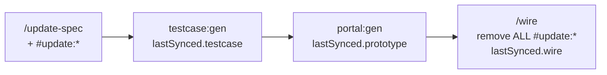

# Spec update tags (#update:*) + specRevision

Internal integer revision — not displayed in docs UI.

## Fields on spec YAML

```yaml
specRevision: 1

lastSynced:
  testcase: 0
  prototype: 0
  wire: 0

changelog:
  - revision: 1
    at: 2026-06-27
    by: update-spec
    summary: Short description
    changes:
      - op: add | remove | modify
        path: ui.blocks.search.fields
        id: activate_status
    tags:
      - "#update:add-block:search-activate_status"

tags:
  - "#update:add-block:search-activate_status"
```

- **specRevision** — int; `+= 1` on each meaningful `/update-spec`.
- **lastSynced** — revision applied per phase (progress markers only).
- **API sync back to FE** — bump `specRevision`, `syncFrom:` in changelog, **no** `#update:*`.

## Tag format `#update:`

| Tag | Typical phases that consume |
|-----|----------------------------|
| `#update:add-block:{id}` | testcase → prototype |
| `#update:remove-block:{id}` | testcase → prototype |
| `#update:modify-block:{id}` | testcase → prototype |
| `#update:acceptance:{req-id}` | testcase |
| `#update:codegen:{layer}` | prototype → **wire** (API/service) |

## Lifecycle — tags removed only at wire



| Phase | Does | Removes `#update:*`? |
|-------|------|----------------------|
| `/update-spec` | Patch spec, bump revision, add tags | No |
| `pnpm testcase:gen` | Regen affected testcase suites | **No** — tags stay (API may still change) |
| `/update-testcase` | AI review testcase | No |
| `pnpm portal:gen` | Regen affected code layers (mock API) | **No** — tags stay until real API |
| `/grill-prototype` | Audit UI | No |
| **`/wire`** | Mock → real API, align contract | **Yes — gỡ toàn bộ `#update:*`** |
| | Set `lastSynced.wire = specRevision` | |

**Why:** Update có thể liên quan API; prototype chỉ mock boundary — chưa chốt endpoint/403/permission thật. Tag giữ đến **wire** để phase API/ghép nhắc còn việc.

## Gen step 0 (testcase / portal)

```
if specRevision <= lastSynced.{phase} and no #update:* → skip (unless --force)
parse #update:* → minimal regen for this phase only
bump lastSynced.{phase} = specRevision
do NOT remove #update:* tags
```

## Wire step 0

```
List all #update:* in tags
Verify: testcase + prototype + real API aligned with spec
Remove every #update:* from tags
lastSynced.wire = specRevision
Optional: changelog entry by: wire, summary: cleared update tags
```

## Stale check (member / CI)

Open `#update:*` with `lastSynced.wire < specRevision` → chưa wire xong sau update.

## vs #tech-debt

| | tech-debt | update |
|--|-----------|--------|
| Meaning | Unanswered question | Confirmed delta |
| Remove when | Resolved in deferTo grill | **After /wire** |

See `grill-tech-debt.md`.
