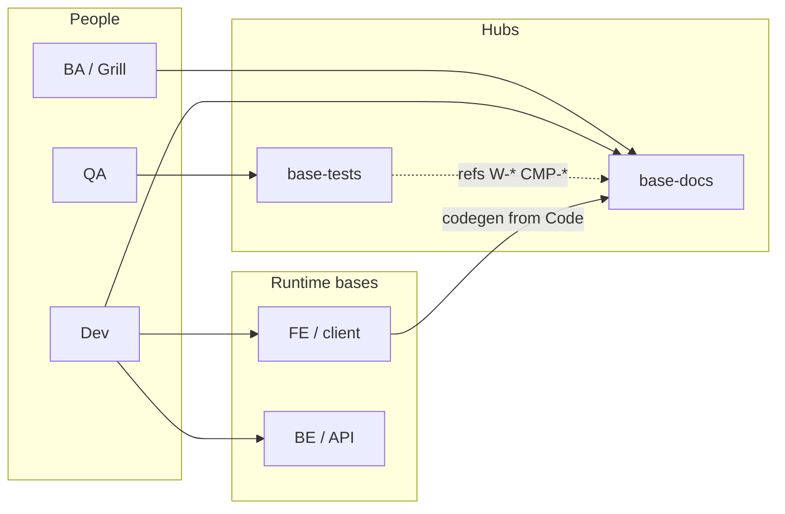
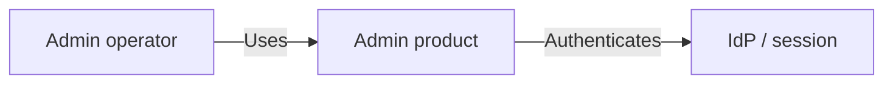

# 03 — Context

status: active

arc42 context + C4 **landscape / system context**. MD + Mermaid only. **No API schemas / UI DSL.**

IDs: `LND-*`, `CTX-*` (D3: landscape lives here, not under building-blocks).

## LND-base

Platform base cluster: FE bases, BE bases, docs hub, tests hub, MCP tooling.

## CTX-admin

Admin product boundary: authenticated operators manage tenant/platform data via Admin Web; Admin API is the system of record behind the FE.

Out of scope at this tier: endpoint lists (see `CTR-*-api` + `code/API-*`).

## See also

- [05 Building blocks](/architecture/05-building-blocks/)
- Redirect stubs: [`/architecture/landscape/`](/architecture/landscape/) · [`/architecture/context/`](/architecture/context/)
