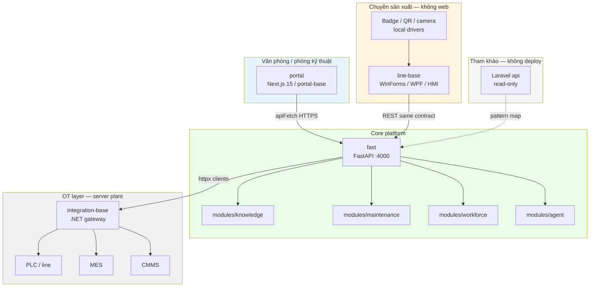
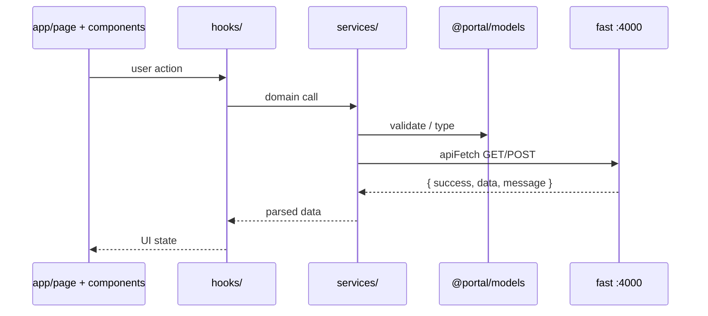
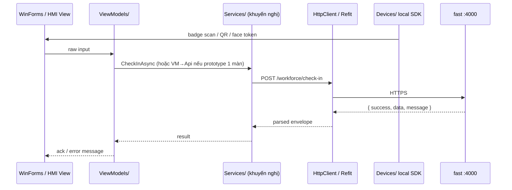
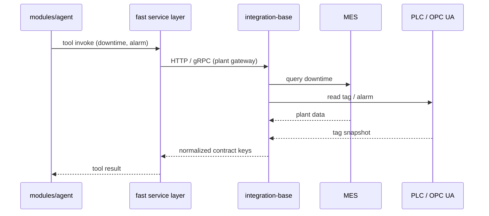
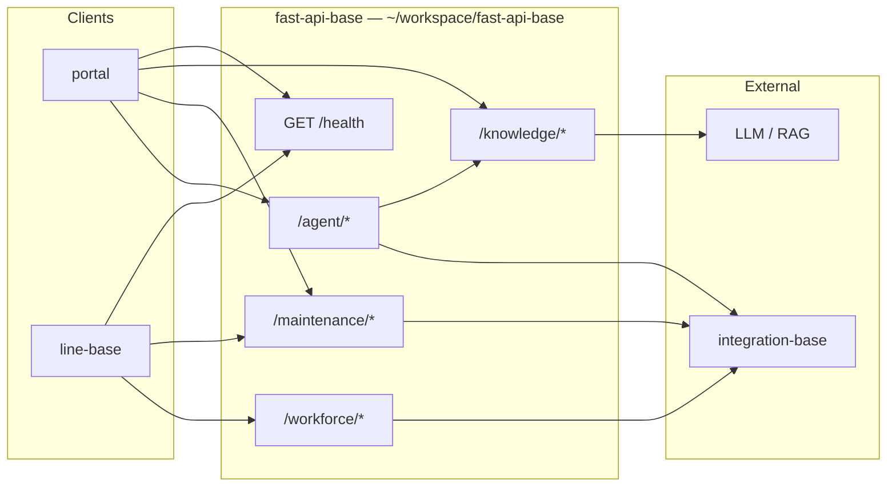
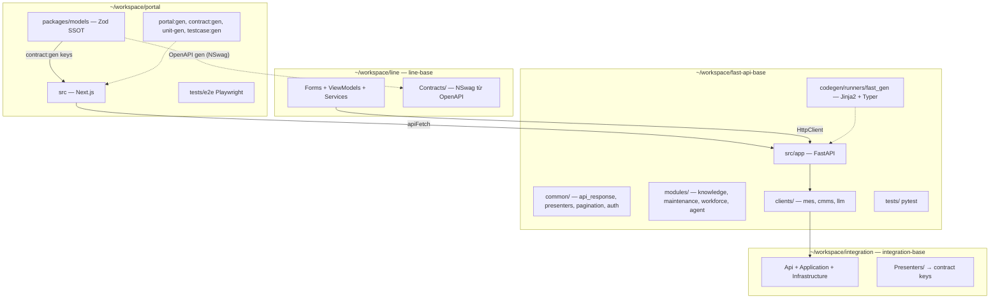
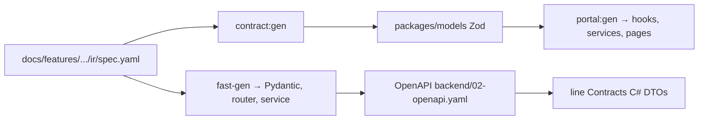
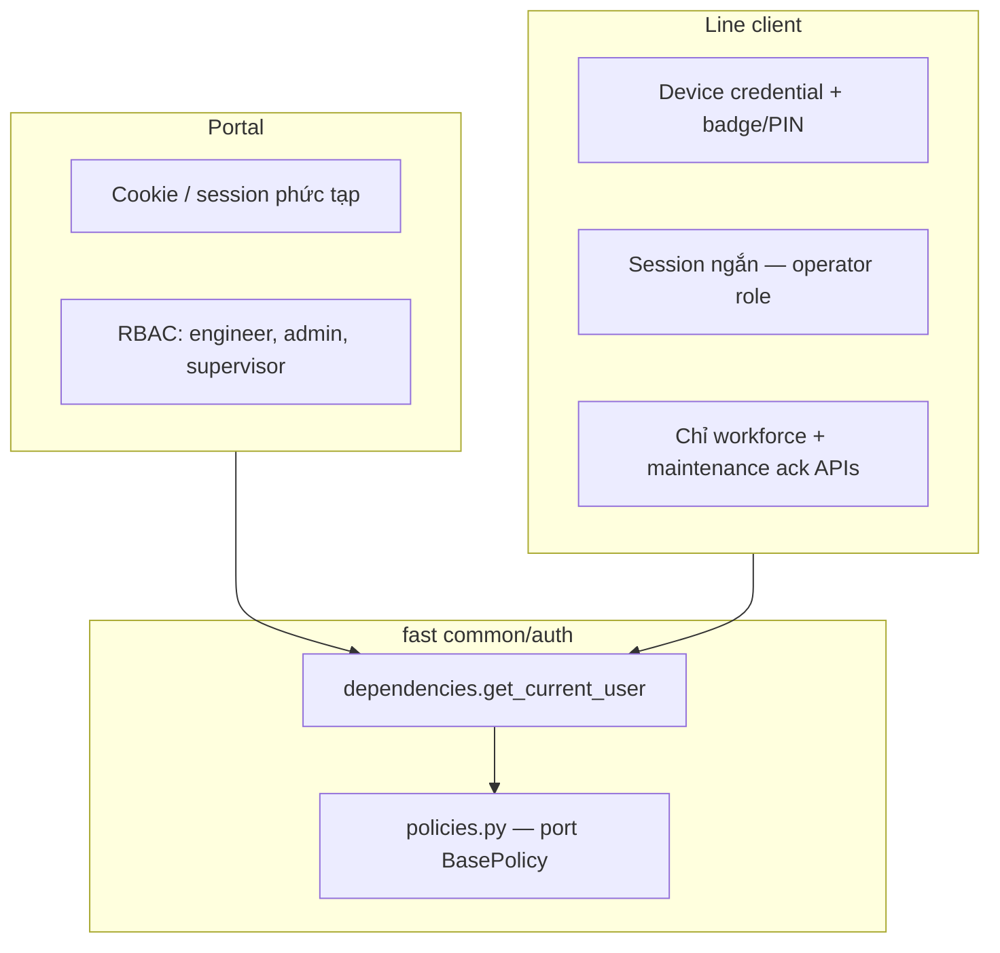
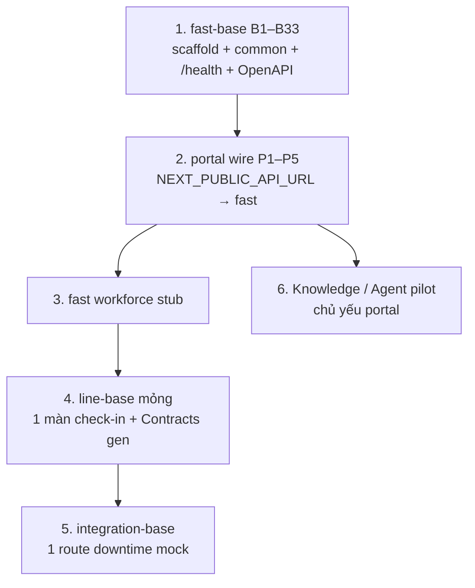
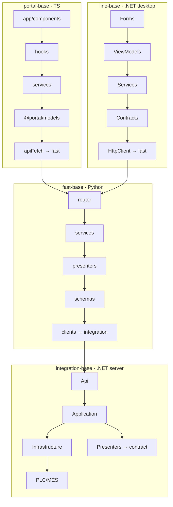

# Factory AI Stack — kiến trúc cụm sản phẩm

> Tổng hợp kiến trúc Factory AI Platform: portal (Next.js), fast (FastAPI), line-base (.NET desktop), integration-base (.NET gateway).  
> TODO: [`fast-api-base-todo.txt`](../../fast-api-base-todo.txt) · [`dotnet-bases-todo.txt`](../../dotnet-bases-todo.txt) (repo root).

**Cập nhật:** 2026-07-09 (bổ sung line-base + integration-base)

---

## 1. Tóm tắt — bốn base tách repo

| Base | Repo | Tech | Đối xứng | Vai trò |
|------|------|------|----------|---------|
| **portal-base** | `~/workspace/portal` | Next.js 15 | Nuxt cũ | Web engineer/admin — Knowledge, Maintenance, Agent |
| **fast-base** | `~/workspace/fast-api-base` | FastAPI | Nest / Laravel api | **API duy nhất** cho portal + line + agent tools |
| **line-base** | `~/workspace/line` | .NET 8 WinForms/WPF | portal-base (client mỏng) | Công nhân chuyền — check-in, nhận ca, QR, ack (không web) |
| **integration-base** | `~/workspace/integration` | .NET 8 ASP.NET | fast-base (adapter server) | PLC/MES/CMMS — **fast gọi xuống**, không UI công nhân |

**Tham khảo / deprecate (không runtime Factory AI):**

| Thành phần | Ghi chú |
|------------|---------|
| **Laravel `~/workspace/api`** | Read-only — docs, api-gen workflow, trait → Python map |
| **Nest `apps/api`** | Deprecate — thay bằng fast |

**Không cần:** repo/microservice deploy riêng chỉ để “call API”; mobile QC để phase sau (vẫn gọi fast).

**Nguyên tắc contract:** Cùng field keys trên FE Zod, fast Pydantic, line Contracts (OpenAPI gen) — [`portal-contract-naming`](../../.cursor/rules/portal-contract-naming.mdc). Envelope: `{ success, data, message }`.

---

## 2. Ba kênh người dùng

| Kênh | Ai dùng | Vào web portal? |
|------|---------|-----------------|
| **Portal** | Engineer, supervisor, QA, admin | Có |
| **Line client** | Công nhân, technician tại máy | **Không** |
| **Mobile** (tùy chọn) | QC walk-around | Thường không full portal |

Logic nghiệp vụ nằm trên **fast** — mỗi kênh chỉ là presentation layer mỏng.

---

## 3. Sơ đồ tổng thể (runtime)



---

## 4. Sơ đồ luồng API (request path)

### 4.1 Portal → fast



**Ràng buộc portal-base:** `page/component` không gọi `apiFetch` trực tiếp; không import ngược từ `models/`.

### 4.2 Line client → fast



**Ràng buộc line-base:** Form/View không gọi PLC/MES; OT qua **integration-base**. Driver thẻ/QR chỉ ở `Devices/`.

### 4.3 fast → plant systems (integration)



---

## 5. Sơ đồ module API (fast)



### Endpoint gợi ý (contract pilot → production)

| Module | Method | Path | Client chính | Mô tả |
|--------|--------|------|--------------|-------|
| health | GET | `/health` | all | Envelope smoke |
| knowledge | POST | `/knowledge/query` | portal, HMI subset | RAG + citation |
| maintenance | GET | `/machines/{id}` | portal, line | QR máy → context |
| maintenance | POST | `/maintenance/step/ack` | line HMI | Xác nhận bước SOP |
| maintenance | POST | `/alarms/{id}/ack` | line HMI | Ack alarm tại máy |
| workforce | POST | `/workforce/check-in` | line | Badge + station |
| workforce | POST | `/workforce/shift/handover` | line | Giao ca |
| workforce | GET | `/workforce/shift/current` | line | Ca hiện tại tại station |
| agent | POST | `/agent/chat` | portal | Tools: knowledge, MES, CMMS |

Payload HMI: ít field, response text ngắn — không full Agent UI trên panel 7".

---

## 6. Sơ đồ repo / ownership



| Repo | Skill | Codegen owner |
|------|-------|---------------|
| portal | `/portal-base` | `portal:gen`, `portal:unit-gen`, `testcase:gen`, `contract:gen` |
| fast | `/fast-base` | `fast_gen`, `fast-unit-gen`, OpenAPI export |
| line | `/line-base` | NSwag/Kiota từ fast OpenAPI; `line-gen` (sau) |
| integration | `/integration-base` | `integration-gen` (sau) — route + adapter stub |

---

## 7. Sơ đồ contract SSOT



**Không rename layer:** `{ content, auth: { id, name } }` — không `content_blog`, `auth_id`.

---

## 8. Auth theo kênh



| Vấn đề | Cách làm |
|--------|----------|
| Offline line (phase sau) | Queue SQLite trên WinForms → sync fast |
| HMI yếu | API payload nhỏ; knowledge trả text ngắn |
| Một nguồn OT | PLC/MES chỉ qua integration-base — không WinForms + fast cùng đọc PLC |

---

## 9. Map chức năng line → module

| Chức năng tại chuyền | UI | fast module |
|----------------------|-----|-------------|
| Check-in / nhận ca | WinForms kiosk | `workforce` |
| Nhận diện badge/face/QR | Camera SDK local → POST verify | `workforce` |
| Scan QR máy | Tablet WinForms | `maintenance` |
| Ack bước SOP / alarm | HMI 7" | `maintenance` |
| Hỏi nhanh SOP | HMI đơn giản | `knowledge` (subset) |
| Báo cáo / Agent đầy đủ | — | `agent` (portal only) |

---

## 10. Laravel common → Python fast (tham khảo)

| Laravel / Nest (cũ) | Python fast (`src/app/common/`) |
|---------------------|----------------------------------|
| BaseController + ApiResponse | `common/http/api_response.py` |
| BaseResource | `common/presenters/base.py` |
| EntrySearchTrait | `services/mixins/search_mixin.py` |
| BasePolicy | `common/auth/policies.py` |
| FormRequest | `modules/*/schemas/request.py` (Pydantic) |
| Pagination helper | `common/pagination.py` |

Pattern: router mỏng → service layer → presenter `to_contract()` — không CommandBus ceremony.

---

## 11. Thứ tự build



Chi tiết checklist fast: [`fast-api-base-todo.txt`](../../fast-api-base-todo.txt).

---

## 12. line-base — .NET desktop (`~/workspace/line`)

**Vai trò:** UI tại chuyền, driver local (thẻ, QR, camera), **chỉ gọi lên fast**. **Không gộp** repo với integration-base — vai trò và layer khác hẳn.

### Stack

| Layer | Chọn gì | Ghi chú |
|-------|---------|---------|
| UI | WinForms (kiosk ổn định) hoặc WPF | HMI vendor → thin shell dùng chung ViewModel |
| MVVM | CommunityToolkit.Mvvm hoặc ReactiveUI | Tách state khỏi View — đối xứng `hooks/` |
| HTTP | `IHttpClientFactory` + Refit hoặc NSwag client | Gen từ OpenAPI fast |
| Contract | `Contracts/` (DTO gen) | Cùng keys Zod/Pydantic |
| Local | SQLite (phase 2) | Offline queue sync fast |
| Config | `appsettings.json` + device profile | `StationId`, `FastApiUrl`, `DeviceCredential` |
| Test | xUnit ViewModel | UI test / WinAppDriver — tùy chọn |

### Cấu trúc thư mục

```text
line/
  src/
    Line.App/              # WinForms/WPF entry, kiosk profiles
      Forms/               # View — binding, event, AutomationId
      ViewModels/          # state, command — đối xứng hooks/
      Services/            # gọi API, parse envelope — đối xứng services/
      Devices/             # IBadgeReader, IQrScanner — SDK vendor
    Line.Contracts/        # DTO gen OpenAPI (optional tách project)
    Line.Common.Http/      # ApiEnvelope<T>, parse — optional trong repo
  tests/
    Line.App.Tests/        # xUnit ViewModel + Service
  docs/operational/
    LINE-CLIENT-STRUCTURE.md
  .cursor/skills/line-base/
```

### line-invariants (đối xứng portal-invariants)

| Tầng | Không làm |
|------|-----------|
| Form/View | `HttpClient` trực tiếp |
| ViewModel | OPC UA / MES / SQL plant |
| Services/ | UI control, WinForms state |
| Contracts/ | import Services/ViewModels |

**Luồng chuẩn:** `View → ViewModel → Services → Contracts/HttpClient → fast`

---

## 13. integration-base — .NET server (`~/workspace/integration`)

**Vai trò:** Gateway nhà máy — fast gọi xuống; chuẩn hóa PLC/MES/CMMS → contract keys. **Không UI công nhân.**

### Stack

| Layer | Chọn gì |
|-------|---------|
| Host | ASP.NET Core 8 Minimal API hoặc Controllers |
| OT | OPC UA (Opc.UaFx / OPC Foundation) |
| MES/CMMS | HTTP/SOAP/SQL adapter tùy plant |
| Auth | API key / mTLS plant DMZ |
| Test | xUnit Application + mock PLC |

### Cấu trúc thư mục

```text
integration/
  src/
    Integration.Api/           # routes mỏng — đối xứng fast router
      Endpoints/
    Integration.Application/   # use cases — đối xứng fast services/
    Integration.Domain/        # plant models nội bộ (không leak ra fast)
    Integration.Infrastructure/
      OpcUa/                   # PLC client
      Mes/                     # MES HTTP/SQL
      Cmms/
    Integration.Presenters/    # domain → contract DTO — đối xứng BaseResource
    Integration.Common/        # ApiResponse, exception middleware
  tests/
  docs/operational/
    INTEGRATION-STRUCTURE.md
  .cursor/skills/integration-base/
```

### integration-invariants

| Tầng | Không làm |
|------|-----------|
| Api/Endpoints | OPC UA call trực tiếp |
| Application | UI, WinForms |
| Infrastructure | expose contract keys lệch spec |

**Luồng chuẩn:** `fast httpx → Api → Application → Infrastructure → PLC/MES` · presenter map response.

---

## 14. So sánh bốn base — layer map



| Base | Presentation | Orchestration | Contract | Transport |
|------|--------------|---------------|----------|-----------|
| portal-base | `app/`, `components/` | `hooks/` | `@portal/models` | `apiFetch` |
| fast-base | — | `modules/*/services/` | `schemas/` (Pydantic) | `clients/` → integration |
| line-base | `Forms/` | `ViewModels/` | `Contracts/` | `Services/` → HttpClient |
| integration-base | — | `Application/` | `Presenters/` | `Infrastructure/` → plant |

---

## 15. Contract packages C# (optional)

Tách rành như `packages/models` — **không** tách repo service deploy:

| Package | Nội dung | Khi nào tách project/NuGet |
|---------|----------|----------------------------|
| `Line.Contracts` / `Factory.Contracts` | DTO gen NSwag/Kiota | ≥2 app .NET dùng cùng OpenAPI |
| `Line.Common.Http` / `Factory.Common.Http` | `ApiEnvelope<T>`, parse `{ success, data, message }` | line + tool .NET khác |

SSOT vẫn `docs/features/.../ir/spec.yaml` (portal) → `contract:gen` → `fast_gen` → OpenAPI → gen C#.

---

## 16. Service layer — khi nào tách, khi nào không

| Câu hỏi | Trả lời |
|---------|---------|
| Repo/microservice deploy riêng chỉ để call API? | **Không** — không thêm process thứ 5 |
| Portal có `services/`? | **Bắt buộc** — portal-invariants |
| line-base có `Services/`? | **Khuyến nghị mỏng**; prototype 1 màn có thể `ViewModel → Refit` trực tiếp |
| Tách `Factory.Services` NuGet? | Chỉ khi nhiều app .NET share client; thường folder trong `line/` đủ |
| integration-base? | `Application/` = service layer — không thêm lớp nữa |

Ví dụ service mỏng line-base (~20 dòng, không repo riêng):

```csharp
public sealed class WorkforceService(IFastApiClient api)
{
    public Task<ApiResult<CheckInData>> CheckInAsync(CheckInRequest req)
        => api.PostAsync("/workforce/check-in", req);
}
```

---

## 17. Codegen / test đối xứng

| Base | Codegen | Unit test | Integration / E2E |
|------|---------|-----------|-------------------|
| portal-base | `portal:gen`, `contract:gen` | vitest `portal:unit-gen` | Playwright |
| fast-base | `fast_gen` | pytest `fast-unit-gen` | curl / pytest API |
| line-base | `line-gen` (sau) — screen + VM stub | xUnit ViewModel/Service | manual kiosk |
| integration-base | `integration-gen` (sau) | xUnit Application | mock OPC |

Mỗi repo: `docs/operational/*-STRUCTURE.md`, `.cursor/skills/*-base`, `.harness/progress.md`.

`team-projects.json` (repo root): group **`factory-ai-stack`** — `portal` · `fast-api-base` · `line` · `integration` (4 repo). [REPO-SPLIT-MAP](./REPO-SPLIT-MAP.md) · [PROJECT-MAPS](./PROJECT-MAPS.md).

---

## 18. Liên kết tài liệu portal

| Chủ đề | File |
|--------|------|
| FE layers (portal-base) | [ARCHITECTURE.md](./ARCHITECTURE.md) — sẽ cập nhật BE = fast |
| Wire phase | [WIRE-PHASE-DIAGRAM.md](./WIRE-PHASE-DIAGRAM.md) — target fast:4000 |
| Contract keys | [CONTRACT-FIELD-REGISTRY.md](./CONTRACT-FIELD-REGISTRY.md) |
| E2E testId | [E2E-TESTIDS.md](./E2E-TESTIDS.md) |
| TODO triển khai fast | [fast-api-base-todo.txt](../../fast-api-base-todo.txt) |
| TODO line + integration | [dotnet-bases-todo.txt](../../dotnet-bases-todo.txt) |

---

## 19. Tóm một câu

**Bốn base tách repo:** `portal` + `fast` + `line` + `integration`. Portal-base = web; line-base = WinForms/HMI gọi fast; integration-base = fast gọi xuống PLC/MES. Không repo service deploy riêng để call API; `Services/` trong line là folder mỏng, không microservice.**
