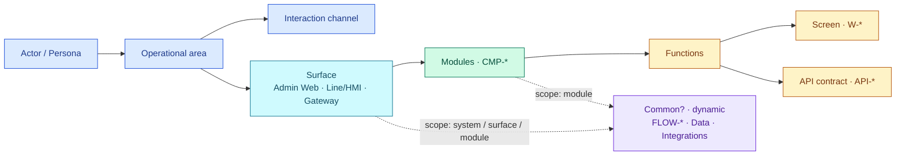
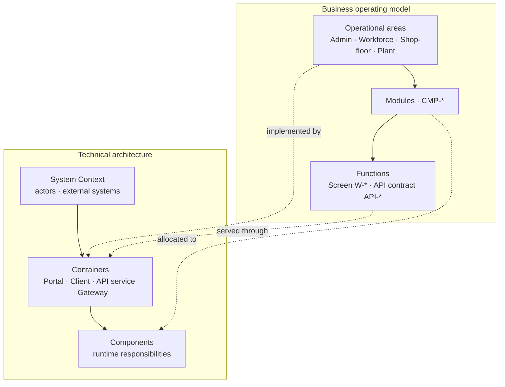

# System doc structure — canonical layer meanings, Operating Model và Architecture

Cấu trúc tài liệu biểu diễn một hệ thống theo hai góc nhìn bổ trợ:

- **Business Operating Model:** actor nào vận hành hệ thống, thuộc operational area nào và sử dụng capability nào.
- **Technical Architecture:** runtime container nào triển khai capability và chúng giao tiếp với nhau như thế nào.

`Web`, `Client` và `API` là technical channel/container, không phải business operational area.

Các layer chuẩn của docs hub là `Overview`, `Architecture`, `Surfaces`, `Components`, `Common`, `Code`.
Trong model triển khai hiện tại, các layer này map sang `context`, `containers`, `journeys`, `product/components`, `product/common`, `W-*` và `API-*` theo ngữ cảnh.
Trong cây chuẩn ở `start-now.md`, nhãn đang dùng là `Overview`, `Operational area`, `Surfaces`, `Modules`, `Functions`, `Architecture`; ở đây chỉ giải nghĩa chúng bằng ngữ nghĩa chuẩn của `Components` và `Code`.
Đây là phần **giải nghĩa layer**, không phải thêm một cây điều hướng mới; cây chuẩn vẫn là cây đang dùng trong `start-now.md`.

**People entry:** [Start now](./start-now.md)  
**IDs / codegen stay:** `CMP-*` · `W-*` · `API-*` · `CTR-*` · `FLOW-*`

---

## 0. Canonical layer meanings

| Layer | Canonical meaning | Typical contents | Do not confuse with |
|-------|-------------------|------------------|---------------------|
| `Overview` | Mô tả mục đích, phạm vi, actor/persona, external systems, operational areas và bối cảnh business. | Purpose, scope, goals, assumptions, business boundaries. | A technical container or implementation chapter. |
| `Architecture` | Mô tả cấu trúc kỹ thuật runtime: system context, containers, runtime flows, deployment và giao tiếp giữa chúng. | CTX / CTR / runtime journeys / deployment. | Business surface navigation. |
| `Surfaces` | Bề mặt tương tác theo kênh nghiệp vụ: Admin Web, Line Client/HMI, Gateway, v.v. Mỗi surface phải nói rõ `action` (người dùng/hệ thống làm gì), `owner` (ai chịu trách nhiệm) và các component/code detail theo scope riêng. *Không phải chia theo repo/service.* | Surface tree, business entry points, surface-level common nodes. | Operational area hoặc backend service. |
| `Module` / `Components` | Năng lực nghiệp vụ có SSOT riêng (`CMP-*`), dùng để định nghĩa ranh giới năng lực, ownership và dependency. | Component README, boundaries, dependencies, maps to surfaces. | Một folder runtime hoặc framework layer. |
| `Common` | Node chia sẻ theo scope `system / surface / component` cho artifact dùng chung. | `FLOW-*`, data model, integrations, shared rules, cross-surface links. | Một component phải được sao chép ở nhiều nơi. |
| `Function` / `Code` | Chi tiết hành vi ở mức code detail: screen behavior, API contract, validation, state, edge case và acceptance. | `W-*`, `API-*`, behavior detail, tests/trace links. | Backend runtime code hoặc API service container. |

> Tên layer là tên điều hướng chuẩn của docs hub. `Modules` và `Functions` là cách gọi hiện hành trong cây hướng dẫn; `Components` và `Code` là ý nghĩa chuẩn của các layer đó.

## 1. Business operating model

```text
overview/                         # purpose, scope, actors, external systems
  operational-areas/              # Admin · Workforce · Shop-floor · Plant integration

surfaces/                         # bề mặt tương tác — không phải operational area
  common?/                        # scope toàn hệ thống — node động, ẩn khi rỗng
    flows/                        # FLOW-* dùng chung
    data-model/                   # DB / data
    integrations/                 # cross-service flow
  admin-web/                      # ví dụ một surface
    common?/                      # scope surface — node động
      flows/  data-model/  integrations/
    modules/                      # business capabilities = CMP-*
      common?/                    # scope module — node động
        flows/  data-model/  integrations/
      functions/                  # screen W-* / API contract API-*
  line-client-hmi/                # cùng cấu trúc common? → modules → functions
  integration-gateway/            # …

architecture/
  context/                        # actors + system boundary
  containers/                     # Portal, Client, API service, Gateway
  runtime/                        # curated FLOW-*
  deployment/                     # placement/topology
```

Đây là **logical navigation model**, không phải yêu cầu tạo các thư mục vật lý tương ứng. `common?` là node **động**: xuất hiện ở scope nào có artifact dùng chung (system / surface / module) và ẩn khi rỗng. Module giữ một SSOT dưới `product/components/`; surface và operational area liên kết tới Module thay vì sao chép Module; `FLOW-*` cũng giữ một SSOT dù được điều hướng qua nhiều node `common?`.



Các quan hệ trong Operating Model là many-to-many:

- One persona may use several channels.
- One channel may serve several operational areas.
- One surface repeats the same `Common? → Modules → Functions` structure.
- One module may support Admin, Workforce, and Shop-floor without being duplicated.
- A Function may expose a screen, an API contract, or both.
- Every surface should answer: `who` uses it, `what action` happens there, and `who owns` the surface.

### Vocabulary

| Term | Meaning | Do not confuse with |
|------|---------|---------------------|
| **Operational area** | Nhóm hoạt động nghiệp vụ: Admin, Workforce, Shop-floor, Plant Integration. Đây là lớp business capstone, không phải layer kỹ thuật. | Runtime container |
| **Persona / actor** | Người hoặc hệ thống thực hiện hoạt động: admin, worker, PLC… | Channel |
| **Interaction channel** | Điểm tương tác: Web Portal, Line Client, HMI, Gateway. Đây là điểm vào của experience, không phải C4 container. | Operational area |
| **Surface** | Bề mặt tương tác gom Module/Function theo kênh hoặc ngữ cảnh sử dụng: Admin Web, Line/HMI, Gateway. Surface phải nêu rõ action, actor và owner. | Operational area · Container |
| **Common** | Node động chứa artifact dùng chung (FLOW-*, data, integration) theo scope system/surface/module | Module riêng lẻ |
| **Module** | Năng lực nghiệp vụ (`CMP-*`) có SSOT, ownership và dependency rõ ràng | Một folder framework |
| **Function** | Hành vi chi tiết; có màn (`W-*`), API contract (`API-*`), hoặc cả hai | API runtime service |
| **Container** | Runtime deployable/process: Portal, Line Client, Backend API, Integration Gateway | Operational area |
| **Flow** | Câu chuyện curated (`FLOW-*` / `*_flow`) | Legacy `dynamics` |

---

## 2. Quan hệ giữa Operating Model và C4 Architecture



Thuật ngữ “API” xuất hiện ở hai cấp độ với ý nghĩa khác nhau:

- **Backend API service** là C4 Container (`CTR-*`).
- **API endpoint/contract** là Code detail (`API-*`), thường đi cùng màn hình nhưng cũng có thể phục vụ job, webhook, device và integration.

---

## 3. Content standards by layer

| Layer | Pure text (why, scope, constraints) | Diagrams / DB / sequence |
|-------|--------------------------------------|---------------------------|
| **Overview** | arc42 spirit: purpose, scope, actor, constraints, assumptions | Context diagram, short narrative |
| **Architecture** | arc42/C4 spirit: system boundary, containers, runtime, deployment | C4 views, flowchart, sequenceDiagram |
| **Surfaces** | Business-facing navigation and scope; keep interaction language, not backend topology | Surface tree, surface-level flowchart |
| **Module** | Capability/component definition, ownership, boundaries, dependencies | Component diagram, boundaries, mapping |
| **Common** | Shared artifacts by scope: shared flow, shared data, shared integrations | Flowchart, sequenceDiagram, data model |
| **Function** | Screen/API behaviour, state, validation, error path, acceptance | Screen detail, API contract, sequenceDiagram |

> Above `Code`: concise arc42 prose and C4 views. At `Code` detail: screen/API contracts and C4-level behaviour.

Prefer `flowchart` / `sequenceDiagram`. Avoid Mermaid `C4Context` in VitePress.

---

## 4. Map → technical SSOT

| Business/technical node | Technical home | Skill |
|-------------------------|----------------|-------|
| Overview | `architecture/03-context/` (`LND-*`, `CTX-*`) + short §01 | `/context` |
| Operational areas / personas | Context narrative + links to components | `/context` |
| Runtime containers | `architecture/05-building-blocks/` (`CTR-*`) | `/containers` |
| Module | `product/components/CMP-*/` | `/component` |
| Function screen | `CMP-*/code/W-*/` | `/spec` · grill |
| Function API contract | `CMP-*/code/API-*/` | `/spec` · grill |
| Flow | `architecture/06-runtime/journeys/FLOW-*.md` | `/journey` |
| Common / DB | `product/common/` · `product/shared/data-model/` | as needed |
| Deployment | `architecture/07-deployment/` | `/deployment` |

Nav uses business labels; **git paths and IDs stay** for codegen, grill, and docskit. Do not create physical `operational-areas/` folders unless the product needs dedicated area pages.

---

## 5. Architecture folder policy

| Chapter | Status |
|---------|--------|
| `01` Introduction | Active — purpose and scope |
| `03` Context | Active — actors, operational areas, system boundary |
| `05` Building blocks | Active — C4 runtime containers + CMP index |
| `06` Runtime | Curated `FLOW-*` only |
| `07` Deployment | Active, stub-first unless placement matters |
| Other chapters | Stub OK; fill only when a real concern requires them |

---

## 6. Skills compliance

1. `/context` owns system scope, actors, personas, and operational areas.
2. `/containers` owns runtime Portal/Client/API/Gateway views, not business-area classification.
3. `/component` owns each module once and maps it to relevant areas and containers.
4. `/spec` owns Function detail: `W-*` and `API-*`.
5. `/journey` owns curated cross-area/module/container flows.
6. New docs use **flow**, never `dynamics`.

Router: `/architecture` maps an ask to context/operational area, containers, module, function, flow, or deployment.

---

## 7. Pilot shape — Auth

```text
overview                 → CTX-admin / LND-base
operational area         → Admin operations
persona + channel        → Admin operator + Web Portal
runtime containers       → CTR-admin-web · CTR-admin-api
module Auth              → CMP-01-auth
  function login         → W-AD-AUTH-001 · API-AD-AUTH-001
flow                     → FLOW-login
```

---

## 8. Related

- [Start now](./start-now.md) — onboarding and responsibility matrix
- Skills are toolkit-owned and generated locally under `.cursor/skills/` after
  installing the docs toolkits — see [Toolkits (MCP)](./toolkits.md).
