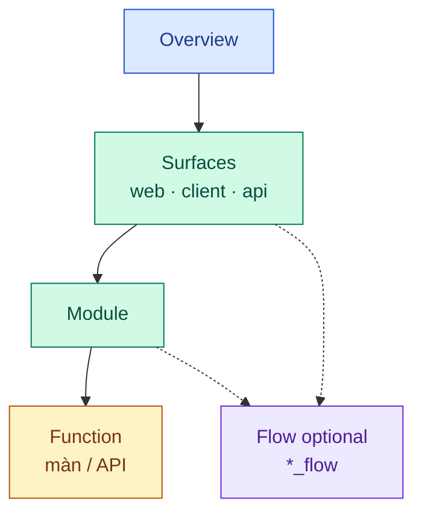
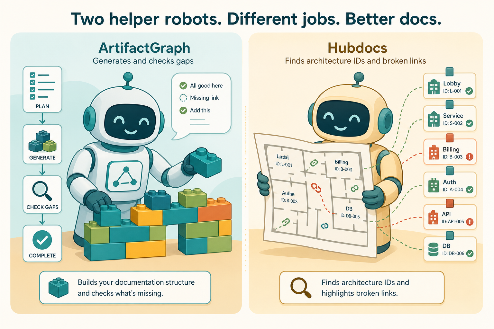

# Start now

Chào team. Đây là **cửa vào** docs hub — một **hệ thống** (nhiều surface: web, client, API), không phải sitemap một website.

Ba câu cần trả lời:

1. **Mình ngồi ghế nào?**  
2. **Đứng ở đâu trên cây** (overview → surfaces → module → function)?  
3. **Chữ / hình tuân thủ chuẩn nào? Skill nào?**

Đừng đọc hết arc42. Chọn ghế → làm đúng tầng → xong.

Chi tiết cây thư mục: [System doc structure](./SYSTEM-DOC-STRUCTURE.md).

```bash
cd path/to/base-docs && pnpm install && pnpm docs:dev
```

Pilot Auth: [CMP-01](/product/components/CMP-01-auth/) · [màn login](/product/components/CMP-01-auth/code/W-AD-AUTH-001/) · [API](/product/components/CMP-01-auth/code/API-AD-AUTH-001/) · [FLOW-login](/architecture/06-runtime/journeys/FLOW-login).


---

## 0. Cây business (nhìn nhanh)

```text
overview
surfaces/          ← web · client · api  (≠ tenant)
  flows/           ← optional (*_flow) xuyên surface
  web|client|api/
    flows/         ← optional trong một app
    [role/…]       ← optional
      module/      ← CMP — năng lực
        function/  ← màn W-* · API API-*
common/            ← UI chung · DB/DA — khi cần
architecture/      ← intro + deploy sống; còn lại stub
```

**Role / flow / common:** có thì có, không thì bỏ tầng — không bắt đủ nhánh.



---

## 1. Chuẩn chữ / hình (bắt buộc)

| Bạn đang viết ở | Text thuần (mục đích, ràng buộc…) | Diagram · DB · sequence |
|-----------------|------------------------------------|---------------------------|
| **Overview · Common · Module trở lên** | **arc42** (tinh thần — không bắt đủ chương 01–12) | **C4** |
| **Function** (trong module) | **C4** (chi tiết màn/API) | **C4** |

> *Trên module: chữ = arc42, hình/DB/seq = C4. Trong function: mọi thứ = C4.*

Flow dùng tên `*_flow` / `FLOW-*`. Skill vẫn **`/journey`** — không gọi *dynamics* trên cây mới.

Architecture team thấy: [Intro](/architecture/01-introduction/) + [Deploy](/architecture/07-deployment/) sống; chương khác stub.

---

## 2. Chọn ghế

| Ghế | Đứng trên cây | Skill chính | Đọc |
|-----|---------------|-------------|-----|
| Lead | Overview · Surfaces · Flow khó · Deploy | `/architecture` → `/context` `/containers` `/journey` `/deployment` | [§3](#3-lead) |
| Feature owner | Module | `/component` | [§4](#4-feature-owner) |
| **Dev member** | Function | `/spec` · grill | [§5](#5-dev-member) |
| BA | Function (+ grill) | `/spec` `/legacy-spec` `/bqa-grill-docs` | [§6](#6-ba) |
| QA | Plans trên **base-tests** | testcase lane | [§7](#7-qa) |
| Gen app | Repo FE/BE | `portal:gen` / api gen | [§8](#8-gen-app) |

Trợ lý Cursor (skill · MCP · ArtifactGraph · Hubdocs): [§9](#9-ai-đang-giúp-bạn).

---

## 3. Lead

Chốt **khung hệ**: overview, surface web/client/api (`CTR-*`), vài flow khó, intro/deploy.

| Việc | Skill | Chuẩn |
|------|-------|-------|
| Overview / biên hệ | `/context` | Text arc42 · hình C4 |
| Surfaces | `/containers` | Text arc42-lite · hình C4 CTR |
| Flow xuyên hệ | `/journey` | Sequence **C4** · file `FLOW-*` |
| Deploy | `/deployment` | Stub trừ khi placement matter |
| Không rõ cửa | `/architecture` | Router theo tầng business |

**Không:** viết full form trong architecture; ép mọi story thành flow; bịa topology prod.

Hubdocs (optional): lục ID / link gãy.

---

## 4. Feature owner

Giữ **module** (`CMP-*`): README = chữ arc42 ngắn (vì sao hộp này, thuộc surface nào) + link function; quan hệ hình = C4.

- Skill: `/component`  
- Path: `product/components/CMP-…/`  
- Gate: đã gắn surface/CTR chưa? Thiếu → lead.  
- Flow neo module → `/journey` chỉ khi xuyên hệ.

---

## 5. Dev member

Viết **function** trong module đã có — **chuẩn C4 only** (màn/API).

| Bước | Skill / lệnh |
|------|----------------|
| Màn mới | `/spec` |
| Hệ cũ | `/legacy-spec` |
| Khóa sự thật | `/bqa-grill-docs` → `/dev-grill-docs` |
| Thử khô | `portal:gen:dry --id W-…` (repo FE) |
| Vá | `/update-spec` |

**Để đâu:**

```text
product/components/CMP-…/code/
  W-…/     ← màn
  API-…/   ← API
```

Common UI / DB wrapper → `product/common/` hoặc shared data — không nhét business màn vào đây.

**Không:** tạo overview/CTR mới; sequence mọi CRUD; yaml màn dưới `architecture/`.

---

## 6. BA

Khóa sự thật trước khi gen chạy xa. Skill grill như bảng ghế. Open questions / `#tech-debt` có id. Output vẫn trong `code/` của module — không mở chương arc42 vì một field.

ArtifactGraph lúc grill: checklist / lệch / đã có mẫu chưa.

---

## 7. QA

| Hub | Repo | Chứa |
|-----|------|------|
| Thiết kế | base-docs | Module · function · vài FLOW |
| Test plan | **base-tests** | SC-* · TC-* |

Flow kiến trúc ≠ file test — chỉ link khi cần. E2E chạy ở repo app.

---

## 8. Gen app

Hub = bản thiết kế. Gen bấm ở **portal / API repo**.

```bash
cd ../portal
pnpm portal:gen:dry --id W-AD-AUTH-001
pnpm portal:gen --id W-AD-AUTH-001
```

ArtifactGraph: allowlist gen. Hubdocs: ít dùng lúc này.

---

## 9. Ai đang giúp bạn?



| Trợ lý | Nói thường | Khi nào |
|--------|------------|---------|
| **Skill `/…`** | Kịch bản chat | Đúng tầng đang làm |
| **Hubdocs** | Thủ thư bản đồ ID | Orphan, link, “topic thuộc đâu” |
| **ArtifactGraph** | Checklist + ống gen | Grill, parity, gen có phép |
| VitePress + Mermaid | Máy chiếu hình | Đọc / zoom diagram |

Setup: [Hubdocs](/platform/toolchain/HUBDOCS) · [ArtifactGraph](/platform/toolchain/ARTIFACTGRAPH).

---

## 10. Cheatsheet

| Ghế | Skill | Chuẩn nội dung | Path |
|-----|-------|----------------|------|
| Lead | `/architecture`… | arc42 chữ · C4 hình | overview / CTR / FLOW / deploy |
| Owner | `/component` | arc42 chữ · C4 hình | `CMP-*` |
| Dev member | `/spec` · grill | **C4** | `code/W-*` · `API-*` |
| Flow | `/journey` | C4 sequence | `FLOW-*` / `*_flow` |
| Gen | portal:gen | — | repo app |

Cây đầy đủ + map ID: [System doc structure](./SYSTEM-DOC-STRUCTURE.md).

Guide cũ / slides: [index](./).
