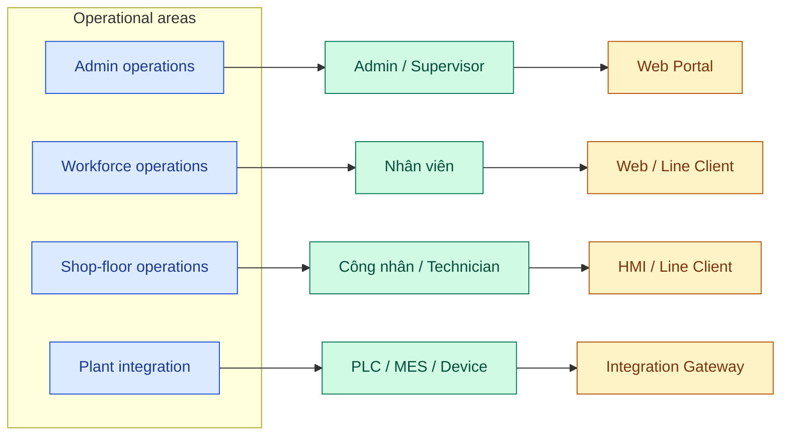
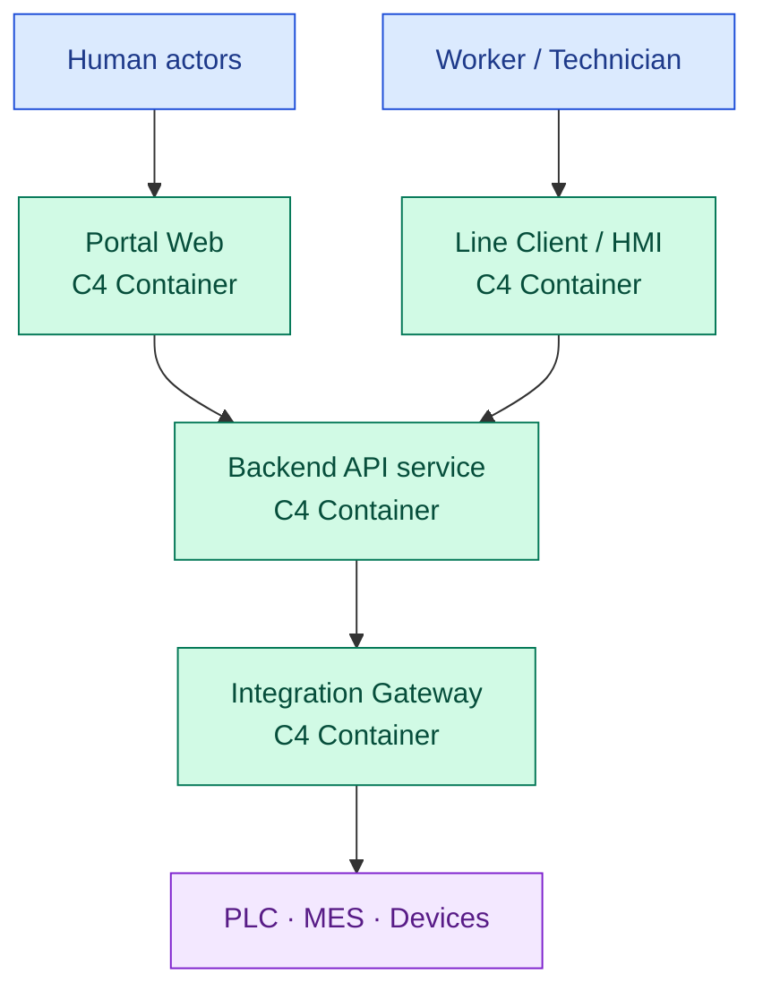
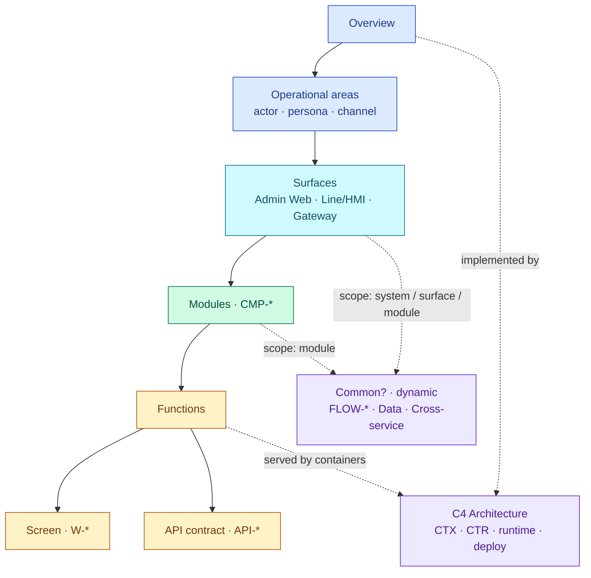
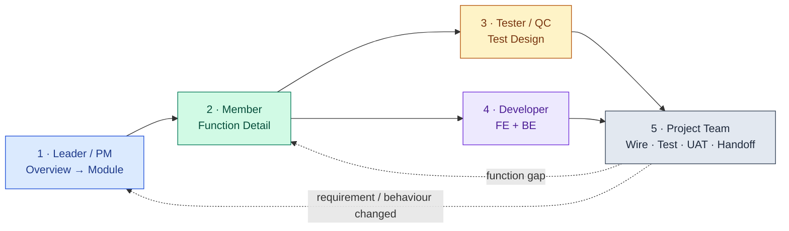
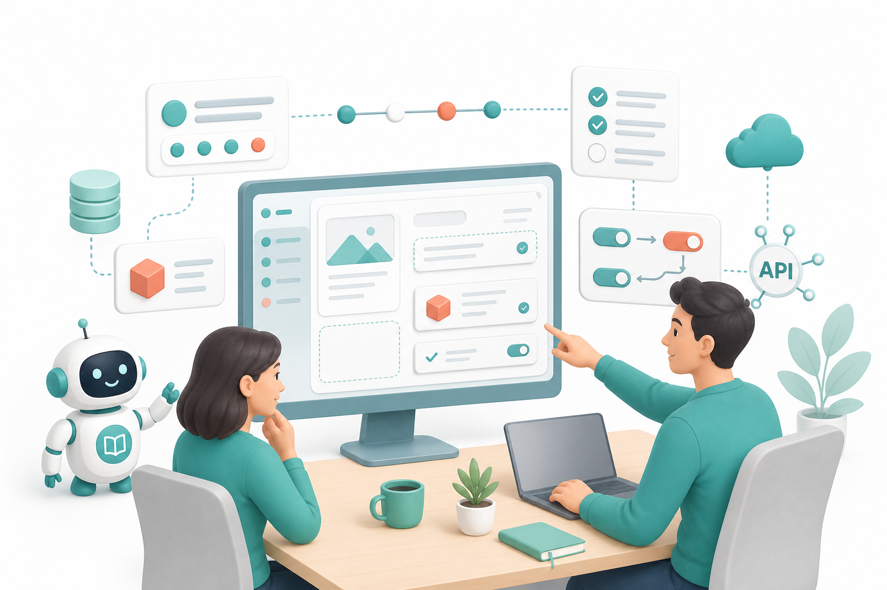
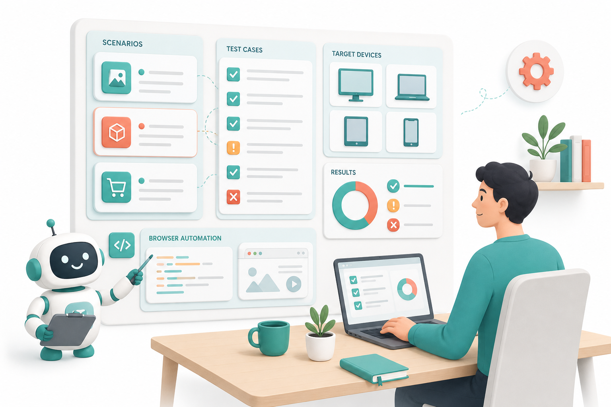
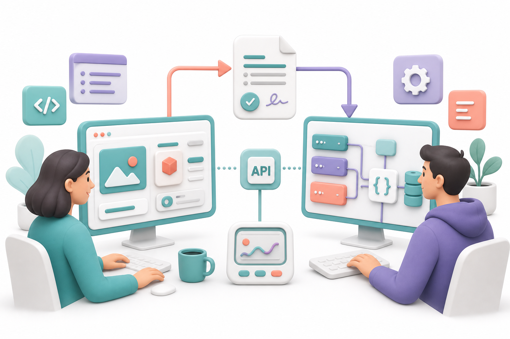
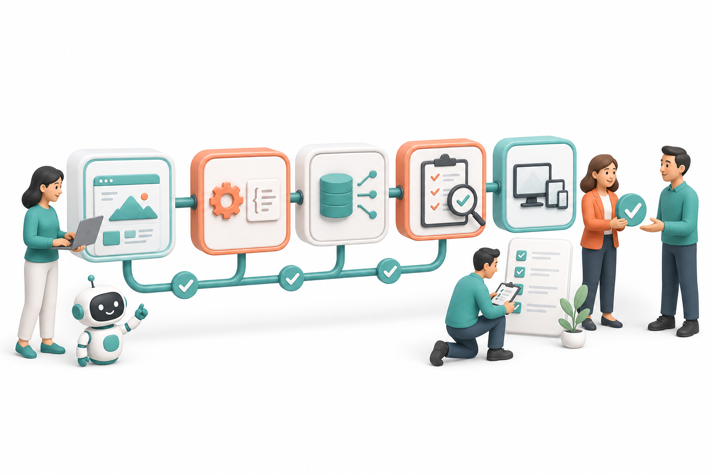

# Start now

<div class="intro-grid">
<div class="intro-card intro-card--main">
<h3>base-docs cung cấp</h3>
<ul>
<li>Khung <strong>arc42 đầy đủ từ Overview đến Module</strong>, ưu tiên cách diễn đạt gần với business: mục tiêu, phạm vi, actor, operational area, capability, constraint và quyết định.</li>
<li><strong>C4 Model</strong> cho Architecture và các nội dung kỹ thuật bên trong từng tầng: System Context, Container, Component, diagram/sequenceDiagram flow, database.</li>
<li><strong>Function Detail</strong> cho hành vi chi tiết của màn hình và API contract: state, action, field, validation, error path và acceptance.</li>
<li>Quy trình vận hành thống nhất để xác định phạm vi, tạo artifact, review, bàn giao, triển khai và duy trì tài liệu.</li>
</ul>
</div>
<div class="intro-card intro-card--side">
<h3>Sau khi đọc, xác định được</h3>
<ol>
<li>Hệ thống phục vụ <strong>operational area</strong> và actor/persona nào?</li>
<li>Nội dung ở tầng <strong>Overview, Module, Function, Flow hay Architecture</strong>?</li>
<li>Artifact cần tạo là <code>CTX-*</code>, <code>CTR-*</code>, <code>CMP-*</code>, <code>W-*</code>, <code>API-*</code> hay <code>FLOW-*</code>?</li>
<li>Ai review và điều kiện chuyển bước kế tiếp?</li>
</ol>
</div>
</div>

<div class="base-note"><span class="base-note-mark">(*)</span><em>Base cung cấp đầy đủ các tầng và artifact tham chiếu, nhưng team không bắt buộc phải triển khai toàn bộ. PM/Leader lựa chọn phạm vi phù hợp với quy mô team, giai đoạn và rủi ro của dự án; nội dung có thể được lược bỏ, thực hiện trước hoặc bổ sung sau. Ví dụ, ở giai đoạn đầu chỉ cần hoàn thiện arc42 cấp cao và một số Flow core đại diện cho nghiệp vụ chính, sau đó mở rộng theo nhu cầu thực tế.</em></div>

Chi tiết quy ước: [System doc structure](./SYSTEM-DOC-STRUCTURE.md).

Pilot tham khảo: [CMP-01 Auth](/product/components/CMP-01-auth/) · [Login screen](/product/components/CMP-01-auth/code/W-AD-AUTH-001/) · [Login API](/product/components/CMP-01-auth/code/API-AD-AUTH-001/) · [FLOW-login](/architecture/06-runtime/journeys/FLOW-login).

<div class="intro-hero">


</div>

---

## 1. Mô hình tài liệu tổng thể

<div class="duo-grid">
<div class="duo-col">

### 1.1 Business Operating Model

Business Operating Model mô tả actor/persona, vùng vận hành, năng lực nghiệp vụ và kênh tương tác.



`Admin`, `Nhân viên`, `Công nhân` là persona/actor trong một vùng vận hành. `Web Portal`, `Line Client`, `HMI`, `Gateway` là interaction channel. Chúng không phải API endpoint và cũng không thay thế C4 Container.

</div>
<div class="duo-col">

### 1.2 Technical Architecture

Technical Architecture mô tả các runtime container thực thi nghiệp vụ, quan hệ phụ thuộc và cơ chế giao tiếp giữa chúng.



</div>
</div>

---

## 2. Cây tài liệu theo nghiệp vụ

<div class="tree-overview-grid">
<div class="tree-overview-grid__tree">

```text
Overview
└─ Operational areas
   ├─ Admin operations
   ├─ Workforce operations
   ├─ Shop-floor operations
   └─ Plant integration

Surfaces
├─ Common?                         # scope toàn hệ thống — chỉ hiện khi có
│  ├─ Business processes · FLOW-*
│  ├─ Data model / Database
│  └─ Cross-service flows · Integrations
│
├─ Admin Web
│  ├─ Common?                      # scope surface
│  │  ├─ Business processes · FLOW-*
│  │  ├─ Data model / Database
│  │  └─ Cross-service flows
│  └─ Modules · CMP-*
│     ├─ Common?                   # scope module
│     │  ├─ Business processes · FLOW-*
│     │  ├─ Data model / Database
│     │  └─ Cross-service flows
│     └─ Functions
│        ├─ Screen · W-*
│        └─ API contract · API-*
│
├─ Line Client / HMI               # cùng cấu trúc: Common? → Modules → Functions
└─ Integration / Gateway           # …

Architecture
├─ System Context · CTX-* / LND-*
├─ Runtime Containers · CTR-*
├─ Runtime Journeys · FLOW-*
└─ Deployment · DEP-*
```

`Common?` là node **động**: xuất hiện ở scope nào có artifact dùng chung (toàn hệ thống, surface hoặc module) và ẩn khi không có.

</div>
<div class="tree-overview-grid__diagram">



</div>
</div>

`Surface` là bề mặt tương tác (Admin Web, Line Client/HMI, Integration Gateway) — không đồng nghĩa với Operational area hay C4 Container. Mỗi surface lặp lại cùng cấu trúc `Common? → Modules → Functions`.

Một Module chỉ có **một SSOT** dưới `product/components/CMP-*`; nếu xuất hiện ở nhiều surface thì các surface chỉ map/link tới cùng Module, không sao chép. `FLOW-*` cũng giữ một SSOT — node `Common?` theo scope chỉ tạo điều hướng, không nhân bản tài liệu. Operational area map/link tới Module; một Module có thể phục vụ đồng thời Admin, Workforce và Shop-floor.

---

## 3. Responsibility matrix

Vai trò được xác định theo trách nhiệm đối với thay đổi, không phụ thuộc hoàn toàn vào chức danh tổ chức. Một thành viên có thể đảm nhiệm nhiều vai trò; mỗi artifact vẫn phải có owner và reviewer rõ ràng.

| Vai trò | Phạm vi phụ trách | Artifact chính | Skill / công cụ |
|---------|-------------------|---------------|-----------------|
| **Solution Architect / Technical Lead** | System scope, operational areas, C4 containers, cross-system flow, deployment | `CTX-*`, `LND-*`, `CTR-*`, `FLOW-*`, `DEP-*` | `/architecture`, `/context`, `/containers`, `/journey`, `/deployment` |
| **Product / Feature Owner** | Ranh giới và ownership của capability/module | `CMP-*` README + mapping area/container | `/component` |
| **Business Analyst** | Actor, business rule, acceptance, open question | Function requirement + grill result | `/spec`, `/legacy-spec`, `/bqa-grill-docs` |
| **Software Engineer** | Function detail, feasibility, contract, edge case | `W-*`, `API-*`, technical grill | `/spec`, `/dev-grill-docs`, `/update-spec` |
| **Quality Engineer** | Scenario, testcase và traceability | `SC-*`, `TC-*` tại `base-tests` | testcase lane |
| **Implementation / Codegen Owner** | Dry-run, generate, integration và verification | Source code tại FE/BE repo | repo-specific generator |

---

## 4. Quy trình vận hành dự án



<section class="phase-card phase-card--lead">
<div class="phase-card__visual">

</div>
<div class="phase-card__body">

### 1. Leader / PM — Phân tích từ Overview đến Module

**Đầu vào:** yêu cầu dự án mới hoặc yêu cầu trên hệ thống legacy như maintain, refactor, migration và mở rộng chức năng.

- **Dự án mới:** dùng `/architecture` để route, sau đó `/context`, `/containers`, `/component`, `/journey`; bổ sung `/decision` hoặc `/cross-cutting` khi có quyết định/ràng buộc tương ứng.
- **Dự án legacy:** dùng `/legacy-spec` để khai thác evidence hiện hữu; `/business-process-trace` (alias cũ `/flow-trace`) cho brownfield process trace; phần kiến trúc mục tiêu vẫn đi qua `/architecture`.

<div class="phase-pills">
<span>Context · scope · actor</span>
<span>Operational areas</span>
<span>C4 architecture</span>
<span>Database / data model</span>
<span>Core business flows</span>
<span>Module boundaries · CMP-*</span>
</div>

**Kết quả:** Context và system boundary rõ; architecture/database/Flow core được mô tả; capability được chia thành Module có owner, dependency và Function index.

</div>
</section>

<section class="phase-card phase-card--member phase-card--reverse">
<div class="phase-card__visual">

</div>
<div class="phase-card__body">

### 2. Member — Phân tích Function / màn hình chi tiết

Member nhận Module và business context đã được thống nhất, sau đó đặc tả từng Function thay vì mở rộng lại toàn bộ architecture.

<div class="phase-pills">
<span>Actor · precondition</span>
<span>Screen states · actions</span>
<span>Fields · validation</span>
<span>API contracts</span>
<span>Error / edge cases</span>
<span>Acceptance criteria</span>
</div>

- Function mới dùng `/spec`; Function từ hệ thống cũ dùng `/legacy-spec`.
- BA xác nhận business truth qua `/bqa-grill-docs`; Engineer kiểm tra feasibility và contract qua `/dev-grill-docs`.
- Output nằm tại `CMP-*/code/W-*` và/hoặc `CMP-*/code/API-*`; open question và tech debt phải có ID trước khi bàn giao.

**Kết quả:** Function Detail đủ rõ để Tester thiết kế testcase và Developer triển khai mà không phải suy đoán lại requirement.

</div>
</section>

<section class="phase-card phase-card--test">
<div class="phase-card__visual">

</div>
<div class="phase-card__body">

### 3. Tester / QC — Thiết kế testcase tại `base-tests`

Tester nhận acceptance, `CMP-*`, `W-*`, `API-*` và `FLOW-*` từ docs hub; test plan được quản lý độc lập tại repo `base-tests`.

<div class="phase-pills">
<span>Map contexts / targets</span>
<span>Scenario · SC-*</span>
<span>Test case · TC-*</span>
<span>Suite / smoke set</span>
<span>Grill + cases:render</span>
<span>Handoff automation</span>
</div>

- `/testcase` tạo Scenario và Test case; `/grill-testcase` kiểm tra coverage, data, assertion và edge cases.
- `pnpm cases:render` sinh bản review từ test plan SSOT.
- Khi cần automation, FE repo đọc plan bằng `testcase:gen` và ghi Playwright vào `tests/e2e/`; file FE không thay thế plan trong `base-tests`.

**Kết quả:** test scope có traceability với Function/Flow và sẵn sàng cho automation, integration test và regression.

</div>
</section>

<section class="phase-card phase-card--dev phase-card--reverse">
<div class="phase-card__visual">

</div>
<div class="phase-card__body">

### 4. Developer — Triển khai FE + BE

Developer triển khai tại code repo tương ứng dựa trên Function Detail, API contract và testcase đã thống nhất.

<div class="phase-pills">
<span>FE scaffold / prototype</span>
<span>BE API / business logic</span>
<span>Contract parity</span>
<span>Unit + build checks</span>
<span class="phase-pill-more">…</span>
</div>

- **FE/client:** tạo route, UI component, state, validation, service/model và xử lý loading/empty/error.
- **BE/API:** triển khai request validation, controller/handler, service, model/repository và response/error contract.
- Kiểm tra field keys giữa FE/BE/client, chạy unit test, typecheck/build và cập nhật `/update-spec` nếu implementation buộc phải thay đổi behaviour.

**Kết quả:** từng phần chạy độc lập, tuân thủ contract và sẵn sàng kết nối end-to-end.

</div>
</section>

<section class="phase-card phase-card--ship">
<div class="phase-card__visual">

</div>
<div class="phase-card__body">

### 5. Project Team — Wire, Integration Test, UAT và bàn giao

Dev, QA, PM/Leader và stakeholder hợp nhất các đầu ra thành một luồng vận hành hoàn chỉnh.

<div class="phase-pills">
<span>Wire FE ↔ BE ↔ Client</span>
<span>Config / auth / environment</span>
<span>Integration + E2E</span>
<span>Regression</span>
<span>UAT</span>
<span>Review · merge · handoff</span>
</div>

- Wire theo contract, xử lý môi trường và dependency thực tế.
- Chạy integration/E2E/regression; gap quay lại Function Detail hoặc testcase tương ứng.
- Stakeholder thực hiện UAT theo acceptance; thay đổi behaviour phải cập nhật docs/spec trước khi đóng.
- Hoàn tất review, merge, release note, tài liệu vận hành và bàn giao ownership.

**Kết quả:** implementation, test evidence, UAT và documented behaviour thống nhất.

</div>
</section>

---

## 5. Trợ lý và công cụ


| Công cụ | Trách nhiệm |
|---------|-------------|
| **Skill `/…`** | Workflow theo đúng tầng và vai trò |
| **Hubdocs** | Tìm ID, dependency, orphan và link |
| **ArtifactGraph** | Gap analysis, parity, tag và codegen allowlist |
| **VitePress + Mermaid** | Trình bày docs và diagrams |

Setup: [Toolkits (MCP)](./toolkits.md) — cài Hubdocs, ArtifactGraph và các toolkit khác.

---

## 6. Tra cứu nhanh

| Nhu cầu | Artifact | Skill | Technical home |
|---------|----------|-------|----------------|
| Scope, actor, operational area | `CTX-*`, `LND-*` | `/context` | `architecture/03-context/` |
| Portal/Client/API/Gateway runtime | `CTR-*` | `/containers` | `architecture/05-building-blocks/` |
| Business capability | `CMP-*` | `/component` | `product/components/` |
| Screen behaviour | `W-*` | `/spec` | `CMP-*/code/W-*/` |
| API endpoint/contract | `API-*` | `/spec` | `CMP-*/code/API-*/` |
| Cross-boundary journey | `FLOW-*` | `/journey` | `architecture/06-runtime/journeys/` |
| Runtime placement | `DEP-*` | `/deployment` | `architecture/07-deployment/` |

Đọc tiếp: [System doc structure](./SYSTEM-DOC-STRUCTURE.md) · [Platform guide index](./).
