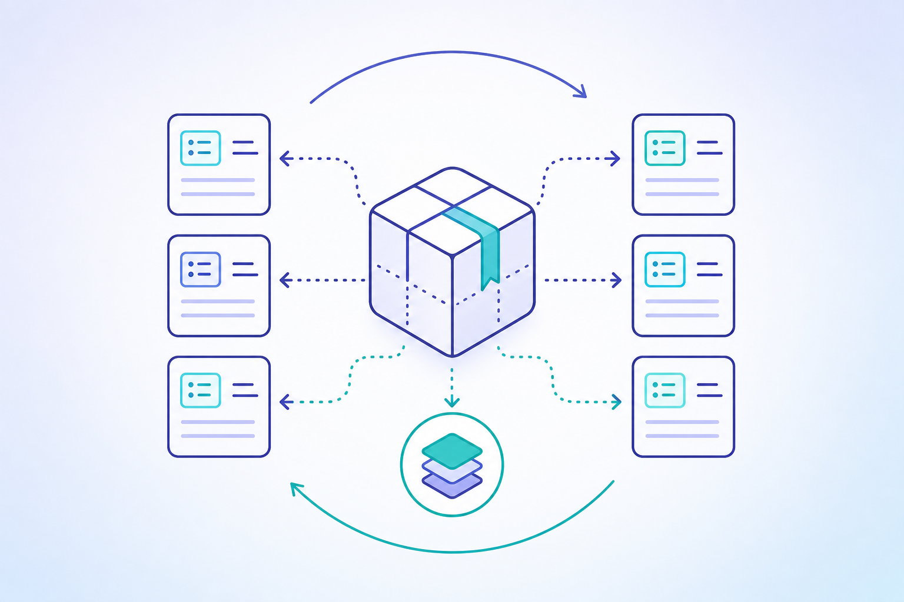
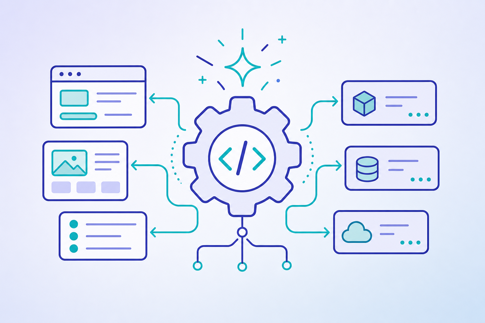
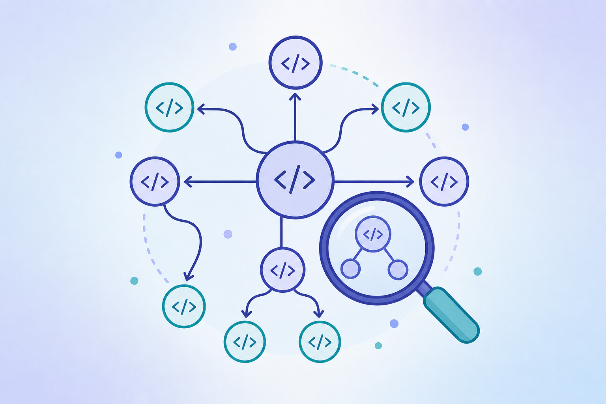

# Toolkits (MCP)

<div class="intro-grid">
<div class="intro-card intro-card--main">
<h3>Toolkit là gì</h3>
<ul>
<li>Một <strong>toolkit</strong> là một package MCP/CLI độc lập: tự cài, tự init, tự chạy. Ví dụ: Hubdocs, Bundlekit, Processkit, Codegenkit, Testkit, ArtifactGraph, CodeGraph, Platform DNA.</li>
<li>Một <strong>repo</strong> là nơi team thao tác và chia sẻ artifact: docs (<code>base-docs</code>), tests (<code>base-tests</code>), code (<code>portal</code>, <code>api</code>, <code>line</code>, …).</li>
<li>Toolkit cài <em>skill</em> (lệnh <code>/…</code>), <em>rule</em> và <em>config</em> vào một repo. Bản clone mới <strong>không</strong> có sẵn skill/rule nào cho tới khi bạn init toolkit.</li>
</ul>
</div>
<div class="intro-card intro-card--side">
<h3>Nguyên tắc</h3>
<ol>
<li>Chỉ cài toolkit bạn cần — cài thừa làm nặng repo (do file <code>.cursor/</code> được sync).</li>
<li>Mỗi toolkit độc lập; không toolkit nào bắt buộc toolkit khác.</li>
<li>Tính năng liên-toolkit chỉ là <strong>accelerator</strong>: thiếu thì fallback, không fail.</li>
<li>Dữ liệu cross-repo đi qua <strong>pointer machine-local</strong>, không đoán sibling.</li>
</ol>
</div>
</div>

<div class="base-note"><span class="base-note-mark">(*)</span><em>Tài liệu này gộp toàn bộ nội dung MCP trước đây (install, profiles, ownership, package contract, migration log) cùng bảng lệnh docs-lane. Thuật ngữ chuẩn: “repo” = artifact hub, “toolkit” = package MCP.</em></div>

---

## 1. Bảng tổng hợp toolkit

Mỗi toolkit hỗ trợ gì, cung cấp skill/rule nào, và sở hữu config gì:

| Toolkit | Hỗ trợ (capability) | Skill cung cấp | Rule / config sở hữu | Lane |
|---------|---------------------|----------------|----------------------|------|
| **Hubdocs** | Index arc42 + C4, resolve ID → path, dependency/orphan | `/architecture` `/context` `/containers` `/component` `/journey` `/deployment` `/cross-cutting` `/decision` `/hubdocs` (+ `/dynamics`→`/journey` redirect) | `hubdocs.mdc`; pointer `HUBDOCS_ROOT` cho consumer | docs (home); fe/be optional (consumer) |
| **Bundlekit** | Bundle IR split/merge/check/render + docs grill + legacy-spec | `/spec` `/update-spec` `/update-spec-legacy` `/legacy-spec` `/bqa-grill-docs` `/dev-grill-docs` `/grill-with-docs` | `team-flow-spec.mdc` `team-flow-grill.mdc` `bundlekit.mdc`; **owner `legacy-repos.json`**; alias `pnpm spec:*` / `docs:render*` | docs |
| **Processkit** | Trace business process + review impact thay đổi | `/business-process-trace` `/business-impact-review` (+ `/flow-trace` redirect) | `processkit.mdc`; không ghi map | docs · fe · be |
| **Codegenkit** | Sinh code FE/BE từ IR đã grill | FE `/prototype` `/wire` `/unit` `/model` `/grill-prototype` `/grill-unit`; BE `/api` (+ grill) | `platform-code-size` `platform-design-vocabulary` `team-flow-prototype` `team-flow-unit` `codegenkit-optional-integrations`; đọc `CODEGENKIT_DOCS_ROOT` | fe · be |
| **Testkit** | Author test plan + sinh Playwright E2E | tests `/testcase` `/grill-testcase`; fe `/test` `/grill-test` | `testkit-optional-accelerators`; pointer `TESTKIT_DOCS_ROOT` / `TESTKIT_TESTS_ROOT` | tests · fe |
| **ArtifactGraph** | Gợi ý tag / gap / parity / gen allowlist | `/artifactgraph` `/docs-mark` (+ `/platform-mark` deprecated) | `artifactgraph.mdc`; index local `.artifactgraph/` | **docs-first**; fe/be/tests chỉ khi cần hint local |
| **CodeGraph** | Explore cấu trúc code / call graph | *(không sync skill)* tool `codegraph_explore` | `codegraph.mdc`; index local `.codegraph/` | any (accelerator) |
| **Platform DNA** | Seed repo identity + bootstrap lane | FE `/platform-base` (Nuxt/Next) | **owner `platform-repos.json`**; resolver `profiles.json` | any repo (không cài vào source của toolkit) |

> `/platform-ai` **không** nằm trong bảng: nó chỉ tồn tại local trong source của từng toolkit để bảo trì chính toolkit đó, không bao giờ sync sang repo đích.

### Lệnh docs-lane (command → nội dung)

Trên repo **docs**, các skill do toolkit cài map sang đúng chapter/section arc42 × C4:

| Command | Trỏ tới | Toolkit |
|---------|---------|---------|
| `/architecture` | arc42 router → chapter / business layer | Hubdocs |
| `/context` | §03 LND/CTX (overview, actors, operational areas) | Hubdocs |
| `/containers` | §05 C4 runtime containers (`CTR-*`) + CMP index | Hubdocs |
| `/component` | `product/components/CMP-*` (module) | Hubdocs |
| `/journey` | §06 `FLOW-*` (`/dynamics` = deprecated alias) | Hubdocs |
| `/deployment` | §07 stub-first DEP | Hubdocs |
| `/cross-cutting` | §08 | Hubdocs |
| `/decision` | §09 ADR | Hubdocs |
| `/hubdocs` | Index arc42/C4 Markdown local (optional) | Hubdocs |
| `/spec` · grill · `/legacy-spec` · `/update-spec*` | Feature Code lane (bundle IR) | Bundlekit |
| `/business-process-trace` | Brownfield cross-system process trace | Processkit |
| `/flow-trace` | Deprecated alias → `/business-process-trace` | Processkit |

Lệnh triển khai code (`/prototype` `/api` `/wire` `/test` `/unit`) chạy ở **code repo** (portal, api, …), không ở docs — xem Codegenkit/Testkit ở §4.

---

## 2. Docs là "registry hub", các repo khác chỉ giữ pointer

Repo **docs** là nơi duy nhất sở hữu registry sản phẩm đầy đủ, architecture ID và bundle IR. Repo khác (FE/BE/tests) **không** copy dữ liệu đó — chúng giữ **pointer machine-local** trỏ tới một checkout docs do member tự chọn.

| Từ repo | Pointer (gitignore / MCP env) | Ai dùng |
|---------|-------------------------------|---------|
| FE | `CODEGENKIT_DOCS_ROOT` (và `--docs-root` khi init) | Codegenkit FE gen / đọc IR |
| FE (Hubdocs optional) | `HUBDOCS_ROOT` / `--docs-root` | Hubdocs ID→path |
| FE (Testkit E2E) | `TESTKIT_DOCS_ROOT` + `TESTKIT_TESTS_ROOT` | Testkit enrichment |
| BE / tests | cùng pattern khi toolkit cần docs | Không bao giờ đoán `../base-docs` |

1. Pointer là **đường dẫn tuyệt đối do member chọn** trên máy đó. Không commit, không suy diễn sibling.
2. Registry / architecture **SSOT ở lại repo docs**. FE/BE đọc qua pointer, không vendor bản sao thứ hai.
3. **ArtifactGraph mặc định ở docs** (registry + parity đầy đủ). Trên FE/BE chỉ cài khi thật cần hint tag/allowlist local; nó không mở docs hub lúc runtime (standalone theo từng repo).

---

## 3. Chọn toolkit theo nhu cầu

Đây là menu, không phải checklist. Chỉ cài khi cần capability tương ứng.

| Tôi muốn… | Cài toolkit | Lane |
|-----------|-------------|------|
| Author/index arc42 + C4 ID | **hubdocs** | docs (home); fe/be optional với `HUBDOCS_ROOT`→docs |
| Split/merge/render bundle IR + docs grill + legacy-spec | **bundlekit** | docs |
| Trace business process / review impact | **processkit** | docs · fe · be |
| Sinh code FE hoặc BE | **codegenkit** | fe · be (FE cần `CODEGENKIT_DOCS_ROOT`) |
| Author test plan / sinh Playwright E2E | **testkit** | tests · fe |
| Gợi ý tag / gap / gen allowlist | **artifactgraph** | docs-first; fe/be/tests chỉ khi cần hint local |
| Explore cấu trúc code / call graph | **codegraph** | any (accelerator) |
| Seed repo identity + bootstrap lane | **platform-dna** | any repo |

---

## 4. Cài từng toolkit (độc lập)

Mỗi block tự đủ. Chạy tại thư mục gốc repo đích. `Node ≥ 22`.

### hubdocs — index architecture/C4 ID


```bash
# Trên repo docs (home khuyến nghị):
curl -fsSL https://raw.githubusercontent.com/raintr91/hubdocs/main/install.sh | bash
hubdocs init --yes
hubdocs harness install --type=docs

# Từ FE/BE (optional): trỏ tool tới một checkout docs do member chọn
hubdocs init --docs-root=/absolute/path/to/docs-hub --yes
hubdocs harness install --type=consumer
```

MCP env `HUBDOCS_ROOT` (hoặc per-tool `docsRoot`) trỏ tới docs hub; không giả định sibling. Consumer mode chỉ sync `/hubdocs` + rule/schema/hook nhẹ — không sync nhóm skill authoring architecture.

### bundlekit — bundle IR + docs grill + legacy



```bash
curl -fsSL https://raw.githubusercontent.com/raintr91/bundlekit/main/install.sh | bash
bundlekit init --type=docs --target=cursor --yes
```

Sở hữu alias `pnpm spec:*` / `pnpm docs:render*` và seed repo-only `legacy-repos.json` + example (đường dẫn máy ở `legacy-repos.local.json` bị gitignore). Accelerator optional: artifactgraph (tags), hubdocs (ID→path), codegraph (evidence) — đều fallback êm.

### processkit — process trace + impact review


```bash
processkit init --type=docs --target=cursor --yes   # hoặc --type=fe | --type=be
```

Accelerator optional: codegraph, hubdocs, artifactgraph.

### codegenkit — sinh code FE/BE



```bash
# FE luôn cần pointer docs machine-local:
codegenkit init --type=fe --adapter=nuxt4 --docs-root=/absolute/path/to/docs-hub --yes
codegenkit init --type=be --adapter=fastapi --yes
```

Adapter: FE `nuxt4` `nextjs` `dotnet-line`; BE `fastapi` `laravel` `dotnet-integration`. Runtime đọc IR/registry qua `CODEGENKIT_DOCS_ROOT` (đặt khi init). Không cài ArtifactGraph trên FE chỉ để với tới docs registry — đó là việc của pointer Codegenkit. Không cài vào docs/tests.

### testkit — plan + sinh Playwright


```bash
testkit init --type=tests --yes
testkit init --type=fe --tests-root=/path/to/tests-hub --docs-root=/path/to/docs-hub --yes
```

Accelerator optional: artifactgraph — trên **tests hub** dùng `--type=common,test` (testcase taxonomy + coverage hint trên plan của chính repo đó); nó không đi theo `TESTKIT_DOCS_ROOT` / `TESTKIT_TESTS_ROOT` — evidence cross-repo đi qua pointer Testkit.

### artifactgraph — tag / gap registry (accelerator)


**Ưu tiên repo docs** — nơi có registry và parity đầy đủ.

```bash
# Khuyến nghị: docs hub
cd /path/to/docs-hub
artifactgraph init --target=cursor --type=common,docs --yes
artifactgraph rebuild

# FE/BE/tests: chỉ khi cần hint tag/allowlist local trên registry của chính repo đó.
# AG không đi theo HUBDOCS_ROOT / CODEGENKIT_DOCS_ROOT / TESTKIT_DOCS_ROOT.
artifactgraph init --target=cursor --type=common,fe --yes    # hiếm
artifactgraph init --target=cursor --type=common,test --yes  # tests hub (accelerator cho Testkit)
```

Accelerator thuần: không toolkit nào bắt buộc nó. Trên repo non-docs, nó chỉ index **repo đó** (lexicon baseline đóng gói + `registries/` local); không tự mở docs hub.

### codegraph — code intelligence (accelerator)



```bash
curl -fsSL https://raw.githubusercontent.com/colbymchenry/codegraph/main/install.sh | sh
codegraph init
```

Index local `.codegraph/`, gitignore. Accelerator thuần.

### platform-dna — repo identity + bootstrap


```bash
platform-dna init --type=docs --project-root=. --yes   # hoặc fe | be | tests
```

Seed `platform-repos.json` (repo identity, portable); FE Nuxt/Next thêm `/platform-base`. Không sync `/platform-ai`. Cũng là bootstrap một-phát cho cả lane — xem §5.

---

## 5. Bootstrap theo lane (tiện lợi)

`platform-dna init --type=<lane>` chạy các toolkit khuyến nghị cho lane đó trong một lệnh. Đây chỉ là wrapper tiện lợi trên cùng các toolkit độc lập — không tạo coupling runtime.

```bash
platform-dna init --type=docs  --project-root=/path/to/docs --yes
platform-dna init --type=fe    --adapter=nuxt4  --docs-root=/absolute/path/to/docs-hub --project-root=/path/to/portal --yes
platform-dna init --type=be    --adapter=laravel --project-root=/path/to/api --yes
platform-dna init --type=tests --project-root=/path/to/base-tests --yes
```

| `--type` | Toolkit khuyến nghị | Accelerator optional | Ghi chú |
|----------|---------------------|----------------------|---------|
| `docs` | hubdocs · bundlekit · processkit | **artifactgraph** (home) · codegraph | Registry / architecture hub |
| `fe` | codegenkit · testkit · processkit (impact) | codegraph · hubdocs (`HUBDOCS_ROOT`→docs) · artifactgraph (hiếm) | Đặt `CODEGENKIT_DOCS_ROOT` |
| `be` | codegenkit · processkit (impact) | codegraph · hubdocs · artifactgraph (hiếm) | Cùng quy tắc pointer với FE |
| `tests` | testkit | artifactgraph (hiếm) | cases authoring |

Cờ hữu ích: `--dry-run` xem trước, `--with=<toolkit>` thêm accelerator, `--no-install` yêu cầu binary đã cài sẵn, `--package-root toolkitId=/path` cho dev local.

> "Toolkit khuyến nghị" là capability một lane điển hình cần — không phải runtime dependency. Cài subset tùy ý; mỗi toolkit chạy độc lập. Platform DNA **không** cài vào source checkout của toolkit.

---

## 6. Ownership & quy tắc độc lập

### Skill / rule — mỗi asset một owner

1. Một `SKILL.md` / rule / extract → đúng **một** toolkit owner. Hai toolkit không cùng sync một file.
2. Bước deterministic liên-toolkit → `requires`. Lookup/token helper → `optional`.
3. Canonical process skill là `/business-process-trace`; `/flow-trace` là redirect deprecated một chu kỳ. `/dynamics` là Hubdocs→`/journey`, không gộp với process trace.
4. Docs hub không init codegenkit/testkit mặc định.
5. Docs grill (`/bqa-grill-docs` → `/dev-grill-docs` → `/grill-with-docs`) thuộc Bundlekit; ArtifactGraph/Codegenkit chỉ là accelerator/handoff, không hard-require.

### Config maps — mỗi map chỉ chứa repo

| File | Owner | Nội dung |
|------|-------|----------|
| `platform-repos.json` (+ example) | **Platform DNA** | Repo identity (lane/role) của repo đang mở |
| `legacy-repos.json` (+ example) | **Bundlekit** | Danh mục legacy repo (brownfield evidence) |
| `*.local.json` | Member | Đường dẫn checkout máy — luôn gitignore |

Cả hai map chỉ chứa **repo**, không chứa toolkit/skill/adapter/install state. Toolkit khác không ghi map. Trạng thái cài của mỗi toolkit nằm trong `install-manifest.json` riêng của nó.

### Independence contract

1. Mỗi toolkit cài/init/chạy **standalone**; cài cái này không kéo cái kia.
2. Dùng liên-toolkit chỉ là **accelerator**; thiếu → fallback có tài liệu, không fail cứng.
3. Mỗi toolkit sở hữu skill/tool/rule/extract + `install-manifest.json` riêng.
4. Truy cập cross-repo dùng pointer machine-local (`HUBDOCS_ROOT`, `CODEGENKIT_DOCS_ROOT`, …), không suy diễn sibling.
5. Gỡ một toolkit chỉ xóa file của nó (`<toolkit> prune`).

---

## 7. Dành cho tác giả toolkit — package contract

Contract chung để build/publish một toolkit MCP (Hubdocs, Bundlekit, Processkit, Codegenkit, Testkit, ArtifactGraph, Platform DNA).

**Manifest** — mỗi toolkit publish `mcp-package.json` (machine-readable): `schemaVersion`, `package`, `version`, `types`, `requires`, `optional`, `tools`, `assets[]` (`source`/`target`/`type`/`owner`), `compatibility` (`node`/`toolApi`/`harnessApi`).

- Một target asset có đúng một owner.
- `requires` cần cho tính đúng; `optional` chỉ tăng tốc.
- Profile cài một subset package; không đổi runtime ownership.

**Install manifest** — trạng thái local ở `.<toolkit>/install-manifest.json`: `packageVersion`, `toolApi`, `harnessApi`, `installedAt`, `files` (mỗi file có `source` + `sha256`).

**Lifecycle**
- `init`: tạo file thiếu; chỉ update file còn khớp hash cũ; báo conflict với file member sửa; `--force` để ghi đè. Không ghi map của toolkit khác; không đụng `*.local.json`.
- Upgrade: validate `toolApi`/`harnessApi` trước khi sync; giữ thay đổi local thành conflict; asset bị gỡ → **stale**, không tự xóa; in lệnh `prune`.
- `prune`: chỉ xóa file stale còn khớp hash cũ; không xóa file đã sửa; map không bao giờ là target; `--dry-run` mặc định, xóa cần `--yes`.
- Uninstall: prune an toàn trước; gỡ MCP entry machine-local; giữ + báo file member đã sửa.

**Compatibility failures**: `toolApi`/`harnessApi` không support → fail trước khi ghi; thiếu `requires` → fail kèm lệnh cài; thiếu `optional` → tiếp tục + log một fallback event; skill mới hơn tool → fail kèm hướng dẫn upgrade/re-init.

**Portability**: manifest/template commit chỉ chứa path repo-relative hoặc Git URL ổn định. Path thực thi máy + checkout root ở MCP config bị ignore hoặc `*.local.json`.

---

## 8. Trạng thái & lịch sử (tóm tắt)

Việc tách MCP thành các toolkit độc lập đã hoàn tất (cutover 2026-07-18):

| Toolkit | Trạng thái |
|---------|-----------|
| Platform DNA | Resolver + repo-only `platform-repos` + FE `/platform-base`; là owner map duy nhất cho `platform-repos*` |
| Bundlekit | Docs engine + grill + legacy; owner `legacy-repos*`; alias `pnpm spec:*` |
| Processkit | Process trace + impact; không ghi map |
| Hubdocs | Architecture/C4 ID; docs-home + consumer mode |
| Codegenkit | FE+BE codegen (gồm `dotnet-line` / `dotnet-integration`) |
| Testkit | Tests/FE profile + Playwright gen |
| ArtifactGraph | Accelerator docs-first; local-only trên repo khác |

Quy ước đã chốt: một skill → một owner; MCP phụ chỉ accelerator; docs là registry hub; `/platform-ai` chỉ local trong toolkit; map chỉ chứa repo.

---

Đọc tiếp: [Start now](./start-now.md) · [System doc structure](./SYSTEM-DOC-STRUCTURE.md) · [Toolchain index](/platform/toolchain/).

Deep docs của từng toolkit sống trong git repo riêng: [Hubdocs](https://github.com/raintr91/hubdocs) · [Bundlekit](https://github.com/raintr91/Bundlekit) · [Processkit](https://github.com/raintr91/Processkit) · [Codegenkit](https://github.com/raintr91/codegenkit) · [Testkit](https://github.com/raintr91/Testkit) · [ArtifactGraph](https://github.com/raintr91/artifactgraph) · [Platform DNA](https://github.com/raintr91/platform-dna) · [CodeGraph](https://github.com/colbymchenry/codegraph).
