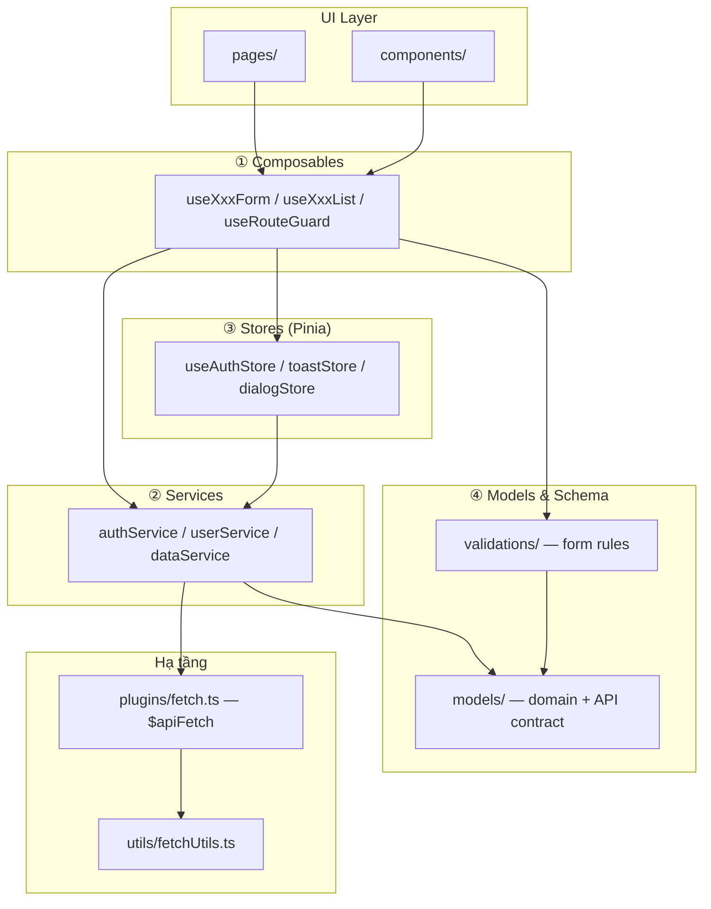

# Kiến trúc 4 tầng — Portal (Nuxt 4)

Tài liệu mô tả chuẩn kiến trúc **Composables → Services → Stores → Models/Schema** và đối chiếu với codebase hiện tại.

> **Kết luận nhanh:** Dự án đã có **4 tầng đầy đủ** (`composables` → `services` → `stores` → `models`). Auth flow (login/register/forgot/reset), data table, `parseApiData` runtime đã theo chuẩn. Còn tùy chọn: đổi tên `useAuth` store, user CRUD pages.

---

## 1. Chuẩn mục tiêu (4 tầng)



### Vai trò từng tầng

| Tầng | Thư mục | Trách nhiệm | Không làm |
|------|---------|-------------|-----------|
| **Composables** | `composables/` | Orchestration UI: form submit, loading/error, navigation, guard | Gọi `$apiFetch` trực tiếp |
| **Services** | `services/` | HTTP/repository: endpoint, method, map response | Giữ state Pinia/cookie |
| **Stores** | `stores/` | State client: token, user, toast, dialog | Logic HTTP chi tiết |
| **Models** | `models/` + `validations/` | Contract dữ liệu: Zod schema, `z.infer` types, parse API | Render UI |

### Quy tắc import (chuẩn)

```
pages / components
  → composables
      → stores (state)
      → services (API)      ← hiện THIẾU
          → models (types + parse)
          → $apiFetch
  → validations (form schema)
      → models (entity shape)
```

**Cấm ngược chiều:** `models/` không import `stores/`, `services/`, `composables/`.

---

## 2. Hiện trạng codebase

### 2.1 Composables — ✅ Có, chưa đủ

```
composables/
├── auth/
│   ├── useAuthLoginForm.ts       ✅ đang dùng (login page)
│   ├── useAuthRegisterForm.ts    ⚠️ chưa có page
│   ├── useAuthForgotPasswordForm.ts
│   ├── useAuthResetPasswordForm.ts
│   ├── useAuthChangePasswordForm.ts
│   └── _schemas.ts               ⚠️ orphan (không ai import)
├── forms/
│   ├── useApiForm.ts             ✅ base form composable
│   └── README.md
├── data/
│   └── useDataResourceTable.ts   ✅
├── useDashboardNav.ts            ✅ nav tối giản auth-first
├── useCommonBreadcrumbs.ts       ✅
└── useRouteGuard.ts              ✅
```

**Đã bổ sung:** `useApiForm`, `useDashboardNav`, `useDataResourceTable`.

**Pattern đúng (auth login):**

```
pages/auth/login.vue
  → validations/auth/schemas.ts     (loginSchema)
  → models/auth/auth.types.ts       (LoginRequest)
  → composables/auth/useAuthLoginForm.ts
      → stores/useAuth.ts           (auth.login)
```

### 2.2 Services — ✅ Có

```
services/
├── auth.service.ts       login, register, me, forgot/reset, logout
├── data.service.ts       search/list API cho DataResourceTable
├── shared/apiResponse.ts assertApiSuccess()
└── index.ts
```

| File | Vai trò |
|------|---------|
| `services/auth.service.ts` | HTTP auth endpoints |
| `services/data.service.ts` | HTTP data search |
| `stores/useAuth.ts` | State only — gọi `createAuthService($apiFetch)` |
| `composables/data/useDataResourceTable.ts` | Gọi `createDataService($apiFetch)` |

**Hạ tầng HTTP hiện có (thay thế tạm service layer):**

- `plugins/fetch.ts` — tạo `$apiFetch`
- `utils/fetchUtils.ts` — interceptors, attach token, normalize lỗi
- `utils/apiValidation.ts` — map 422 → form errors
- `types/apiFetch.d.ts` — augment Nuxt app

### 2.3 Stores — ⚠️ Có, nhưng trộn API + state

```
stores/
├── useAuth.ts        ⚠️ state (cookie) + API methods
├── toastStore.ts     ✅ UI global state
└── dialogStore.ts    ✅ UI global state
```

| Store | Chuẩn? | Ghi chú |
|-------|--------|---------|
| `toastStore` | ✅ | Chỉ UI state, dùng bởi `OrGlobalToast`, `plugins/fetch.ts` |
| `dialogStore` | ✅ | Chỉ UI state |
| `useAuth` | ✅ | State + orchestration; API qua `authService` |

**Đặt tên chưa nhất quán:** `useAuth` (kiểu composable) vs `toastStore` / `dialogStore` (suffix `Store`).

### 2.4 Models & Schema — ⚠️ Có, bị phân tán

```
models/                          ← domain + API contract (Zod)
├── common/
│   ├── api.schema.ts            ApiSuccessSchema, ApiErrorSchema
│   ├── api.types.ts
│   ├── fields.ts                email, id, …
│   └── parse.ts                 parseSchema — dùng qua services/parseApiData
├── auth/
│   ├── auth.schema.ts           LoginRequestSchema, TokenResponseSchema, …
│   └── auth.types.ts            z.infer types
└── user/
    ├── user.schema.ts
    └── user.types.ts

validations/                     ← form rules (vee-validate toTypedSchema)
├── auth/schemas.ts              loginSchema (min 8 chars password…)
├── user/schemas.ts              sẵn sàng cho user CRUD (chưa có page)
└── common/rules.ts, messages.ts

types/
└── apiFetch.d.ts                augment $apiFetch
```

**Hai nguồn Zod cho cùng concept (cố ý nhưng cần hiểu rõ):**

| Concern | `models/` | `validations/` |
|---------|-----------|----------------|
| Login body gửi API | `LoginRequestSchema` — lỏng (`password: string`) | `loginSchema` — chặt (min 8, email rule) |
| User entity | `UserSchema` / `UserMeSchema` | `userUpsertSchema` — subset form |

**Runtime parse API response:** `parseApiData()` trong `services/shared/parseApiData.ts` gọi `parseSchema()` cho login/register/me.

---

## 3. Bảng đối chiếu chuẩn

| Tiêu chí | Chuẩn | Portal | Trạng thái |
|----------|-------|--------|------------|
| Tầng Composables | Có, orchestration UI | `auth/*`, `useApiForm`, guards, breadcrumbs | ✅ |
| Tầng Services | Repository/API riêng | `auth.service`, `data.service` | ✅ |
| Tầng Stores | Chỉ client state | `useAuth` tách API sang service | ✅ |
| Models (Zod + types) | `models/` domain contract | Có, có barrel `index.ts` | ✅ |
| Form validation | Tách `validations/` | Có `toTypedSchema` | ✅ |
| Parse API runtime | `parseSchema` ở service | Có helper, chưa dùng | ❌ |
| `useApiForm` base | 1 composable form chung | `composables/forms/useApiForm.ts` | ✅ |
| Component gọi API | Qua service/composable | `DataResourceTable` → `useDataResourceTable` | ✅ |
| Orphan code | Không | auth pages thiếu, validations/user/robot orphan | ⚠️ |
| Naming stores | `*Store` hoặc `use*Store` | Lẫn `useAuth` vs `toastStore` | ⚠️ |

**Điểm tổng: ~95%** — 4 tầng hoàn chỉnh; auth pages đầy đủ; còn tùy chọn naming store + user CRUD.

---

## 4. Luồng mẫu: Auth Login (chuẩn nhất hiện có)

```ts
// ① Page — pages/auth/login.vue
import { loginSchema } from '~/validations/auth/schemas'
import type { LoginRequest } from '~/models/auth/auth.types'
import { useAuthLoginForm } from '~/composables/auth/useAuthLoginForm'

const { onSubmit, apiError, isSubmitting } = useAuthLoginForm()
const { handleSubmit, errors, setErrors } = useForm<LoginRequest>({
  validationSchema: loginSchema,
  initialValues: { email: '', password: '' }
})
```

```ts
// ② Composable — composables/auth/useAuthLoginForm.ts
export function useAuthLoginForm() {
  const auth = useAuth()
  const onSubmit = async (values: LoginRequest) => {
    await auth.login(values)  // ← nên là authService.login()
    await navigateTo(redirect)
  }
  return { apiError, isSubmitting, onSubmit }
}
```

```ts
// ③ Store (hiện tại) — stores/useAuth.ts
const login = async (payload: LoginRequest) => {
  const res = await $apiFetch('/api/auth/login', { method: 'POST', body: payload })
  // ← nên chuyển sang services/auth.service.ts
  setToken(issuedToken)
}
```

```ts
// ④ Model — models/auth/auth.schema.ts + auth.types.ts
export const LoginRequestSchema = z.object({ email: fields.email, password: z.string() })
export type LoginRequest = z.infer<typeof LoginRequestSchema>
```

---

## 5. Chuẩn đề xuất khi thêm feature mới

### 5.1 Thêm entity mới (ví dụ: `WorkOrder`)

```bash
# 1. Model
models/work-order/work-order.schema.ts   # Zod entity + request/response
models/work-order/work-order.types.ts    # z.infer
models/work-order/index.ts

# 2. Service
services/work-order.service.ts           # list(), get(), create() — chỉ $apiFetch + parse

# 3. Store (nếu cần cache UI state)
stores/workOrderStore.ts                 # items, selectedId — gọi service

# 4. Composable
composables/work-order/useWorkOrderList.ts

# 5. Validation (nếu có form)
validations/work-order/schemas.ts
```

### 5.2 Template service

```ts
// services/auth.service.ts (đề xuất)
import type { LoginRequest } from '~/models/auth/auth.types'
import { LoginResponseSchema } from '~/models/auth/auth.schema'
import { parseSchemaOrThrow } from '~/models/common/parse'

export function createAuthService(api: typeof $apiFetch) {
  return {
    async login(payload: LoginRequest) {
      const res = await api('/api/auth/login', { method: 'POST', body: payload })
      return parseSchemaOrThrow(LoginResponseSchema, res.data)
    }
  }
}
```

### 5.3 Template composable form

Dùng `useApiForm` thay lặp logic trong từng `useAuth*Form` — đã áp dụng cho toàn bộ auth composables.

---

## 6. Roadmap dọn dần

| Ưu tiên | Việc cần làm |
|---------|--------------|
| ~~P0~~ | ~~Tạo `services/` — tách API từ `stores/useAuth.ts`~~ ✅ |
| ~~P0~~ | ~~Implement `composables/forms/useApiForm.ts`~~ ✅ |
| ~~P1~~ | ~~Refactor `DataResourceTable.vue` → composable + service~~ ✅ |
| ~~P1~~ | ~~Implement `useDashboardNav.ts`~~ ✅ |
| ~~P1~~ | ~~Dùng `parseSchema` khi nhận API response~~ ✅ (`parseApiData` trong auth service) |
| ~~P2~~ | ~~Xóa `schemas/` rỗng~~ ✅ |
| ~~P2~~ | ~~Wire auth pages (register/forgot/reset)~~ ✅ |
| ~~P2~~ | ~~Xóa `validations/robot` orphan~~ ✅ |
| ~~P2~~ | ~~Fix `DataListPage` trùng tên~~ ✅ → `DataPageShell` |
| P2 | Đổi tên `useAuth` → `useAuthStore` (tùy chọn) |
| P2 | User CRUD pages dùng `validations/user/schemas.ts` (khi cần) |
| ~~P3~~ | ~~Xóa `composables/auth/_schemas.ts`~~ ✅ |

---

## 7. Lệnh tham khảo

```bash
# Unit test models (đã có ví dụ)
pnpm test:unit

# Thêm shadcn UI component (tầng presentation, không thuộc 4 layer data)
pnpm ui:add button
```

---

## 8. Tài liệu liên quan

- [Toolchain index](./index.md) — entrypoint docs local/VitePress
- [E2E-TESTIDS.md](./E2E-TESTIDS.md) — quy ước `data-testid` + Cypress
- `composables/forms/README.md` — spec `useApiForm` (chưa implement)
- `plugins/fetch.ts` + `utils/fetchUtils.ts` — HTTP client
