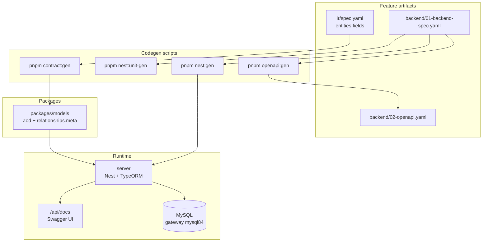

# Backend API — quick reference

> **R2/R3:** Product Code + architecture → [`base-docs`](../../base-docs/) · E2E plans → [`base-tests`](../../base-tests/) · gen: `pnpm portal:gen --id …` / `pnpm testcase:gen --id …` · [HUBS](./HUBS.md) / [DOCS-HUB](./DOCS-HUB.md) / [TESTS-HUB](./TESTS-HUB.md)


NestJS API in `server/` · TypeORM (MySQL) · CQRS · shared Zod via `@portal/models`.

---

## Stack diagram



---

## Local dev

### 1. Database (gateway)

```bash
# ~/gateway
make up-mysql
```

MySQL host trong Docker network: `mysql84` (portal `api-node` đã set `DB_*` mặc định).

### 2. API env

```bash
cp server/.env.example server/.env
# chỉnh DB_* nếu gateway khác mặc định
```

### 3. Codegen (pilot)

```bash
pnpm contract:gen --spec `base-docs` Product Code (prefer `--id`)
pnpm openapi:gen --spec `base-docs` Product Code (prefer `--id`)
pnpm nest:gen --spec `base-docs` Product Code (prefer `--id`) --force
pnpm nest:unit-gen --spec `base-docs` Product Code (prefer `--id`) --force
```

### 4. Run & verify

```bash
pnpm dev:api
pnpm --filter @portal/api test
```

- Health: `GET http://localhost:4000/api/health`
- Swagger: `http://localhost:4000/api/docs`
- Pilot CRUD: `GET|POST|PATCH|DELETE /api/sample-items`

---

## ORM choice

| `codegen.orm` | Entity output | Extra |
|---------------|---------------|-------|
| `typeorm` | `*.entity.ts` + decorators thật | `DatabaseModule` + `TypeOrmModule.forFeature` |
| `prisma` | stub entity + `prisma/models/*.prisma` (luôn gen từ fields + relationships.meta) | merge vào `server/prisma/schema.prisma` |

Relation wiring: đọc `packages/models/src/{entity}/*.relationships.meta.ts`.

---

## Scripts

| Lệnh | Output |
|------|--------|
| `pnpm contract:gen` | `@portal/models` Zod |
| `pnpm openapi:gen` | `backend/02-openapi.yaml` |
| `pnpm nest:gen` | `server/src/modules/...` |
| `pnpm nest:unit-gen` | `*.handler.spec.ts` (Jest) |
| `pnpm --filter @portal/api test` | API unit tests |

Chi tiết workflow AI: [TEAM-AI-BACKEND-WORKFLOW](./TEAM-AI-BACKEND-WORKFLOW.md) · [FEATURE-ARTIFACT-COMMANDS](./FEATURE-ARTIFACT-COMMANDS.md).

| Doc | Mục đích |
|-----|----------|
| [BACKEND-CODEGEN](./BACKEND-CODEGEN.md) | Hub script `contract:gen` · `nest:gen` · `nest:unit-gen` |
| [NEST-UNIT-PHASE-DIAGRAM](./NEST-UNIT-PHASE-DIAGRAM.md) | Jest lane chi tiết |
| [WIRE-PHASE-DIAGRAM](./WIRE-PHASE-DIAGRAM.md) | Sau API unit → integration |

---

## Common layer

| Laravel (legacy) | Nest (`server/src/common/`) |
|------------------|-------------------------------|
| ApiResponse trait | `http/api-response.*` |
| BaseQuery | `crud/base-read.query.ts` |
| BaseAction | `crud/base-write.handler.ts` |
| BaseResource | `crud/base-resource.ts` |
| BaseCriteria | `criteria/base-criteria.ts` |
| — | `persistence/typeorm-write.repository.ts` |

Layout module: [NEST-API-STRUCTURE](./NEST-API-STRUCTURE.md).
