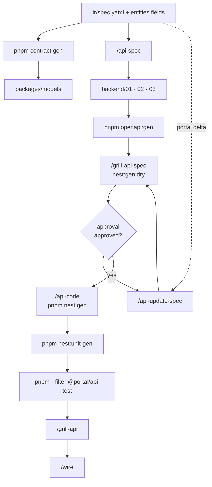
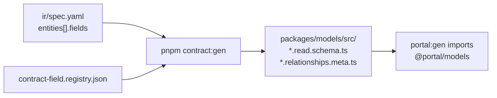
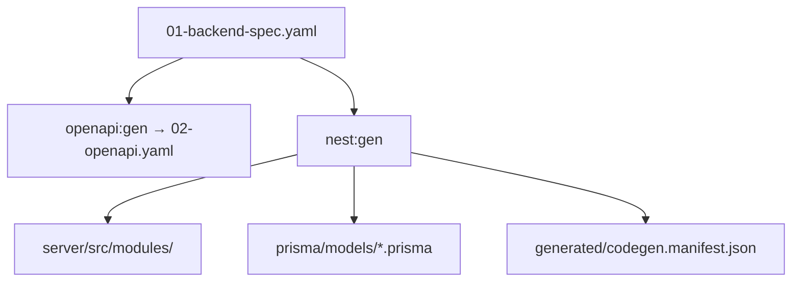

# Backend / API phase (Nest in-repo)

> **R2/R3:** Product Code + architecture → [`base-docs`](../..) · E2E plans → [`base-tests`](https://github.com/raintr91/base_test) · gen: `pnpm portal:gen --id …` / `pnpm testcase:gen --id …` · [HUBS](./HUBS.md) / [DOCS-HUB](./DOCS-HUB.md) / [TESTS-HUB](./TESTS-HUB.md)


> Hub: [BACKEND-CODEGEN](./BACKEND-CODEGEN.md) · [TEAM-AI-BACKEND-WORKFLOW](./TEAM-AI-BACKEND-WORKFLOW.md) · [FULL-CYCLE-PIPELINE-DIAGRAM](./FULL-CYCLE-PIPELINE-DIAGRAM)

Phase **2c API** — chạy **song song** portal scaffold (2a) và E2E prep (2b); converge tại **Wire** (phase 3).

---

## API cycle (tổng)



---

## Sub-lane: Contract (`contract:gen`)



Chi tiết field `kind`, scopes, relation: [CONTRACT-FIELD-REGISTRY](./CONTRACT-FIELD-REGISTRY.md).

---

## Sub-lane: Codegen (`nest:gen` + `openapi:gen`)



Cấu trúc module CQRS: [NEST-API-STRUCTURE](./NEST-API-STRUCTURE.md) · Laravel API git: [quickstart](https://github.com/raintr91/lara12/blob/v3/docs/operational/BACKEND-API-QUICKSTART.md).

---

## Sub-lane: API unit (Jest)

**Không gộp diagram này** — xem file riêng: [NEST-UNIT-PHASE-DIAGRAM](./NEST-UNIT-PHASE-DIAGRAM.md).

Tóm tắt: `nest:gen` → `nest:unit-gen` → `pnpm --filter @portal/api test` → `/grill-api` → `/wire`.

---

## Command chain

| Mục tiêu | Chuỗi |
|----------|--------|
| Contract Zod | dev-grill fill `entities.fields` → `pnpm contract:gen` |
| Feature backend mới | `/api-spec` → `openapi:gen` → `/grill-api-spec` → `/api-code` |
| Portal đổi spec | `/api-update-spec` → `/grill-api-spec` → … |
| API unit verify | `nest:unit-gen` → Jest green → `/grill-api` |

---

## Lệnh mẫu

```bash
pnpm contract:gen:dry --spec `base-docs` / `--id`
pnpm contract:gen --spec `base-docs` / `--id`
pnpm openapi:gen --spec `base-docs` / `--id`
pnpm nest:gen:dry --spec `base-docs` / `--id`
pnpm nest:gen --spec .../backend/01-backend-spec.yaml --force
pnpm nest:unit-gen --spec .../backend/01-backend-spec.yaml --force
pnpm --filter @portal/api test
pnpm dev:api
```

Pilot: ``base-docs` Product Code (prefer `--id`)`

---

## Liên kết

| Doc | Nội dung |
|-----|----------|
| [BACKEND-CODEGEN](./BACKEND-CODEGEN.md) | Hub script backend |
| [NEST-UNIT-PHASE-DIAGRAM](./NEST-UNIT-PHASE-DIAGRAM.md) | Jest lane chi tiết |
| [CONTRACT-FIELD-REGISTRY](./CONTRACT-FIELD-REGISTRY.md) | Field registry |
| [NEST-API-STRUCTURE](./NEST-API-STRUCTURE.md) | Common layer |
| [WIRE-PHASE-DIAGRAM](./WIRE-PHASE-DIAGRAM.md) | Sau `/api-code` |
| [Portal reference](https://github.com/raintr91/nuxt_4/blob/nuxt_v_3/docs/operational/PORTAL-CODEGEN.md) | `portal:gen` (FE, không models) |
| [UNIT-PHASE-DIAGRAM](./UNIT-PHASE-DIAGRAM.md) | Vitest portal (song song) |
| [TEST-PHASE-DIAGRAM](./TEST-PHASE-DIAGRAM.md) | E2E (song song) |

Legacy Laravel `<api-checkout>` — read-only reference khi port pattern.
