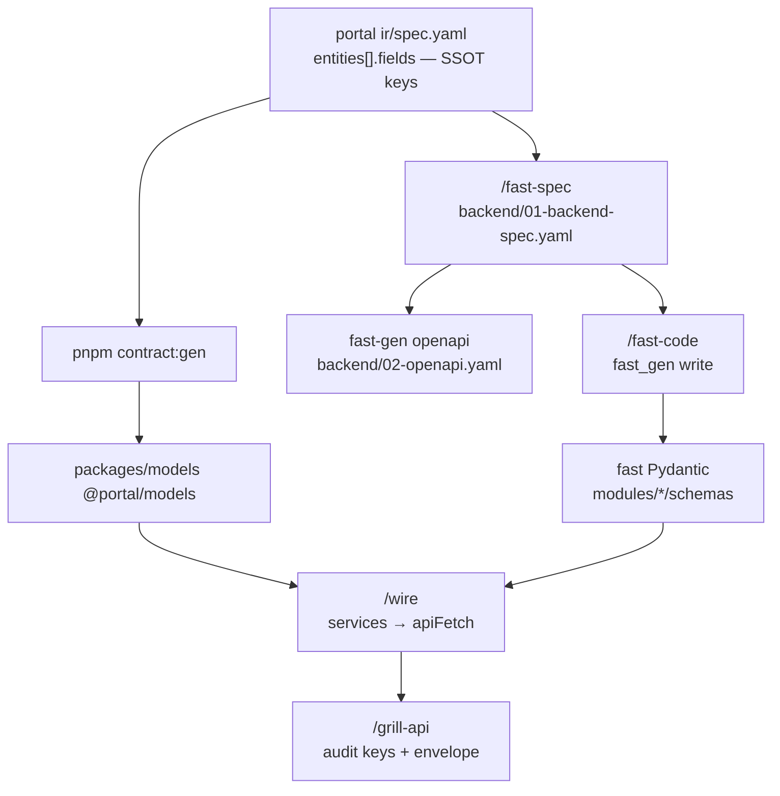

# Contract portal ↔ fast-api-base

> **R2/R3:** Product Code + architecture → [`base-docs`](../../base-docs/) · E2E plans → [`base-tests`](../../base-tests/) · gen: `pnpm portal:gen --id …` / `pnpm testcase:gen --id …` · [HUBS](./HUBS.md) / [DOCS-HUB](./DOCS-HUB.md) / [TESTS-HUB](./TESTS-HUB.md)


> Hub cho block **CONTRACT** trong [`fast-api-base-todo.txt`](../../fast-api-base-todo.txt) (dòng 195–200).  
> Rule: [portal-contract-naming](../../.cursor/rules/portal-contract-naming.mdc) · Repo split: [REPO-SPLIT-MAP](./REPO-SPLIT-MAP.md)

**Cập nhật:** 2026-07-09

---

## 1. Trạng thái từng mục (todo)

| Mục | Code / pilot | Doc / diagram | Ghi chú |
|-----|--------------|---------------|---------|
| **SSOT field keys** | ✅ `ir/spec.yaml` + pilots (`contract-pilot`, `knowledge-hub`) | [CONTRACT-FIELD-REGISTRY](./CONTRACT-FIELD-REGISTRY.md) | `kind: array` / relation — `contract:gen` cần registry đủ (citations pilot: dùng `knowledge-hub.schema.ts` tay) |
| **contract:gen → Zod** | ✅ `pnpm contract:gen` → `packages/models` | [BACKEND-CODEGEN](./BACKEND-CODEGEN.md) sub-lane Contract | HANDOFF: `{function}/generated/CONTRACT-HANDOFF.md` |
| **fast Pydantic / OpenAPI** | ✅ Pydantic stub modules; ⚠️ OpenAPI chỉ `contract-pilot` | `fast-api-base/docs/operational/FAST-API-STRUCTURE.md` · `FAST-CODEGEN.md` | `fast-gen openapi` → `backend/02-openapi.yaml` — chưa chạy cho `knowledge-hub` |
| **Envelope** | ✅ `api_response.success/error` ↔ `assertApiSuccess` + `parseApiData` | fast FAST-API-STRUCTURE § Envelope · [WIRE-PHASE-DIAGRAM](./WIRE-PHASE-DIAGRAM.md) `/grill-api` | FE type gọn hơn BE (`code`, `trace_id` optional phía FE) |
| **List `{ items, total }`** | ✅ `PaginatedResult` + `SampleItemListResponseSchema` | Chưa E2E list qua fast (sample-items mock) | `meta.pagination` có helper `to_envelope_meta()` — dùng khi cần |
| **Auth cookie/header** | ⚠️ Stub: `auth_token` cookie → `Bearer` · fast `get_current_user` stub | [PAGE-LIFECYCLE](./PAGE-LIFECYCLE.md) `wire` | Chưa JWT thật / refresh — đủ cho pilot E2E |

---

## 2. Luồng contract (diagram)



| Phase | Doc diagram |
|-------|-------------|
| Contract Zod | [BACKEND-PHASE-DIAGRAM](./BACKEND-PHASE-DIAGRAM.md) sub-lane Contract |
| Fast backend | `fast-api-base/docs/operational/FAST-BACKEND-PHASE-DIAGRAM.md` |
| Wire + audit | [WIRE-PHASE-DIAGRAM](./WIRE-PHASE-DIAGRAM.md) |
| Full stack | [factory-ai-stack](./factory-ai-stack.md) |

---

## 3. Envelope (đã align pilot)

**Fast** (`src/app/common/http/api_response.py`):

```json
{
  "success": true,
  "code": 200,
  "message": "Success",
  "data": { },
  "meta": null
}
```

**Portal** (`src/services/shared/api-response.ts`):

- `assertApiSuccess(res)` — `success === true`
- `parseApiData(schema, res.data)` — Zod parse `data`

Global prefix: **`/api`** — `NEXT_PUBLIC_API_URL` + `api-client.ts`.

---

## 4. List & pagination

| Shape | Fast | Portal Zod |
|-------|------|------------|
| Inline list | `data: { items, total }` | `*ListResponseSchema` (`items`, `total?`) |
| Meta pagination | `meta.pagination` via `PaginatedResult.to_envelope_meta()` | `ApiSuccess.meta` (optional) |

Search list pilot: `contract-pilot` / `sample-items` — FE schema có; wire list endpoint fast chưa E2E.

---

## 5. Auth (stub — chưa production)

| Tầng | Hiện tại |
|------|----------|
| Portal middleware | Cookie `auth_token` → redirect nếu thiếu (lifecycle `wire`) |
| `apiFetch` | `Authorization: Bearer <token>` từ cookie |
| Fast `Depends` | `get_current_user` — Bearer stub → `CurrentUser` |

Gate production: JWT issuer, refresh, `require_user` trên route nhạy cảm — **chưa** trong todo CONTRACT.

---

## 6. Hashtag / tech tags (spec)

| Tag | Doc | Ý nghĩa |
|-----|-----|---------|
| `#needs-component:*` | [NEEDS-COMPONENT-FLOW](./NEEDS-COMPONENT-FLOW.md) | Thiếu Mo/Data* trước gen |
| `#wire-only:*` | NEEDS-COMPONENT-FLOW · knowledge-hub `#wire-only: network` | Prototype mock; thật ở `/wire` |
| `#shell:` · `#widget:` | [DESIGN-REGISTRY-PROMOTION](./DESIGN-REGISTRY-PROMOTION.md) | Design registry |

**Chưa có** tag chuẩn trong spec cho MES/CMMS/LLM — mô tả ở `factory-ai-stack` + fast `clients/` (xem §7).

---

## 7. Gọi dịch vụ bên thứ 3 (fast)

OT / external **không** gọi từ portal — chỉ **fast-api-base**:

| Client | Path | Trạng thái |
|--------|------|------------|
| MES | `src/app/clients/mes_client.py` | Stub + mock fallback |
| CMMS | `src/app/clients/cmms_client.py` | Stub |
| LLM / RAG | `src/app/clients/llm_client.py` | Stub |
| Integration gateway | `factory-ai-stack` § OT | Phase sau (`~/workspace/integration`) |

Env: `MES_BASE_URL`, `CMMS_BASE_URL`, … trong fast `.env.example`.

---

## 8. OpenAPI artifact

| Bước | Lệnh |
|------|------|
| Sau `01-backend-spec.yaml` | `cd fast-api-base && PYTHONPATH=tools:src python -m fast_gen.cli openapi --spec <portal>/`docs/features/` (stub only — SSOT on hubs) / .../backend/01-backend-spec.yaml` |
| Output | `backend/02-openapi.yaml` cạnh spec (portal yaml tree) |
| Pilot có file | `_example/contract-pilot/backend/02-openapi.yaml` |
| Pilot thiếu file | `factory/knowledge-hub` — **chưa** export |

Dùng sau cho line-base NSwag / audit contract — không bắt buộc cho wire pilot query-only.

---

## 9. Lệnh verify nhanh

```bash
# Envelope
curl -s http://127.0.0.1:4000/api/health | jq .

# Knowledge hub contract end-to-end
cd ~/workspace/portal && pnpm test:e2e tests/e2e/factory/knowledge-hub.spec.ts

# Contract gen
pnpm contract:gen --spec `base-docs` Product Code (prefer `--id`)
```

---

## 10. Việc còn lại (production)

1. Auth JWT thật (portal + fast) — stub đủ pilot
2. `contract:gen` — `plant_id` nullable optional trên write schema (registry/template)
3. Cập nhật [BACKEND-PHASE-DIAGRAM](./BACKEND-PHASE-DIAGRAM.md) body Nest → fast
