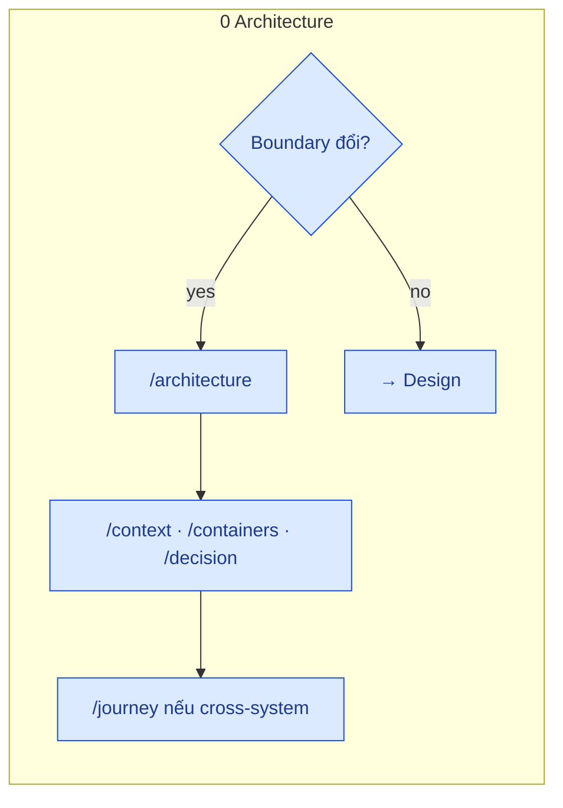
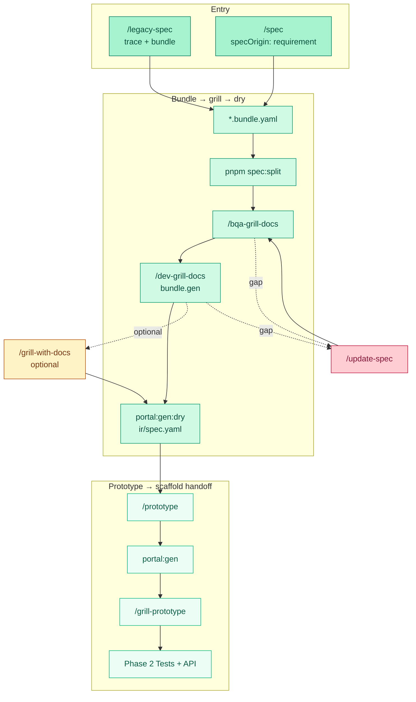

# Design phase — Pipeline cycle

> Chi tiết **Phase 1** · Overview màu: [FULL-CYCLE-PIPELINE-DIAGRAM](./FULL-CYCLE-PIPELINE-DIAGRAM.md) · Hub: [Toolchain index](./index.md)

Diagram tách nhỏ: [FEATURE-ARTIFACT-GRILL](./FEATURE-ARTIFACT-GRILL.md) · [FEATURE-ARTIFACT-BUNDLE-IR](./FEATURE-ARTIFACT-BUNDLE-IR.md)

Gam màu Design = **emerald** (khớp full-cycle). Architecture gate = **blue** (Phase 0).

---

## Architecture gate (Phase 0 — trước Design khi cần)

Chỉ khi **group / module boundary**, CTX/CTR mới, hoặc integrate hệ mới. Skip nếu CMP đã map `CTR-*`.

Skills: `/architecture` · `/hubdocs` (optional validate IDs). Journeys: `architecture/06-runtime/journeys/FLOW-*`.

---

## Design cycle (Phase 1)

Tint trong gam emerald: **Entry** đậm hơn · **Core** giữa · **Out** nhạt hơn · optional grill-with = amber (không phải bước default) · gap = rose.

---

## Ma trận lệnh

| Lệnh | Artifact |
|------|----------|
| `/architecture` … (Phase 0) | `architecture/**` CTX/CTR/ADR/`FLOW-*` — không bundle Code |
| `/legacy-spec` | `base-docs/product/legacy-dynamics/…/_legacy.dynamics.yaml` + Code bundle.legacy |
| `/spec` | bundle design v1, `specOrigin: requirement` |
| `/bqa-grill-docs` | design vs legacy ui vs common |
| `/dev-grill-docs` | `bundle.gen` → ir/spec codegen |
| `/grill-with-docs` | Reconcile — **không** default |
| `/prototype` | Chỉ đọc `ir/spec.yaml` |
| `pnpm docs:render` | bundle → `md/` |

## Lệnh script (design phase)

Xem [FEATURE-ARTIFACT-COMMANDS](./FEATURE-ARTIFACT-COMMANDS.md).

## Tag & gap (phase này)

| Doc | Khi nào đọc |
|-----|----------------|
| [TECH-DEBT-FLOW](./TECH-DEBT-FLOW.md) | Grill defer câu hỏi → `#tech-debt:{id}` · step 0 mỗi grill |
| [UPDATE-SPEC-FLOW](./UPDATE-SPEC-FLOW.md) | Gap sau grill/prototype → `#update:*` |
| [FEATURE-ARTIFACT-GRILL](./FEATURE-ARTIFACT-GRILL.md) | Chuỗi bqa → dev → dry |

Grill step 0 (nhẹ): CMP gắn `CTR-*` nào? Missing → Phase 0 `/containers` · `/component`, không bịa hierarchy trong bqa.

Sau `portal:gen:dry` pass → [Portal reference](https://github.com/raintr91/nuxt_4/blob/nuxt_v_3/docs/operational/PORTAL-CODEGEN.md) · [NEEDS-COMPONENT-FLOW](./NEEDS-COMPONENT-FLOW.md) (`#needs-component` trong `/prototype`).
