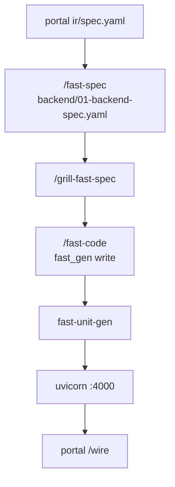

# Fast backend phase diagram

| Phase | Skill | Output |
|-------|-------|--------|
| Contract | portal `/contract` | `packages/models` |
| Backend spec | `/fast-spec` | `backend/01-backend-spec.yaml` |
| Audit | `/grill-fast-spec` | approval on spec |
| Code | `/fast-code` | `src/app/modules/*` |
| Test | pytest | `tests/` |
| Wire | portal `/wire` | FE services → fast |

Hub: [TEAM-AI-BACKEND-WORKFLOW.md](./TEAM-AI-BACKEND-WORKFLOW.md)
