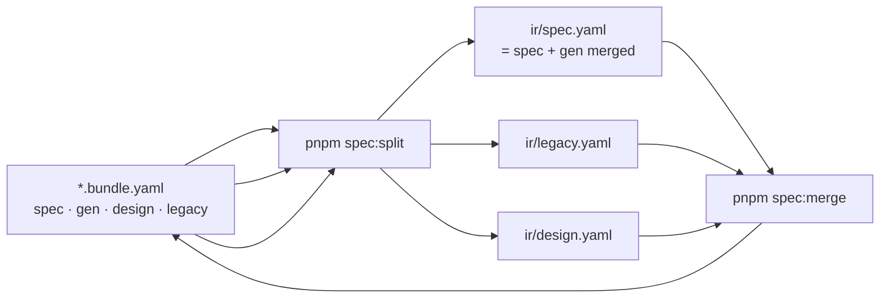

# Bundle ↔ IR split

> Một diagram · [FEATURE-ARTIFACT-FLOWS](./FEATURE-ARTIFACT-FLOWS.md)

## spec vs gen (authoring)

| Section | Chứa | Ai sửa |
|---------|------|--------|
| `bundle.spec` | Design v1: actors, requirements, `ui.routes`, `api`, `acceptance` | `/spec`, `/legacy-spec`, `/bqa-grill-docs` |
| `bundle.gen` | `codegen`, `tags`, `ui.filters/columns/...` | `/dev-grill-docs` |
| `bundle.design` | zones, behavior, actions | BQA + spec |
| `bundle.legacy` | behaviors, fields, evidence | `/legacy-spec` |
| `bundle.review` | Prose BA — **không** split sang ir | BQA |

## Quy tắc edit thủ công

**Sửa tay → sửa bản `*.bundle.yaml`, sau đó re-split.** Không sửa tay `ir/*`.

- `spec:split` luôn **ghi đè** `ir/spec.yaml`, `ir/legacy.yaml`, `ir/design.yaml` từ bundle (không merge). Nên mọi edit tay trên `ir/*` sẽ bị mất khi re-split, trừ khi đã `spec:merge` ngược lại bundle.
- Quy trình khuyên dùng:
  1. Sửa trực tiếp section tương ứng trong `*.bundle.yaml` (vd `spec`, `gen`, `design`, `legacy`).
  2. `pnpm spec:split -- <bundle.yaml>` (hoặc `pnpm spec:split:all` quét toàn bộ) để tái sinh `ir/*`.
- `ir/*` chỉ được sửa bởi **công cụ grill** (`/dev-grill-docs`, `/bqa-grill-docs`) — sau đó chạy `pnpm spec:merge` đẩy ngược `gen`/tags về bundle. Giữa grill và merge **không** re-split.

## Bundlekit aliases

| Lệnh | Mục đích |
|------|----------|
| `pnpm spec:split -- <bundle.yaml>` | bundle → `ir/*` |
| `pnpm spec:merge -- <bundle.yaml>` | `ir/*` → bundle (sau dev-grill sửa ir/spec) |
| `pnpm spec:split:check -- <bundle.yaml>` | CI: ir sync bundle |
| `pnpm spec:normalize-gen -- <bundle.yaml> --write` | Tách codegen ra `gen` từ spec cũ |

Bundlekit init generates local templates under `templates/`.
