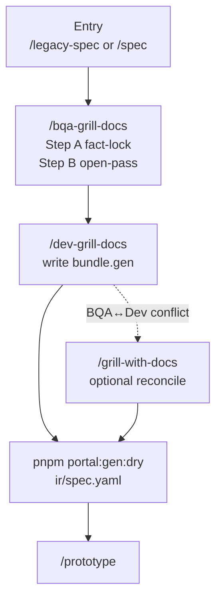

# Grill — Spec Validation + Decision Resolution

> Một diagram · [Toolchain index](./index.md)

## Load policy (tóm tắt)

| Phase | Load | Không load |
|-------|------|------------|
| bqa-grill | `ir/design`, `ir/legacy` ui slice, common bundles, `review` | legacy source, `ir/spec` codegen |
| dev-grill | design + legacy behaviors, write `gen` | legacy source, models/ |
| grill-with-docs | bundle + ir reconcile | archaeology lại |

## grillStatus

| Field | Set bởi |
|-------|---------|
| `bqaFacts` | sau fact-lock |
| `bqaOpen` | sau open-pass |
| `dev` | sau `portal:gen:dry` pass |

Mindset: **không** hỏi "legacy đang làm gì?" — đã có IR.

Extract: `grill/validation.md` · Skills: `bqa-grill-docs`, `dev-grill-docs`, `grill-with-docs`

## Liên kết (cùng phase)

| Doc | Nội dung |
|-----|----------|
| [TECH-DEBT-FLOW](./TECH-DEBT-FLOW.md) | `#tech-debt:{id}` · `openQuestions.deferTo` |
| [UPDATE-SPEC-FLOW](./UPDATE-SPEC-FLOW.md) | `#update:*` khi gap spec |
| [DESIGN-PHASE-DIAGRAM](./DESIGN-PHASE-DIAGRAM.md) | Toàn cycle design → prototype |
| [Portal reference](https://github.com/raintr91/nuxt_4/blob/nuxt_v_3/docs/operational/PORTAL-CODEGEN.md) | Gate sau `portal:gen:dry` |
| [NEEDS-COMPONENT-FLOW](./NEEDS-COMPONENT-FLOW.md) | `#needs-component` · `#wire-only` |
