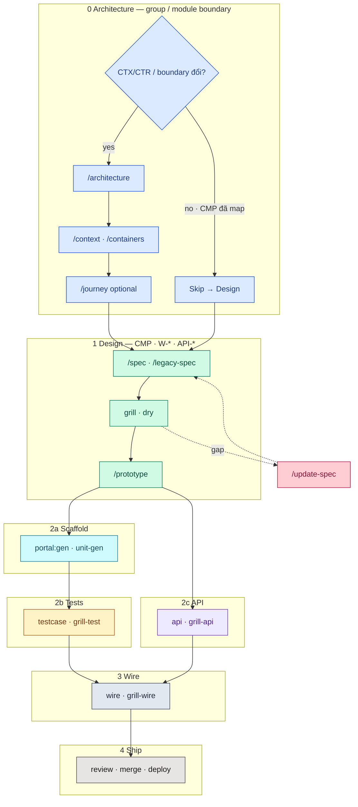

# Full cycle pipeline — Tổng quan

> Overview **một concern** · Detail từng phase → file riêng ([FEATURE-ARTIFACT-FLOWS](./FEATURE-ARTIFACT-FLOWS.md)).
> Mermaid: subgraph = phase (gam màu) · node trong phase = tint nhạt cùng hue. Zoom: `vitepress-mermaid-renderer`.

---

## Palette (cố định)

| Phase | Hue | Subgraph / accent | Node tint |
|-------|-----|-------------------|-----------|
| **0** Architecture | Blue | `#93C5FD` / stroke `#1D4ED8` | `#DBEAFE` |
| **1** Design | Emerald | `#6EE7B7` / `#047857` | `#D1FAE5` |
| **2a** Scaffold | Cyan | `#67E8F9` / `#0E7490` | `#CFFAFE` |
| **2b** Tests | Amber | `#FCD34D` / `#B45309` | `#FEF3C7` |
| **2c** API | Violet | `#C4B5FD` / `#6D28D9` | `#EDE9FE` |
| **3** Wire | Slate | `#94A3B8` / `#334155` | `#E2E8F0` |
| **4** Ship | Stone | `#A8A29E` / `#44403C` | `#E7E5E4` |
| Gap (`/update-spec`) | Rose | — | `#FECDD3` |

---

## Toàn flow (Phase 0 + 1…4)



Detail Design (node trong gam emerald): [DESIGN-PHASE-DIAGRAM](./DESIGN-PHASE-DIAGRAM).

---

## Phase map

| Phase | Đại diện | Detail |
|-------|----------|--------|
| **0** Architecture | Boundary group/module+ · CTX/CTR · curated `FLOW-*` | Skills `/architecture` … `/journey` · [HUBDOCS](./HUBDOCS) |
| 1 Design | bundle yaml → ir/spec → prototype | [DESIGN-PHASE-DIAGRAM](./DESIGN-PHASE-DIAGRAM) · [FEATURE-ARTIFACT-FLOWS](./FEATURE-ARTIFACT-FLOWS) |
| 2a Scaffold | `portal:gen` · `portal:unit-gen` · HANDOFF / manifests | [Portal reference](https://github.com/raintr91/nuxt_4/blob/nuxt_v_3/docs/operational/PORTAL-CODEGEN.md) |
| 2b Tests | `*.test.yaml` · `testcase:gen` · grill-test | [TEST-PHASE-DIAGRAM](./TEST-PHASE-DIAGRAM) |
| 2c API | api-spec · grill-api · api-code | [BACKEND-PHASE-DIAGRAM](./BACKEND-PHASE-DIAGRAM) |
| 3 Wire | wire · grill-wire | [WIRE-PHASE-DIAGRAM](./WIRE-PHASE-DIAGRAM) |
| 4 Ship | review · merge · deploy | — |

**Skip Phase 0** khi chỉ sửa screen/API trong CMP đã gắn `CTR-*`.

## Feature artifact (tách file)

| Diagram | File |
|---------|------|
| Layout yaml/md | [FEATURE-ARTIFACT-LAYOUT](./FEATURE-ARTIFACT-LAYOUT) |
| Bundle ↔ IR | [FEATURE-ARTIFACT-BUNDLE-IR](./FEATURE-ARTIFACT-BUNDLE-IR) |
| Legacy dynamics | [FEATURE-ARTIFACT-LEGACY-DYNAMICS](./FEATURE-ARTIFACT-LEGACY-DYNAMICS) |
| Grill | [FEATURE-ARTIFACT-GRILL](./FEATURE-ARTIFACT-GRILL) |
| Lệnh script | [FEATURE-ARTIFACT-COMMANDS](./FEATURE-ARTIFACT-COMMANDS) |

## Gap loop

[UPDATE-SPEC-FLOW](./UPDATE-SPEC-FLOW) · [TECH-DEBT-FLOW](./TECH-DEBT-FLOW) · [NEEDS-COMPONENT-FLOW](./NEEDS-COMPONENT-FLOW) · [NEEDS-TEST-FLOW](./NEEDS-TEST-FLOW) · [NEEDS-UNIT-FLOW](./NEEDS-UNIT-FLOW)

## Related docs

| Doc | Nội dung |
|-----|----------|
| [TEST-PHASE-DIAGRAM](./TEST-PHASE-DIAGRAM.md) | E2E lane · testcase:gen · grill-test |
| [UNIT-PHASE-DIAGRAM](./UNIT-PHASE-DIAGRAM.md) | Vitest lane · portal:unit-gen |
| [Portal reference](https://github.com/raintr91/nuxt_4/blob/nuxt_v_3/docs/operational/PORTAL-CODEGEN.md) | portal:gen + portal:unit-gen |
| [Portal unit-gen roadmap](https://github.com/raintr91/nuxt_4/blob/nuxt_v_3/docs/operational/PORTAL-UNIT-GEN-ROADMAP.md) | Roadmap smoke / registry / PRs |
| [DESIGN-PHASE-DIAGRAM](./DESIGN-PHASE-DIAGRAM.md) | Spec → grill → prototype (+ Architecture gate) |
| [BACKEND-PHASE-DIAGRAM](./BACKEND-PHASE-DIAGRAM.md) | API repo |
| [WIRE-PHASE-DIAGRAM](./WIRE-PHASE-DIAGRAM.md) | Integration |

```bash
pnpm docs:dev
```

Mở: `/platform/toolchain/FULL-CYCLE-PIPELINE-DIAGRAM` · thử zoom Mermaid.
