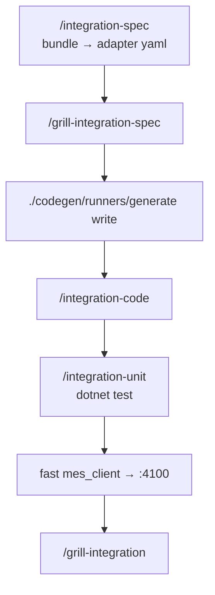

# Integration phase diagram

```mermaid
flowchart TD
  SPEC["/integration-spec\nbundle → adapter yaml"]
  GSPEC["/grill-integration-spec"]
  GEN["./codegen/runners/generate write"]
  CODE["/integration-code"]
  UNIT["/integration-unit\ndotnet test"]
  WIRE["fast mes_client → :4100"]
  GRILL["/grill-integration"]

  SPEC --> GSPEC --> GEN --> CODE --> UNIT --> WIRE --> GRILL
```

Hub: [TEAM-AI-INTEGRATION-WORKFLOW](./TEAM-AI-INTEGRATION-WORKFLOW.md)
