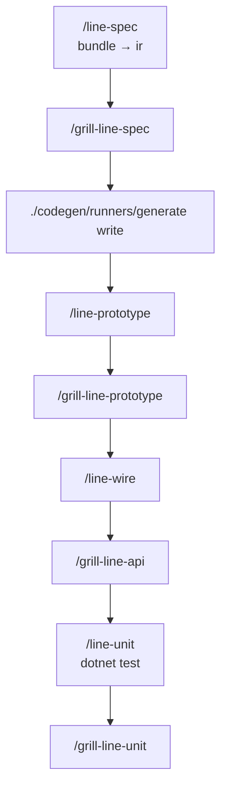

# Line phase diagram

```mermaid
flowchart TD
  SPEC["/line-spec\nbundle → ir"]
  GSPEC["/grill-line-spec"]
  GEN["./codegen/runners/generate write"]
  PROTO["/line-prototype"]
  GPROTO["/grill-line-prototype"]
  WIRE["/line-wire"]
  GAPI["/grill-line-api"]
  UNIT["/line-unit\ndotnet test"]
  GUNIT["/grill-line-unit"]

  SPEC --> GSPEC --> GEN --> PROTO --> GPROTO --> WIRE --> GAPI --> UNIT --> GUNIT
```

Hub: [TEAM-AI-LINE-WORKFLOW](./TEAM-AI-LINE-WORKFLOW.md)
