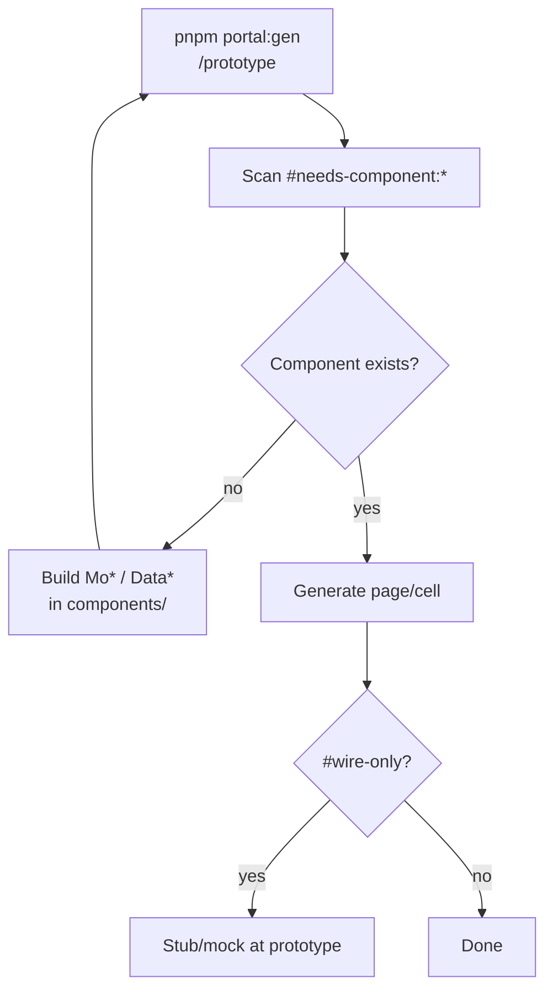

# Needs component flow



## Tag format

```
#needs-component:{cell-key}:MoXxx:label
```

Example: `#needs-component:cell-status:MoStatusBadge:Status`

## Related tags

| Tag | Meaning |
|-----|---------|
| `#needs-component:*` | Missing molecule/organism — build before re-gen |
| `#custom-slot:*` | Non-standard cell renderer |
| `#wire-only:*` | Defer real implementation to `/wire` |

## Flow

1. Dev grill adds `#needs-component` tags during `/dev-grill-docs`.
2. `/prototype` or `pnpm portal:gen` scans tags and reports missing components.
3. Developer builds `Mo*` / `Data*` in `components/molecules/` or `components/organisms/`.
4. Re-run `pnpm portal:gen` until no unresolved `#needs-component` tags remain.

See [Portal codegen (gen + unit)](./PORTAL-CODEGEN.md) · `.cursor/extracts/codegen/tags.md`

## Liên kết (cùng phase)

| Doc | Nội dung |
|-----|----------|
| [PORTAL-CODEGEN](./PORTAL-CODEGEN.md) | `portal:gen` scan tags · HANDOFF |
| [DESIGN-REGISTRY-PROMOTION](./DESIGN-REGISTRY-PROMOTION.md) | `#shell:` · `#widget:` promote |
| [DESIGN-PHASE-DIAGRAM](./DESIGN-PHASE-DIAGRAM.md) | `/prototype` trong design cycle |
