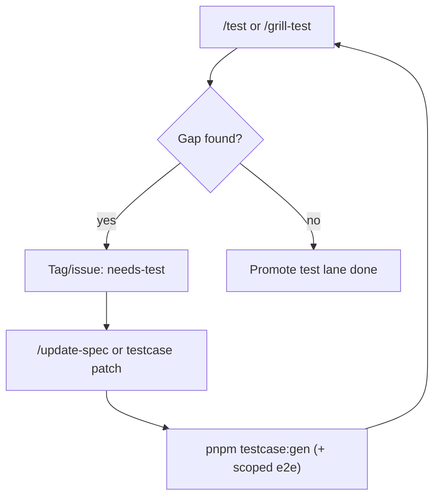

# Needs test flow

## Khi nào dùng

- Thiếu testcase file hoặc testcase không cover acceptance quan trọng.
- Thiếu `data-testid` khiến PO/spec E2E không gen được ổn định.
- Mismatch spec ↔ testcase ↔ generated Playwright skeleton.

## Hành động chuẩn

1. Ghi rõ gap ở session `/grill-test` (không loop mù).
2. Patch spec/testcase qua `/update-spec`.
3. Re-gen scoped bằng `pnpm testcase:gen` và chạy `pnpm test:e2e` scoped.
4. Grill lại; pass thì chốt phase test.

## Liên kết

| Doc | Nội dung |
|-----|----------|
| [TEST-PHASE-DIAGRAM](./TEST-PHASE-DIAGRAM.md) | E2E lane chi tiết |
| [UPDATE-SPEC-FLOW](./UPDATE-SPEC-FLOW.md) | Gap loop chuẩn |
| [E2E-TESTIDS](./E2E-TESTIDS.md) | Contract `data-testid` |
