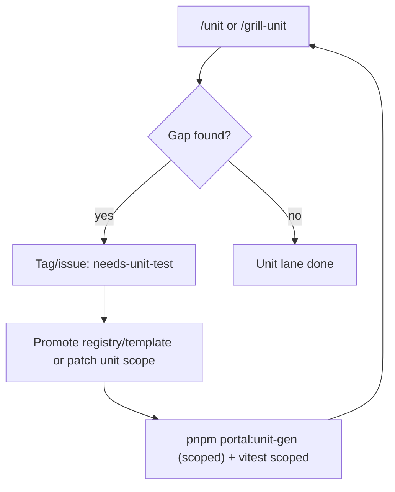

# Needs unit flow

## Khi nào dùng

- `needsUnit[]` còn debt trong manifest/HANDOFF.
- Thiếu file unit ở layer logic (schema/service/composable/store action).
- Coverage/reqIds audit fail ở `/grill-unit`.

## Hành động chuẩn

1. Ghi gap rõ trong `/grill-unit` (không chạy full regen mặc định).
2. Nếu là pattern chung: promote registry + template.
3. Re-gen scoped bằng `pnpm portal:unit-gen` và chạy vitest scoped.
4. Grill lại; pass thì chốt unit lane.

## Liên kết

| Doc | Nội dung |
|-----|----------|
| [UNIT-PHASE-DIAGRAM](./UNIT-PHASE-DIAGRAM.md) | Unit lane chi tiết |
| [UNIT-REGISTRY-PROMOTION](./UNIT-REGISTRY-PROMOTION.md) | Promote pattern/tag |
| [PORTAL-UNIT-GEN-ROADMAP](./PORTAL-UNIT-GEN-ROADMAP.md) | Roadmap + pattern status |
