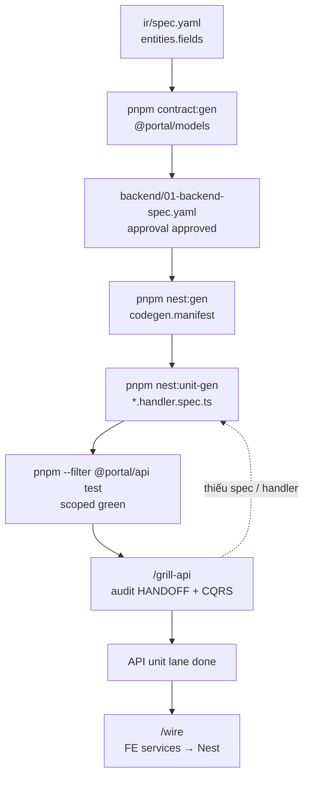
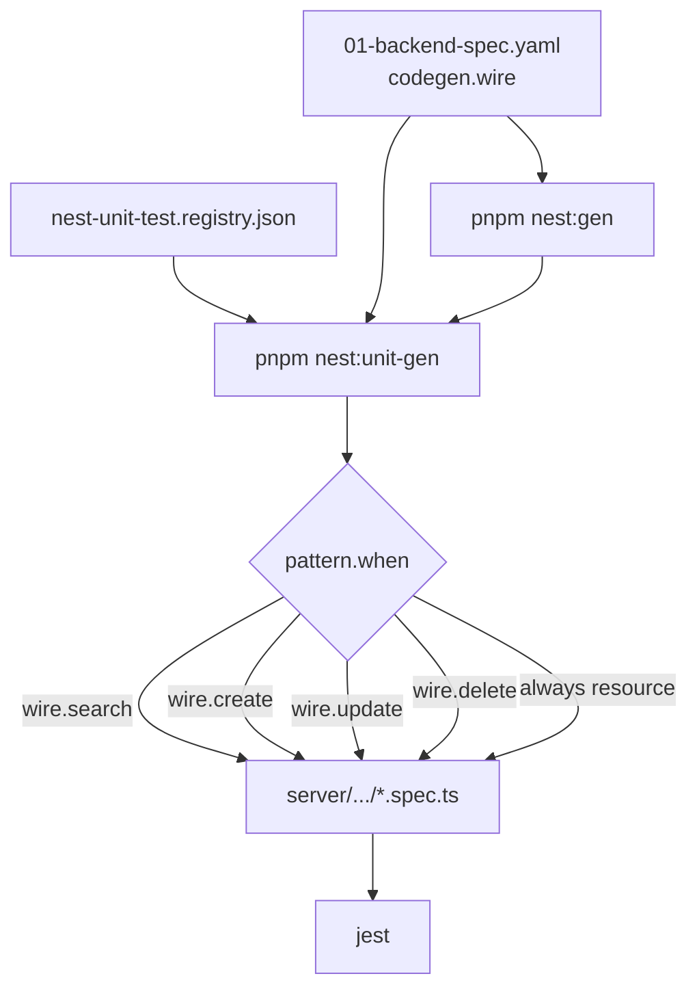

# API unit phase — Dev lane (Jest / Nest)

> **R2/R3:** Product Code + architecture → [`base-docs`](../../base-docs/) · E2E plans → [`base-tests`](../../base-tests/) · gen: `pnpm portal:gen --id …` / `pnpm testcase:gen --id …` · [HUBS](./HUBS.md) / [DOCS-HUB](./DOCS-HUB.md) / [TESTS-HUB](./TESTS-HUB.md)


> **Dev-only** — lane Jest cho `server`, **độc lập** Vitest portal ([UNIT-PHASE-DIAGRAM](./UNIT-PHASE-DIAGRAM.md)) và E2E ([TEST-PHASE-DIAGRAM](./TEST-PHASE-DIAGRAM.md)).  
> Nằm trong phase **2c API** — [BACKEND-PHASE-DIAGRAM](./BACKEND-PHASE-DIAGRAM.md) · [FULL-CYCLE-PIPELINE-DIAGRAM](./FULL-CYCLE-PIPELINE-DIAGRAM).  
> Hub codegen: [BACKEND-CODEGEN](./BACKEND-CODEGEN.md) · Skills: `/api-code` (sau grill) · verify Jest trong HANDOFF

Trạng thái codegen API unit (portal repo):

| PR | Tên | Trạng thái | Deliverable |
|----|-----|------------|-------------|
| **API-U1** | `nest:unit-gen` scaffold | ✅ Done | Handler/resource `*.spec.ts` từ `nest-unit-test.registry.json` |
| **API-U2** | Mock `getRepositoryToken` | ✅ Done | Search + create/update/delete handler specs |
| **API-U3** | `/grill-api` Jest audit | ⬜ Planned | Coverage + CQRS wiring checklist (skill extract) |
| **API-U4** | E2E against Nest | ⬜ Planned | Playwright hit `localhost:4000` sau `/wire` |

---

## API unit lane (flow chính)

Chỉ luồng `backend/01-backend-spec.yaml` → Jest — **không** gộp Vitest portal, **không** loop grill săn 100%.



| Bước | Ai | Việc |
|------|-----|------|
| `contract:gen` | script | Zod + `*.relationships.meta.ts` — prerequisite models |
| `nest:gen` | script | CQRS module + TypeORM entity + `codegen.manifest.json` |
| `nest:unit-gen` | script | Jest specs theo `codegen.wire` (search/create/update/delete) |
| **`pnpm --filter @portal/api test`** | dev | Handler/resource **green** scoped |
| **`/grill-api`** | dev + AI | Audit manifest, repository wiring TODO, không regen hàng loạt |
| **`/wire`** | dev | FE `services/` trỏ Nest thật — [WIRE-PHASE-DIAGRAM](./WIRE-PHASE-DIAGRAM.md) |

**`/grill-api` không loop** đến khi 100% coverage: pass audit → sang wire; gap → bảng đề xuất; chỉ quay `nest:unit-gen` khi thiếu **file** spec.

---

## Registry & `codegen.wire`

Theo `nest-unitgen/runners/` + `registries/nest-unit-test.registry.json`.



| Pattern | `when` | Output |
|---------|--------|--------|
| `searchHandler` | `wire.search` | `queries/search-{entity}.handler.spec.ts` |
| `createHandler` | `wire.create` | `commands/create-{entity}.handler.spec.ts` |
| `updateHandler` | `wire.update` | `commands/update-{entity}.handler.spec.ts` |
| `deleteHandler` | `wire.delete` | `commands/delete-{entity}.handler.spec.ts` |
| `resource` | `always` | `{entity}.resource.spec.ts` |

Mock chuẩn: `getRepositoryToken(Entity)` + `Test.createTestingModule` — không hit MySQL trong unit lane.

---

## 1 source logic → 1 file test

| Source (`server/src/modules/…`) | Test |
|-----------------------------------|------|
| `queries/search-{entity}.handler.ts` | `queries/search-{entity}.handler.spec.ts` |
| `commands/create-{entity}.handler.ts` | `commands/create-{entity}.handler.spec.ts` |
| `commands/update-{entity}.handler.ts` | `commands/update-{entity}.handler.spec.ts` |
| `commands/delete-{entity}.handler.ts` | `commands/delete-{entity}.handler.spec.ts` |
| `{entity}.resource.ts` | `{entity}.resource.spec.ts` |

Contract Zod (`@portal/models`) — test riêng qua Vitest portal `tests/unit/models/` sau `contract:gen`, **không** duplicate trong Jest.

---

## Đọc gì / không đọc gì (sau `nest:gen`)

| Đọc | Không đọc |
|-----|-----------|
| `generated/codegen.manifest.json`, `HANDOFF.md` | Toàn bộ `server` inventory |
| `backend/01-backend-spec.yaml` `codegen.wire` | FE `pages/` |
| Handler/resource file vừa gen | Laravel `~/workspace/api` runtime |

---

## Lệnh mẫu (pilot)

```bash
pnpm contract:gen --spec `base-docs` Product Code (prefer `--id`)
pnpm nest:gen --spec `base-docs` Product Code (prefer `--id`) --force
pnpm nest:unit-gen --spec `base-docs` Product Code (prefer `--id`) --force

pnpm --filter @portal/api test
pnpm --filter @portal/api test -- --testPathPattern=sample-item
```

---

## Liên kết

| Doc | Mục đích |
|-----|----------|
| [BACKEND-CODEGEN](./BACKEND-CODEGEN.md) | `nest:gen` + `nest:unit-gen` hub |
| [BACKEND-PHASE-DIAGRAM](./BACKEND-PHASE-DIAGRAM.md) | API cycle tổng |
| [TEAM-AI-BACKEND-WORKFLOW](./TEAM-AI-BACKEND-WORKFLOW.md) | Skills `/api-spec` … `/api-code` |
| [NEST-API-STRUCTURE](./NEST-API-STRUCTURE.md) | Common layer CQRS |
| [UNIT-PHASE-DIAGRAM](./UNIT-PHASE-DIAGRAM.md) | Vitest portal (song song) |
| [WIRE-PHASE-DIAGRAM](./WIRE-PHASE-DIAGRAM.md) | Sau API unit xong |
| `.cursor/skills/api-code/SKILL.md` | `/api-code` |
