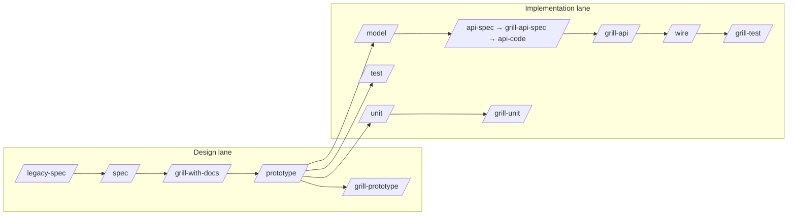

# Prompt Templates — Team AI Flow

> **R2/R3:** Product Code + architecture → [`base-docs`](../../base-docs/) · E2E plans → [`base-tests`](../../base-tests/) · gen: `pnpm portal:gen --id …` / `pnpm testcase:gen --id …` · [HUBS](./HUBS.md) / [DOCS-HUB](./DOCS-HUB.md) / [TESTS-HUB](./TESTS-HUB.md)


> Copy/paste vào Cursor Agent. Thay placeholder `{...}`. Chi tiết command: [`FEATURE-ARTIFACT-FLOWS.md`](FEATURE-ARTIFACT-FLOWS.md) · Skills: `.cursor/skills/`

**Quy tắc:** một session = một command · chat mới khi đổi phase · cập nhật `.harness/progress.md` trước khi đóng session.

---

## Sơ đồ lane



**Placeholder thường dùng**

| Placeholder | Ví dụ |
|-------------|-------|
| `{slug}` | `admin-hotel-list` |
| `{role}` | `admin` |
| `{page}` | `hotel` |
| `{function}` | `list`, `create`, `update` |
| Spec path | `base-docs` Product Code (prefer `--id`) |
| Testcase path | base-docs Product Code /  {role}/{page}/{slug}.test.yaml` |

---

## Block chung (dán đầu mọi prompt — tùy chọn)

```text
Một session = một command. Chỉ làm đúng scope command này.

Feature slug: {admin-hotel-list}
Spec: `base-docs` Product Code (prefer `--id`)
Testcase: base-docs Product Code /  {role}/{page}/{slug}.test.yaml

Ràng buộc:
- Tuân agent-discipline: sửa tối thiểu, không refactor ngoài scope
- Contract naming: giữ nguyên key API/model, không đổi tên tiện FE
- Docs/handoff tiếng Việt; key kỹ thuật giữ English
- Không đọc cả repo — chỉ file liên quan slug trên
- Xong: cập nhật .harness/progress.md (nếu có)
```

---

## Design lane

### `/legacy-spec` — Code → spec (read-only)

**Khi nào:** Nguồn sự thật là code legacy, chưa có spec.

**Prerequisite:** root `platform-repos.json` / `legacy-repos.json` (nếu cross-repo). See [PROJECT-MAPS](./PROJECT-MAPS.md).

```text
/legacy-spec

Module: {admin hotel list}
Slug đích: {admin-hotel-list}
Nguồn legacy: resolve từ root platform-repos / legacy-repos — không đoán path ([PROJECT-MAPS](./PROJECT-MAPS.md)).

Scope:
- Chỉ đọc/phân tích code; KHÔNG sửa production code
- Inventory compact trước; không đọc cả repo
- Tách spec theo spec-split-by-function (1 spec = 1 child function)

Output:
- `base-docs` Product Code (prefer `--id`)
- base-docs Product Code /  {role}/{page}/{slug}.test.yaml (round 1)
- pnpm docs:render
- Evidence: inferredFromCode | openQuestion — không bịa business intent

Extracts: legacy-config, legacy-blade-to-api, spec-split-by-function, agent-discipline

Handoff: gap lớn → /grill-with-docs · refine → /spec · UI → /prototype
```

---

### `/spec` — Spec mới / bổ sung từ requirement

**Khi nào:** Có requirement mới, hoặc refine spec đã có.

```text
/spec

Slug: {admin-hotel-list}
Requirement: {mô tả ngắn: list + search + pagination + row actions delete/edit}

Tham chiếu:
- `base-docs` Product Code (prefer `--id`) (common UI)
- spec-split-by-function: chỉ 1 function (list), không gộp create/update

Scope IN: `base-docs` + `base-tests`, harness notes
Scope OUT: pages/, components/, mocks/, E2E, unit

Làm:
1. Nếu spec.yaml đã có → verify gap (actors, fields, validation, routes, API, edge cases)
2. Nếu mới → draft từ docs/templates/
3. Testcase round 1 khớp acceptance criteria
4. pnpm docs:render
5. openQuestions ghi vào YAML, không chỉ chat

Extracts: common-ui-spec, spec-split-by-function, agent-discipline

Handoff: gap chưa rõ → /grill-with-docs · UI → /prototype
```

**Variant — tách spec con:**

```text
/spec

Tách thêm slug mới: {admin-hotel-create} từ spec cha {admin-hotel-list}.
Chỉ scope create form + validation + API POST. Link dependency trong notes của list spec.
```

---

### `/grill-with-docs` — Phỏng vấn spec trước prototype

**Khi nào:** Sau `/spec` hoặc `/legacy-spec`, **trước** `/prototype`.

```text
/grill-with-docs

Target: base-docs Product Code /  {role}/{page}/{admin-hotel-list}.spec.yaml

Focus batch này (chọn 1–2 chủ đề, không hỏi lan):
- [ ] actors + permissions (ai thấy list, ai delete)
- [ ] empty state + loading + error API
- [ ] pagination (page size, ≥2 page mock sau này)
- [ ] row actions + confirm dialog destructive
- [ ] API contract shape (nested auth, không flatten)

Style:
- Hỏi theo batch 3–5 câu cụ thể, có ví dụ
- User trả lời → cập nhật YAML ngay + pnpm docs:render
- Sau interview: **codegen readiness** — thêm codegen, ui.filters/columns, tags; gate `pnpm portal:gen:dry --spec <file>`
- Dừng khi dry-run pass; không implement UI

Extracts: legacy-blade-to-api, agent-discipline, portal-codegen-readiness

Handoff: /prototype khi `portal:gen:dry` pass (spec portal-gen-ready)
```

**Variant — ghi ADR:**

```text
/grill-with-docs

Target: {admin-hotel-list}
Sau khi chốt: ghi ADR docs/adr/{slug}-permission-model.md cho quyết định RBAC list/delete.
```

---

### `/prototype` — UI thật, mock chỉ API boundary

**Khi nào:** Spec đã approve (qua grill nếu phức tạp).

```text
/prototype

Slug: {admin-hotel-list}
Spec: `base-docs` Product Code (prefer `--id`)

Order:
1. Read spec tags — `#needs-component` inventory (Mo* names from grill)
2. Implement missing Mo* molecules in /prototype (gen does not emit stubs)
3. Registry promote if common — DESIGN-REGISTRY-PROMOTION.md
4. pnpm portal:gen --spec ... --force
5. HANDOFF *Prototype next* = remaining slots only; wire-only / manual-composable

Scope IN: components (Mo* only if tagged), wire generated pages, mocks boundary, testId
Scope OUT: hand-write models/service/composable/page if gen already emitted them
```

**Variant — chỉ một màn:**

```text
/prototype

Slug: {admin-hotel-create}
Chỉ form create + validation inline alert. Không làm list page trong session này.
```

---

### `/grill-prototype` — Audit trước demo / handoff

**Khi nào:** Sau `/prototype`, trước demo team, `/test`, hoặc `/wire`.

```text
/grill-prototype

Slug: {admin-hotel-list}
Route prototype: {/admin/hotels}

Checklist (verify, sửa trong scope nếu rõ):
- [ ] Khớp spec: happy path, validation message, loading/empty/error
- [ ] Mock pagination ≥2 pages
- [ ] Không gọi backend thật; mock đúng boundary
- [ ] DataListPage / registry shell reuse; composable mock boundary
- [ ] testcase testIds.required ⊆ UI (E2E-TESTIDS)
- [ ] Auth bypass documented
- [ ] Layout: text/icon/vị trí theo common UI

Không chạy Playwright/Vitest.
Extracts: verify-gate, common-ui-spec, portal-test-readiness

Handoff (tiếng Việt): route, spec + testcase files, testIds ok/missing,
setup.session + mocks vs spec api, #wire-only list, open issues → /test
```

---

## Implementation lane — Models & Backend

### `/model` — Chỉ `models/`

```text
/model

Slug: {admin-hotel-list}
Spec: `base-docs` Product Code (prefer `--id`)

Scope: CHỈ models/{entity}/
- Zod API contract + z.infer types
- Key khớp spec/API/BE; validation UI để validations/
- Không $apiFetch; không sửa service/composable/page/test

Done: schema compile, types export, không import ngược tầng trên

Handoff: /wire hoặc /unit (parser) sau khi có API thật
```

---

### `/api` — Router backend (từ Portal workspace)

```text
/api

Feature: {admin-hotel-list}
Portal spec: `base-docs` Product Code (prefer `--id`)

Resolve backend từ platform-repos — stop nếu thiếu config.
Đọc spec + testcase; align key với Portal models/.

KHÔNG implement BE trong portal workspace.
Báo rõ repo/path đã đọc.

Pipeline BE (chạy trong repo api/):
→ /api-spec → /grill-api-spec → /api-code

Handoff Portal: /grill-api → /wire
```

---

### Backend repo (`api/`) — 3 command

> Chạy trong workspace `api/`, không phải `portal/`. Chi tiết: `api/src/docs/TEAM-AI-BACKEND-WORKFLOW.md`

**`/api-spec`**

```text
/api-spec

Portal slug: {admin-hotel-list}
Input: base-docs Product Code /  .../yaml/admin/hotel/list/ir/spec.yaml (đọc từ portal qua platform-repos path)

Output:
- Backend spec + OpenAPI
- Mock YAML cho FE prototype/wire
- Contract key giữ nguyên Portal models/

Handoff: /grill-api-spec
```

**`/grill-api-spec`**

```text
/grill-api-spec

Target: backend spec vừa sinh cho {admin-hotel-list}

Audit trước khi code:
- [ ] CRUD/actions đủ spec
- [ ] Không page-init API legacy; SPA-init create/login; detail API cho edit
- [ ] Pagination/filter/request validation
- [ ] Error shape 422 Laravel cho useApiForm
- [ ] Permission matrix

Không viết Laravel code. Handoff: /api-code
```

**`/api-code`**

```text
/api-code

Slug: {admin-hotel-list}
Implement theo backend spec đã approve.

Scope: Laravel endpoint, FormRequest, Resource, Policy, feature test
Verify: chạy scoped test/backend check; báo exit code

Handoff Portal: /grill-api rồi /wire
```

---

### `/grill-api` — Kiểm tra BE xong, trước `/wire` (Portal)

```text
/grill-api

Slug: {admin-hotel-list}
Backend: đã /api-code xong (ghi path evidence)

Checklist:
- [ ] Endpoints cover spec actions
- [ ] Request/response/pagination khớp FE models/
- [ ] Validation, permission, error shapes documented cho /wire
- [ ] Backend test status

KHÔNG sửa Portal UI. KHÔNG rename contract.
Extract: legacy-blade-to-api

Handoff: /wire khi checklist pass hoặc open issues rõ
```

---

### `/wire` — Thay mock bằng API thật

```text
/wire

Slug: {admin-hotel-list}

Inputs:
- spec.yaml + testcase YAML
- BE contract / staging response (hoặc OpenAPI từ /api-spec)
- Prototype hiện tại + danh sách route auth bypass cần restore

Order:
1. Align models/ với API thật
2. services/* + $apiFetch + parseApiData
3. composables gọi service
4. validations nếu 422 cần map
5. pages/components bind composable
6. Gỡ mock production
7. Restore auth/guest/rbac middleware (từ grill-prototype handoff)
8. Chạy scoped E2E liên quan

Rules: 4 tầng Portal; không rename field; mock chỉ test/fallback explicit

Verify: lint/typecheck + scoped E2E — báo exit code (verify-gate)

Handoff: /grill-test nếu E2E đã có; gap test → /test
```

---

## Testing lane

### `/test` — Playwright E2E

```text
/test

Slug: {admin-hotel-list}
Scenario focus: {hotel-list-empty} (1 testcase YAML / session)

Inputs (only — không legacy):
- base-docs Product Code /  .../yaml/admin/hotel/list/ir/spec.yaml
- base-docs Product Code /  .../testcases/*.yaml (E2E only; không map unit)
- Prototype UI + composables

Readiness: .cursor/extracts/test/readiness.md

Rules:
- Testcase YAML = E2E source of truth (1 file ≈ 1 tests/e2e/{module}/{function}.spec.ts)
- Page Object: tests/e2e/pages/{module}/*Page.ts — getByTestId only
- helpers/session.ts cho setup.session; fixtures/ cho mocks
- Vertical slice: 1 testcase → PO + spec → pnpm test:e2e scoped → scenario tiếp
- Pre-/wire: mock theo testcase.setup.mocks; post-/wire: API thật; #wire-only mock/skip

Sau goto: assertLayoutIntegrity khi smoke / semantic assertions

Verify: pnpm test:e2e {path-to-spec} — báo exit code (verify-gate)

Done: /grill-test → pnpm portal:lifecycle set {route} test
```

**Variant — testcase YAML slice:**

```text
/test

Implement Playwright từ testcase {chain-hotel-list.yaml}
Spec: `base-docs` Product Code (prefer `--id`)
Rules: getByTestId only, Page Object, storageState, Faker khi data.dynamic
Ref: docs/templates/testcase.yaml · .cursor/skills/test/SKILL.md
```

---

### `/grill-test` — Audit E2E coverage

```text
/grill-test

Slug: {admin-hotel-list}

Matrix: requirementIds ↔ testcase ↔ spec file ↔ tests/e2e/*.spec.ts

Cross-check spec + testcase YAML vs tests/e2e/:
- [ ] Mỗi function split có testcase + Playwright spec + PO
- [ ] testIds.required trên UI và trong PO
- [ ] List: happy path; pagination ≥2 pages khi mock có
- [ ] Create/edit/detail/row actions theo spec split
- [ ] #wire-only: mock hoặc skip pre-wire
- [ ] PO only — không getByTestId/css/xpath trực tiếp trong spec
- [ ] Scoped pnpm test:e2e pass hoặc root cause rõ (verify-gate)

Extracts: portal-test-readiness, verify-gate
Pass → pnpm portal:lifecycle set {route} test
Không thay /test; không backend; không Vitest
```

---

### `/unit` — Vitest

```text
/unit

Slug: {admin-hotel-list}
Focus: {hotel list composable load + empty state} (1 behavior / session)

Scope: tests/unit/ — logic only, không browser
Good targets: validations/, service parser, composable state, store actions, pure helpers

Rules:
- Test public interface; mock $apiFetch tại service boundary
- Vertical slice: 1 behavior → 1 test → green → tiếp
- Không mock call-count nội bộ

Verify: pnpm test:unit {scoped-path} — báo exit code

Handoff: /grill-unit
```

---

### `/grill-unit` — Audit unit coverage

```text
/grill-unit

Slug: {admin-hotel-list}

Sau /unit, kiểm tra:
- [ ] Behaviors quan trọng qua public interface
- [ ] Boundary mock đúng; không skip/ignore giả
- [ ] Gap đặt tên file/branch nếu team target 100%
- [ ] Không Playwright ở đây

Không thay /unit
```

---

## Utility

### `platform-base` — Convention chung (tránh lạm dụng)

Chỉ khi **không** fit command cụ thể (shared component, review architecture).

```text
@platform-base skill

Task: {thêm testId cho FormField suffix pattern mới}
Scope: components/molecules/MoFormField.vue only
Không đọc reference.md trừ khi cần template code đầy đủ
```

---

## Lộ trình session gợi ý (feature mới)

| # | Command | Ghi chú |
|---|---------|---------|
| 1 | `/legacy-spec` hoặc `/spec` | Entry theo nguồn (code vs requirement) |
| 2 | `/grill-with-docs` | Permission + empty + API contract |
| 3 | `/prototype` | List page mock 2 pages |
| 4 | `/grill-prototype` | Audit trước demo |
| 5 | `/model` | Zod list response |
| 6 | `/api-spec` → `/grill-api-spec` → `/api-code` | Trong repo `api/` |
| 7 | `/grill-api` | Check BE vs models |
| 8 | `/test` | `hotel-list-empty` (1 scenario) |
| 9 | `/wire` | Thay mock, restore auth |
| 10 | `/test` | `hotel-create-success` |
| 11 | `/unit` | Validation + service parser |
| 12 | `/grill-test` + `/grill-unit` | Audit trước release |

Mỗi ô = **chat mới** + block chung + template command.

---

## `.harness/progress.md` — snippet cuối session

```markdown
## {admin-hotel-list}

| Phase | Status | Notes |
|-------|--------|-------|
| spec | done | openQuestions: pagination default 20 |
| grill-with-docs | done | ADR permission |
| prototype | done | auth bypass: /admin/hotels |
| grill-prototype | done | 2 issues → fixed |
| model | done | models/hotel/ |
| api-code | done | api repo PR #123 |
| wire | in_progress | list wired, create pending |
| test | pending | empty + create |
```

Session mới: *"Đọc .harness/progress.md, tiếp tục /wire create cho admin-hotel-create"*.

---

## Token tips (tóm tắt)

| Việc | Gợi ý |
|------|--------|
| Scope | Một command, một slug, một scenario |
| Context | Trỏ path spec — không paste cả YAML vào chat |
| Skill | Không @ `platform-base/reference.md` trừ khi cần template |
| Model Cursor | Auto cho `/model`, `/wire`, `/prototype`; Premium cho grill/debug |
| Session | Chat mới khi đổi phase; harness thay vì kể lại chat cũ |
| Scaffold | `pnpm portal:gen --spec ...` trước `/prototype`; agent chỉ HANDOFF + diff |
| Registry | Sau prototype: promote reusable UI → `registries/design.registry.json` — [DESIGN-REGISTRY-PROMOTION.md](./DESIGN-REGISTRY-PROMOTION.md) |

Chi tiết codegen: [`PORTAL-CODEGEN.md`](./PORTAL-CODEGEN.md) · `.cursor/extracts/codegen/tags.md` · token budget: `.cursor/extracts/artifact-graph.md`.
