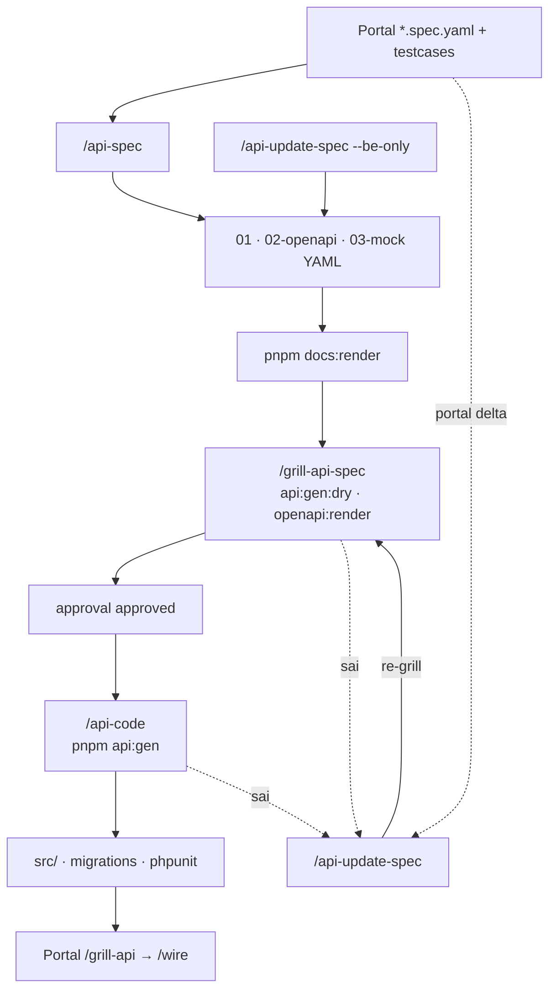

# Team AI Backend Workflow

> **R2/R3:** Product Code + architecture → [`base-docs`](../..) · E2E plans → [`base-tests`](https://github.com/raintr91/base_test) · gen: `pnpm portal:gen --id …` / `pnpm testcase:gen --id …` · [HUBS](./HUBS.md) / [DOCS-HUB](./DOCS-HUB.md) / [TESTS-HUB](./TESTS-HUB.md)


Progressive disclosure: **một session = một command**. Shared snippets: `.cursor/extracts/`

Session mới: đọc `.harness/progress.md` trước khi tiếp tục cùng feature slug.

## Flow diagram (end-to-end)



## `/api` router

| State | Command |
|-------|---------|
| Chưa có `01-backend-spec` | `/api-spec` |
| Portal delta / `pendingTechDebt` | `/api-update-spec` |
| Chỉ sửa BE nội bộ | `/api-update-spec --be-only` |
| Chưa codegen-ready | `/grill-api-spec` |
| `approval` approved | `/api-code` → `pnpm api:gen` |

Harness: `.harness/progress.md` · `feature_list.json` · `portalRefs` · `pendingTechDebt`

## Luồng thường gặp

| Mục tiêu | Chuỗi command |
|----------|----------------|
| Feature mới | `/api-spec` → `/grill-api-spec` → `approval` → `/api-code` |
| Portal đổi spec | `/api-update-spec` → `/grill-api-spec` → … |
| Pilot từng phần (list trước) | `/api-spec` (list) → grill → code → sau đó `/api-update-spec` (export, …) → grill lại |
| Chỉ sửa BE nội bộ | `/api-update-spec --be-only` → grill nếu đổi OpenAPI/mock |
| Webhook / partner API (no Portal) | `/api-int-spec` → `/grill-int-spec` → `/api-code` |

## Gap loop

| Khi | Hành động |
|-----|-----------|
| `grill-api-spec` hoặc `/api-code` **sai** | → `/api-update-spec` → **re-grill** → `grill-api-spec` |
| Portal đổi spec giữa chừng | `*.spec.yaml` → `/api-update-spec` (không full `/api-spec` lại) |
| `pendingTechDebt` | Merge qua `/api-update-spec` |

## Chú thích diagram

| Ký hiệu | Ý nghĩa |
|---------|---------|
| AI (xanh lá) | `/api-spec`, `/api-update-spec`, `/grill-api-spec`, HANDOFF trong `/api-code` |
| Gate (vàng) | `api:gen:dry`, `openapi:lint` — bắt buộc trước `/api-code` |
| Script (xanh dương) | `pnpm docs:render`, `pnpm api:gen` |
| Artifact (tím) | YAML trio, `codegen.commands`, `HANDOFF.md`; `generated/*.md` |
| Decision (cam) | `/api` router, `approval.status` |
| `pendingTechDebt` | Portal spec đã có, BE chưa merge — track trong YAML |
| Domain tags | `#call-external`, `#cross-entity-service` |
| Codegen tags | `#gen:*` — grill only; script thực thi |
| Non-CRUD | export/import/custom → `#manual-service`; mail/payment → `#call-external` |

Alias ngắn — skill giữ tên đầy đủ: [INTEGRATION-API-SPEC](./INTEGRATION-API-SPEC.md).
Chi tiết sync: `.cursor/extracts/api-spec-sync.md`
Chi tiết integration: `.cursor/extracts/api-integration-spec.md`
Chi tiết hashtag: `.cursor/extracts/codegen/tags.md` (docs hub) · BE codegen tags live in the BE checkout.
Scripts: `scripts/docs/` · `codegen/runners/` · `pnpm docs:render` · `pnpm api:gen` / `pnpm api:gen:dry`

## Commands

| Command | Skill | Output |
|---------|-------|--------|
| `/api-spec` | `.cursor/skills/api-spec/` | ``docs/features/` (stub only — SSOT on hubs) / {slug}/01-backend-spec.yaml`, `02-openapi.yaml`, `03-mock-data.yaml` |
| `/api-update-spec` | `.cursor/skills/api-update-spec/` | Sync portal delta / merge child specs / `be-only` updates in-place |
| `/grill-api-spec` | `.cursor/skills/grill-api-spec/` | Audit + codegen-ready + `api:gen:dry` gate |
| `/api-code` | `.cursor/skills/api-code/` | `pnpm api:gen` + HANDOFF manual items |
| `api:gen` | `codegen/runners/` | Execute `m:*` from spec (called by `/api-code`) |
| `/api` | `.cursor/skills/api/` | Router — spec vs grill vs code |

**Integration (không Portal FE, không diagram Portal):**

| Đầy đủ | Alias | Skill |
|--------|-------|-------|
| `/api-integration-spec` | `/api-int-spec` | `.cursor/skills/api-integration-spec/SKILL.md` |
| `/grill-integration-spec` | `/grill-int-spec` | `.cursor/skills/grill-integration-spec/SKILL.md` |

| `docs:render` | `scripts/docs/render-backend-spec.mjs` | `generated/*.md` + `api-base/generated.md` (member / CI) |

**PHPUnit riêng** — diagram: [UNIT-PHASE-DIAGRAM](./UNIT-PHASE-DIAGRAM.md)

| Command | Skill |
|---------|-------|
| `/unit` | `.cursor/skills/unit/SKILL.md` |
| `/grill-unit` | `.cursor/skills/grill-unit/SKILL.md` |

Hashtags in spec (read matching extract):

- `#call-external` → `.cursor/extracts/call-external.md`
- `#cross-entity-service` → `.cursor/extracts/cross-entity-service.md`

## Extracts (`.cursor/extracts/`)

| File | Dùng khi |
|------|----------|
| `spec-evolution.md` | Portal spec đổi sau khi đã có backend YAML |
| `api-spec-sync.md` | `/api-update-spec` — portalRefs, pendingTechDebt, semver, be-only |
| `entity-relationship.md` | Platform/Tenant, pivot M-N, relationships |
| `derived-data.md` | Field/table BE-only, refresh strategy |
| `call-external.md` | `#call-external` — integrations |
| `cross-entity-service.md` | `#cross-entity-service` — orchestration |
| `codegen.md` | `/api-code` — `m:*` / `pnpm api:gen` |
| `codegen/tags.md` | `#gen:*`, `#manual-*`, domain tags (docs hub copy) |
| `api-codegen-readiness.md` | Grill exit checklist + `api:gen:dry` gate |
| `api-integration-spec.md` | Partner/webhook — no Portal FE |
| `http-layer.md` | Controller/Action/Query/Resource boundaries |
| `media-s3.md` | Path in DB, URL at response |
| `agent-discipline.md` | Scope, surgical edits, no speculation |
| `verify-gate.md` | Verify trước khi claim done |

Extract PHPUnit (opt-in, không team diagram): `unit-coverage.md`

Không clone vendor Superpowers/Karpathy/Matt Pocock — nội dung đã rút gọn trong extracts + team skills.

## Harness state

`.harness/` — copy `progress.example.md` → `progress.md`, `feature_list.example.json` → `feature_list.json` per feature. Cập nhật sau mỗi command.

## Input from Portal

```text
`product/components/CMP-*/code/{W-*,API-*}/` trên docs hub
Test plans: https://github.com/raintr91/base_test
```

## Prompt mẫu

```
/api-spec chain/hotel list
/api-update-spec chain/hotel
/api-update-spec chain/hotel --be-only
/grill-api-spec chain/hotel
/api-code chain/hotel
```

Integration (không Portal FE):

```
/api-int-spec integrations/stripe/charge
/grill-int-spec integrations/stripe/charge
/api-code integrations/stripe/charge
```

PHPUnit (rule riêng — không testcase):

```
/unit chain/hotel
/grill-unit chain/hotel
```

## Rules vs skills

| Tầng | Ví dụ |
|------|-------|
| alwaysApply | `api-invariants.mdc` |
| opt-in skill | `api-spec`, `api-integration-spec`, `api-update-spec`, `grill-api-spec`, `grill-integration-spec`, `api-code` |
| globs | `team-flow-api-spec`, `team-flow-api-integration-spec`, `team-flow-api-code`, `team-flow-unit`, `api-code-size` |

## Docs render + Codegen (repo root)

```bash
pnpm docs:render
pnpm docs:dev
pnpm api:gen:dry --spec `docs/features/` (stub only — SSOT on hubs) / {slug}/01-backend-spec.yaml
pnpm api:gen --spec `docs/features/` (stub only — SSOT on hubs) / {slug}/01-backend-spec.yaml --write-spec
```

## OpenAPI tooling

Chạy từ **repo root** (`api/`):

```bash
pnpm openapi:render
pnpm openapi:bundle
pnpm openapi:preview
pnpm swagger:dev
```
