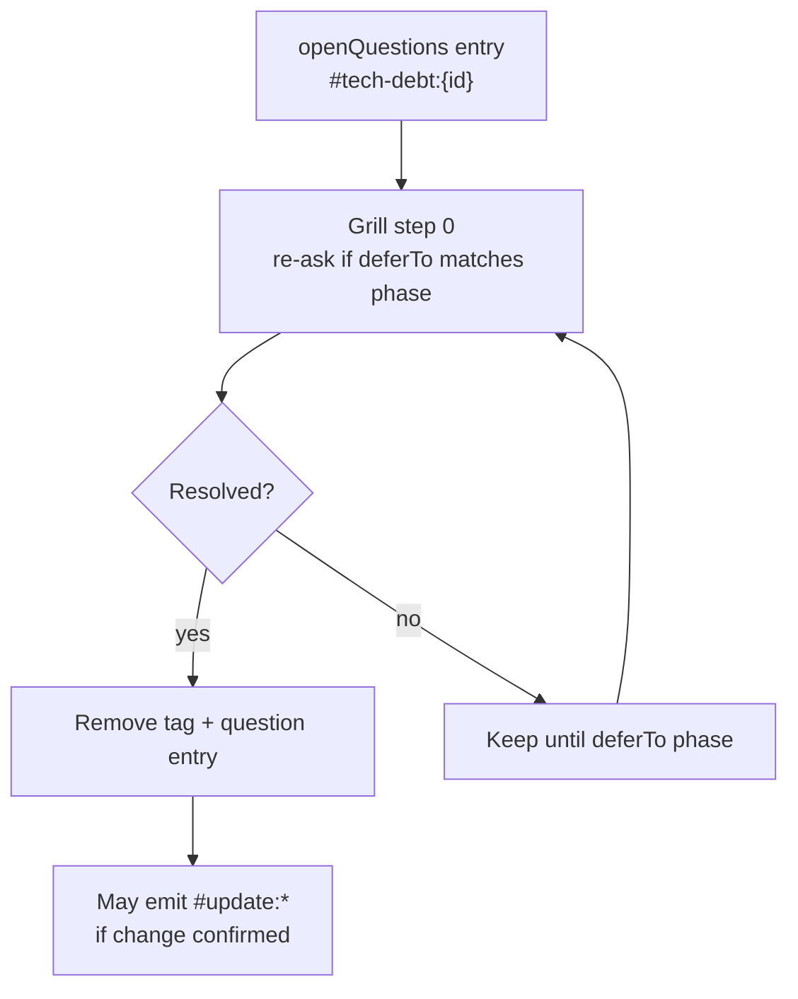

# Tech debt flow



## Spec shape

```yaml
openQuestions:
  - id: auth-permission-matrix
    question: "Full permission matrix for hotel delete?"
    deferTo: wire          # design | testcase | prototype | wire | api
    tags:
      - "#tech-debt:auth-permission-matrix"
```

## vs `#update:*`

| | `#tech-debt:{id}` | `#update:*` |
|---|-------------------|-------------|
| Meaning | Open question, not yet decided | Confirmed delta |
| Cleared at | When resolved at `deferTo` phase | `/wire` only |
| Bumps `specRevision` | No (until resolved → update) | Yes |

See `.cursor/extracts/grill-tech-debt.md`.

## Grill step 0

Every grill command re-asks unresolved `#tech-debt:*` items whose `deferTo` matches the current phase:

- `/bqa-grill-docs` → `deferTo: design`
- `/dev-grill-docs` → `deferTo: prototype`, `deferTo: api`
- `/wire` → `deferTo: wire`

## Liên kết (cùng phase)

| Doc | Nội dung |
|-----|----------|
| [FEATURE-ARTIFACT-GRILL](./FEATURE-ARTIFACT-GRILL.md) | Grill tạo / re-ask tech-debt |
| [UPDATE-SPEC-FLOW](./UPDATE-SPEC-FLOW.md) | `#update:*` sau khi đã chốt delta |
| [DESIGN-PHASE-DIAGRAM](./DESIGN-PHASE-DIAGRAM.md) | Gap loop trong design |
