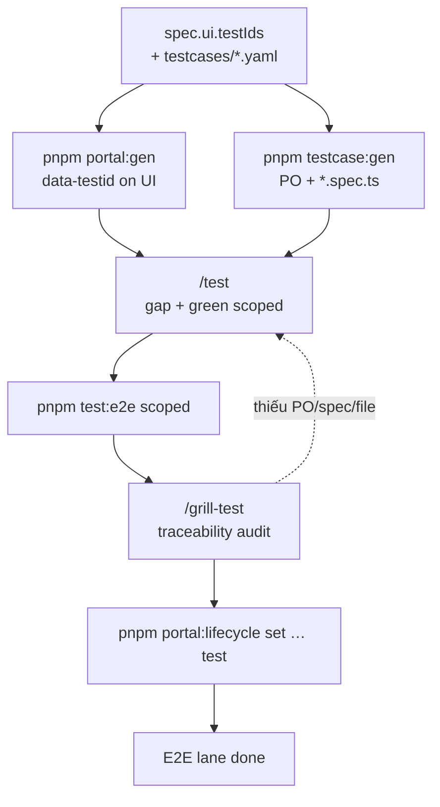
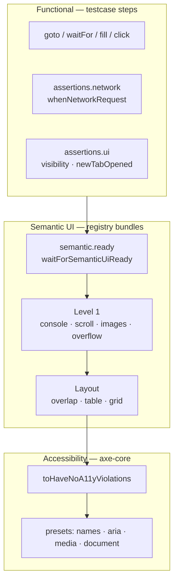
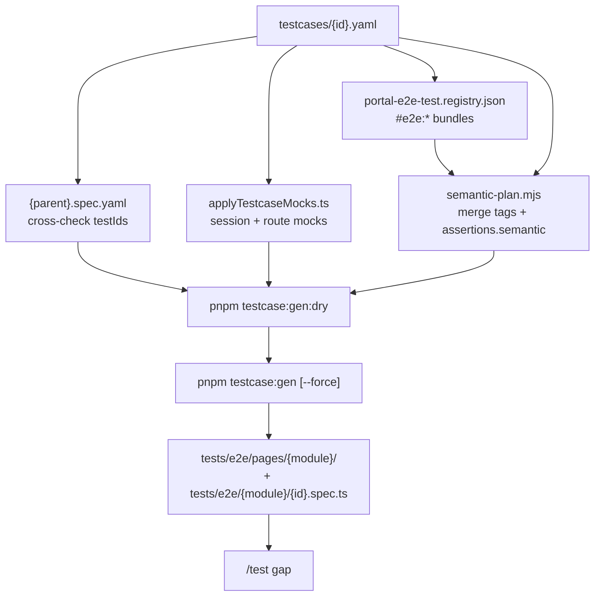
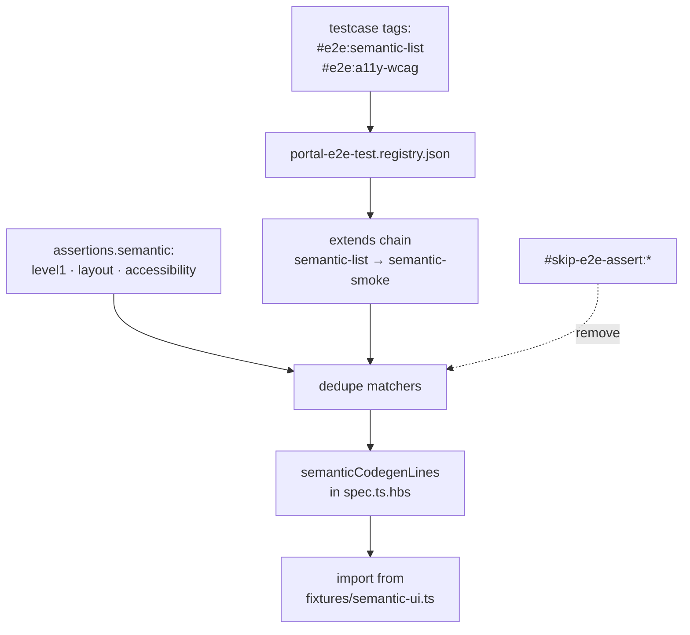
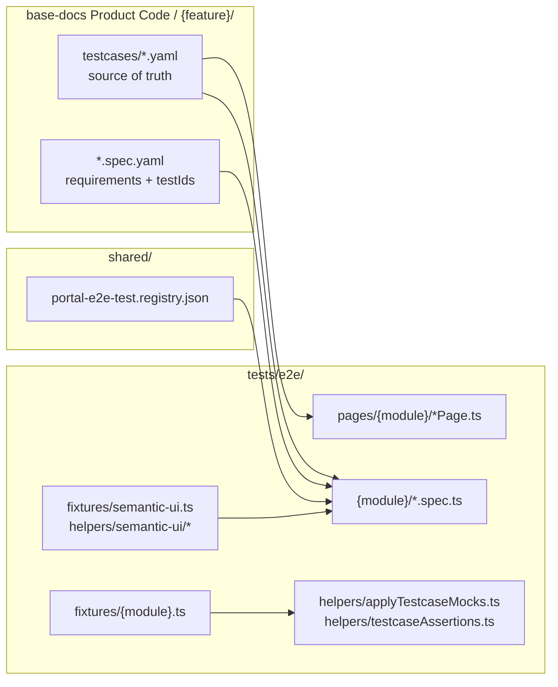
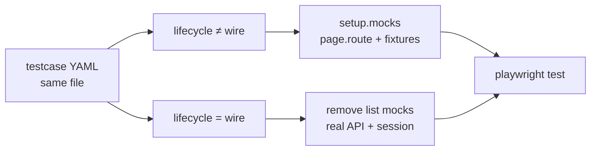
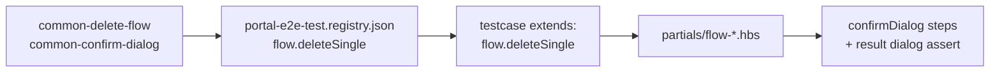

# Test phase — E2E lane (Playwright)

> **R2/R3:** Product Code + architecture → [`base-docs`](../../base-docs/) · E2E plans → [`base-tests`](../../base-tests/) · gen: `pnpm portal:gen --id …` / `pnpm testcase:gen --id …` · [HUBS](./HUBS.md) / [DOCS-HUB](./DOCS-HUB.md) / [TESTS-HUB](./TESTS-HUB.md)


> **QA + Dev** — lane Playwright từ testcase YAML, **độc lập** unit lane ([UNIT-PHASE-DIAGRAM](./UNIT-PHASE-DIAGRAM.md)).  
> Nằm trong [FULL-CYCLE-PIPELINE-DIAGRAM](./FULL-CYCLE-PIPELINE-DIAGRAM) phase **2a Tests**.  
> Hub: [PORTAL-CODEGEN](./PORTAL-CODEGEN.md) · Skills: `/test` · `/grill-test` · `testcase:gen`

Trạng thái codegen E2E (portal repo):

| PR | Tên | Trạng thái | Deliverable |
|----|-----|------------|-------------|
| **12** | `testcase:gen` | ✅ Done | PO + `*.spec.ts` từ `testcases/*.yaml`; pilot `chain/hotel` |
| **13a** | Semantic + axe registry | ✅ Done | `portal-e2e-test.registry.json`, `#e2e:*` bundles |
| **13b** | Flow partials | ⬜ Planned | delete, confirm dialog, CSV import (`#e2e:flow-*`) |

---

## E2E lane (flow chính)

Chỉ luồng testcase → Playwright — **không** gộp Vitest, **không** loop grill ↔ test săn 100%.



| Bước | Ai | Việc |
|------|-----|------|
| Grill | BA/dev | `ui.testIds.required` + `patterns`; testcase mirror; `#e2e:*` khi cần semantic/axe |
| `portal:gen` | script | Emit `data-testid` trên page/shell |
| `testcase:gen` | script | Page Object + spec skeleton + semantic matchers |
| **`/test`** | dev + AI | Session/fixture gap, UI testId fix, scoped green |
| **`/grill-test`** | dev + AI | Matrix spec↔testcase↔PO↔spec — **audit**, không regen hàng loạt |
| Lifecycle | dev | `pnpm portal:lifecycle set {route} test` sau grill pass |

**`/grill-test` không loop** đến 100% coverage: pass → promote lifecycle; gap → bảng đề xuất; **chỉ** quay `/test` khi thiếu **file** hoặc testId trên UI.

Unit (`/unit`, `portal:unit-gen`) — pipeline khác, không thay E2E lane.

---

## Ba lớp assertion trong một spec E2E

Một file `tests/e2e/{module}/{id}.spec.ts` có thể gồm **functional** (bắt buộc) và **semantic/a11y** (bundle opt-in).



| Lớp | Mục đích | Không thay thế |
|-----|----------|----------------|
| Functional | User flow, API mock, testId | Unit test logic |
| Semantic Level 1–2 | UI “render được nhưng vỡ” (overflow, table lệch) | Functional pass |
| Axe | WCAG A/AA, accessible names | Manual keyboard review |

Chi tiết matcher: [E2E-SEMANTIC-UI-ASSERTIONS](./E2E-SEMANTIC-UI-ASSERTIONS.md) · extract: `.cursor/extracts/platform-e2e-semantic-tags.md`

---

## `testcase:gen` — contract lifecycle



| Input | Validate | Output |
|-------|----------|--------|
| `setup.session` | Handler trong `session.ts` | `applyTestcaseSession` |
| `setup.mocks[].response` | `tests/e2e/fixtures/{module}.ts` | `applyTestcaseMocks` |
| `testIds.required` | ⊆ `spec.ui.testIds.required` (warn) | PO methods |
| `steps` | `goto`, `waitFor`, `fill`, `click` | Generated steps |
| `assertions.network` | path + method | `whenNetworkRequest` |
| `assertions.ui` | visibility, `newTabOpened` | `expectTestIdVisible`, tab helper |
| `tags` `#e2e:*` | Bundle trong registry | `expect(...)` từ `semantic-ui` fixture |
| `assertions.semantic` | `ready`, `level1`, `layout`, `accessibility` | Union với bundle tags |
| `#skip-e2e-assert:*` | Matcher id | Loại khỏi union |

---

## `#e2e:*` — bundle resolution (PR13a) {#semantic-bundles}



| Hashtag | Bundle | Matchers (tóm tắt) |
|---------|--------|-------------------|
| `#e2e:semantic-smoke` | Level 1 | `toHaveNoConsoleErrors`, `toHaveNoHorizontalScroll`, `toHaveNoBrokenImages` |
| `#e2e:semantic-list` | List page | smoke + overflow + table layout + overlap |
| `#e2e:semantic-form` | Form page | smoke + text overflow |
| `#e2e:a11y-wcag` | Axe WCAG | `toHaveNoA11yViolations` (scope `rootTestId`) |
| `#e2e:a11y-presets` | Axe presets | names, aria, media, document semantics |
| `#e2e:a11y-full` | Full | wcag + presets |

**Bắt buộc** khi có matcher semantic/axe: `assertions.semantic.ready.rootTestId`.

Grill gợi ý:

- Mọi list sau prototype: `#e2e:semantic-smoke` tối thiểu.
- List có table: `#e2e:semantic-list`.
- Promote lifecycle `test`: cân nhắc `#e2e:a11y-wcag`.

---

## Cấu trúc file trên disk



Quy ước: `chain-hotel-list.yaml` → `tests/e2e/chain-hotels/chain-hotel-list.spec.ts` + `pages/chain-hotels/ChainHotelListPage.ts` (`module` từ `spec.ui.testIds.module` hoặc `codegen.module`).

---

## E2E modes (prototype vs wire)



Spec `#wire-only` trong feature spec → testcase giữ mock hoặc skip cho đến `/wire`.

---

## Đọc gì / không đọc gì (`/test`)

| Đọc | Không đọc |
|-----|-----------|
| `testcases/*.yaml`, spec `ui.testIds` | Legacy blade/repos |
| `portal-e2e-test.registry.json` khi có `#e2e:*` | `portal-unit-test.registry.json` |
| Prototype page + `Mo*` testId | Inventory toàn `tests/e2e/` |
| `test/readiness.md` | Rapi / recorder exports |
| 1 testcase vertical slice | `portal:unit-gen` trong session E2E |

---

## Lệnh mẫu

```bash
pnpm portal:e2e-registry
pnpm testcase:gen:dry --testcase base-docs Product Code /  chain/hotel/testcases/chain-hotel-list.yaml
pnpm testcase:gen --id <W-|TC-|suite>
pnpm testcase:gen --testcase ... --force

pnpm test:e2e tests/e2e/chain-hotels/
pnpm portal:lifecycle set /hotels test
```

---

## Gap loop

| Khi | Hành động |
|-----|-----------|
| `grill-test` / `grill-prototype` sai testId hoặc acceptance | → `/update-spec` |
| Thiếu bundle / matcher mới | → thêm `portal-e2e-test.registry.json` + `semantic-plan.mjs` |
| Sau patch | re-grill → tiếp tục `/test` |

[UPDATE-SPEC-FLOW](./UPDATE-SPEC-FLOW.md) · [E2E-TESTIDS](./E2E-TESTIDS.md)

---

## PR13b (planned) — flow partials



Chưa implement — hiện delete/confirm chỉ có spec design + `.test.yaml` draft.

---

## Liên kết

| Doc | Mục đích |
|-----|----------|
| [PORTAL-CODEGEN](./PORTAL-CODEGEN.md) | `testcase:gen` · `ui.testIds` · registry E2E |
| [PORTAL-UNIT-GEN-ROADMAP](./PORTAL-UNIT-GEN-ROADMAP.md) PR12–13 | Roadmap codegen E2E |
| [E2E-TESTIDS](./E2E-TESTIDS.md) | Contract `data-testid` |
| `testgen/runners/README.md` | CLI + steps supported |
| `registries/e2e-test.registry.json` | Bundle + matcher registry |
| [E2E-SEMANTIC-UI-ASSERTIONS](./E2E-SEMANTIC-UI-ASSERTIONS.md) | Matcher design + levels |
| `.cursor/extracts/platform-e2e-semantic-tags.md` | Hashtag cheat sheet |
| `.cursor/extracts/test/readiness.md` | Gate trước `/test` |
| `.cursor/skills/test/SKILL.md` | `/test` |
| `.cursor/skills/grill-test/SKILL.md` | `/grill-test` |
| [UNIT-PHASE-DIAGRAM](./UNIT-PHASE-DIAGRAM.md) | Vitest lane (tách biệt) |
