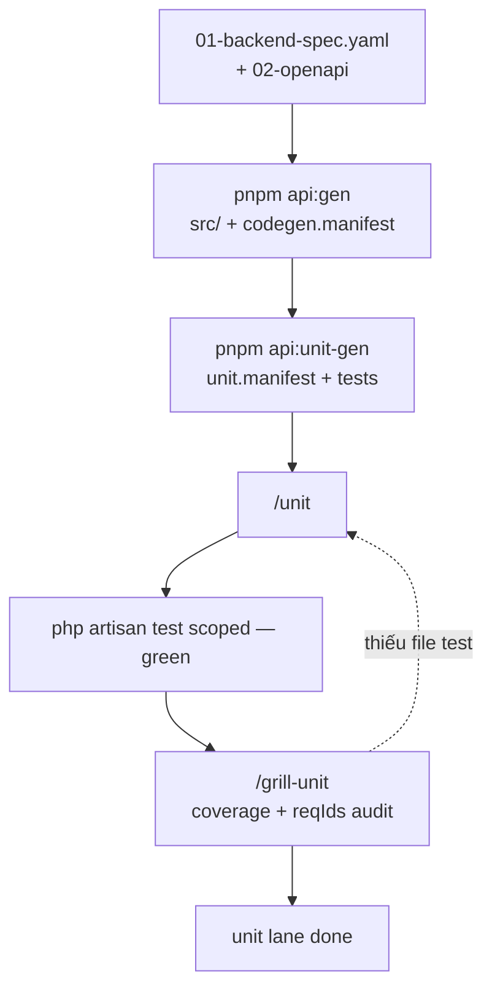
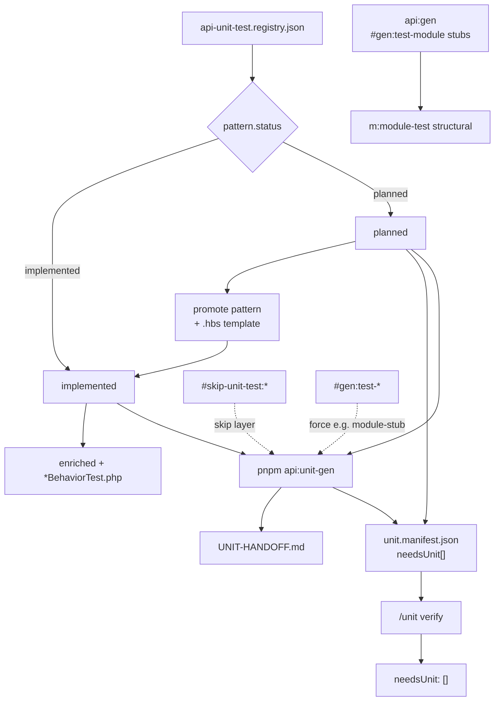

# Unit phase — PHPUnit (API dev lane)

> **R2/R3:** Product Code + architecture → [`base-docs`](../..) · E2E plans → [`base-tests`](https://github.com/raintr91/base_test) · gen: `pnpm portal:gen --id …` / `pnpm testcase:gen --id …` · [HUBS](./HUBS.md) / [DOCS-HUB](./DOCS-HUB.md) / [TESTS-HUB](./TESTS-HUB.md)


> **Standalone** — không nằm [TEAM-AI-BACKEND-WORKFLOW](./TEAM-AI-BACKEND-WORKFLOW.md) diagram chính (spec → codegen → Portal wire).  
> Hub: `unitgen/runners/README.md` · Skills: `/unit` · `/grill-unit`

---

## Unit lane (flow chính)

Chỉ luồng PHPUnit dev — **không** gộp tag lifecycle, **không** loop grill ↔ unit săn 100%.



| Bước | Ai | Việc |
|------|-----|------|
| `api:gen` | script | Module + `#gen:test-module` stubs; auto `api:unit-gen` (`#gen:test-unit`) |
| `api:unit-gen` | script | Enriched + `*BehaviorTest.php` → `unit.manifest.json` |
| **`/unit`** | dev + AI | `needsUnit` clear, PHPUnit **green** scoped (`UnitTestCase`) |
| **`/grill-unit`** | dev + AI | Coverage module + `reqIds` — **audit**, không regen hàng loạt |

**`api:gen --force`** mới pass `--force` sang `api:unit-gen`. Stub dedupe: phase `all` skip `m:module-test` khi codegen/workspace đã có structural `*Test.php` — xem README `api-unit-gen`.

**`/grill-unit` không loop** đến khi 100%: pass → done; gap → bảng đề xuất; quay `/unit` chỉ khi thiếu **file** test.

---

## `#needs-unit-test` — tag lifecycle

Theo `unitgen/runners/` + `registries/unit-test.registry.json`.



| Tag / field | Nghĩa |
|-------------|--------|
| `needsUnit[]` | Registry debt — `pattern.status: planned` (export-report, login-as, …) |
| `#needs-unit-test:*` | HANDOFF mirror; clear khi pattern `implemented` + tests green |
| `#gen:test-module` | Structural stub (`api:gen` / `m:module-test`) |
| `#gen:test-unit` | Auto `api:unit-gen` sau `api:gen` (crud-standard) |
| `#gen:test-module-stub` | Force `m:module-test` (bypass stub dedupe) |
| `#manual-action:*` | Map → pattern qua `manualTopicMap` + `when` |
| App concerns | `src/tests/Unit/Concerns/` — `commonBaselines`, không gen per module |

Phases `api:unit-gen`: `stub` · `enriched` · `behavioral` · `all` (default).

---

## Layer map (entity)

| Prod | Structural (make / `m:module-test`) | Enriched / behavioral (`api:unit-gen`) |
|------|-------------------------------------|----------------------------------------|
| `Http/Requests/*SearchRequest` | `{Request}Test.php` stub | enriched hooks + `*RulesKeysBehaviorTest.php` |
| `Http/Queries/{Entity}Query` | `{Entity}QueryTest.php` | `{Entity}QueryChainScopeBehaviorTest.php` |
| `Http/Actions/{Entity}Action` | `{Entity}ActionTest.php` | `{Entity}ActionRelationshipsBehaviorTest.php` |
| `Http/Resources/{Entity}Resource` | `{Entity}ResourceTest.php` | `*OpenApiShape*` · `*NestedRelations*` |
| Controller | `{Entity}ControllerInvokeTest.php` | invoke-all pattern |

---

## Lệnh mẫu

```bash
pnpm api:gen --spec `docs/features/` (stub only — SSOT on hubs) / chain/hotel/01-backend-spec.yaml
pnpm api:unit-gen --spec `docs/features/` (stub only — SSOT on hubs) / chain/hotel/01-backend-spec.yaml --force

cd src && php artisan test --testsuite=ModuleChain --filter=Hotel
cd src && php artisan test --coverage --testsuite=ModuleChain
```

---

## Liên kết

| Doc | Mục đích |
|-----|----------|
| [TEAM-AI-BACKEND-WORKFLOW](./TEAM-AI-BACKEND-WORKFLOW.md) | Spec → codegen → wire (không unit) |
| `unitgen/runners/README.md` | Dedupe stub, `--force`, phases |
| `.cursor/extracts/api-unit-test-tags.md` | Hashtag reference |
| `.cursor/skills/unit/SKILL.md` | `/unit` |
| `.cursor/skills/grill-unit/SKILL.md` | `/grill-unit` |
