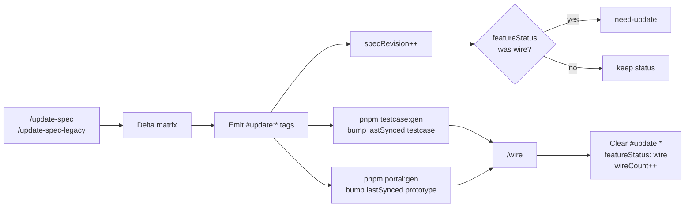

# Update spec flow

## Tag reference

| Tag | Trigger |
|-----|---------|
| `#update:add-block:{id}` | New `ui.blocks[]` entry |
| `#update:modify-block:{id}` | Existing block changed |
| `#update:remove-block:{id}` | Block removed |
| `#update:api:{id}` | API contract delta |
| `#update:test:{id}` | Test scenario delta |

See `.cursor/extracts/spec-update-tags.md` and `spec-update-delta.md`.

## Liên kết (cùng phase)

| Doc | Nội dung |
|-----|----------|
| [TECH-DEBT-FLOW](./TECH-DEBT-FLOW.md) | `#tech-debt:*` — chưa chốt; khác `#update:*` |
| [DESIGN-PHASE-DIAGRAM](./DESIGN-PHASE-DIAGRAM.md) | Gap từ grill → `/update-spec` |
| [WIRE-PHASE-DIAGRAM](./WIRE-PHASE-DIAGRAM.md) | Clear `#update:*` tại wire |

## Rules

- Spec remains source of truth — no rename-only mapping layers.
- Tags persist through testcase and prototype sync; cleared only at wire.
- No backward lifecycle states after wire.
