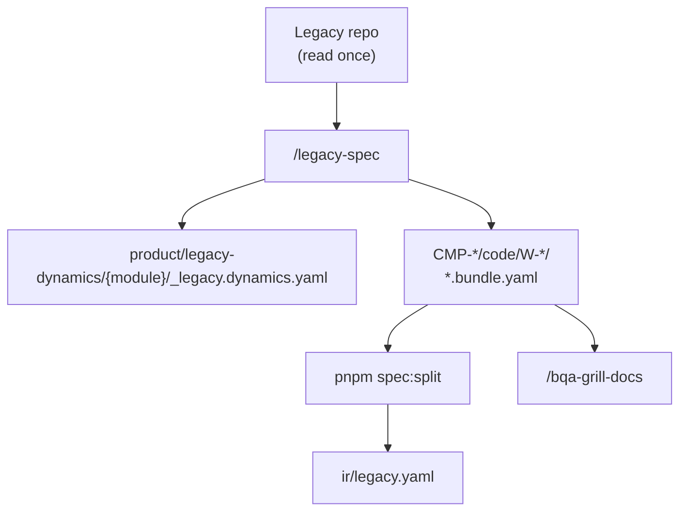

# Legacy dynamics — archaeology flow (docs hub)

> SSOT: this docs hub · Product journeys = [`architecture/06-runtime/journeys/`](../../architecture/06-runtime/) (`FLOW-*`, `/journey`) · **this** tree = observed legacy module dynamics.



## Output rules

| Có | Không |
|----|-------|
| `legacy.behaviors[]`, `fields[]`, evidence pointer | `codegen`, `tags`, `ui.filters/columns` trên dynamics file |
| `legacyRef` → dynamics slice | Dump controller prose dài |
| Evidence `legacy://` refs | Confuse with product `FLOW-*` |

## Paths

| File | Location |
|------|----------|
| `_legacy.dynamics.yaml` | `product/legacy-dynamics/{module}/` |
| Template | `product/legacy-dynamics/_template/_legacy.dynamics.yaml` |
| Feature Code + `bundle.legacy` | `product/components/…/code/` |

## Validate

```bash
pnpm legacy-dynamics:validate -- product/legacy-dynamics/{module}/_legacy.dynamics.yaml
```

Skill: `/legacy-spec` · extract `legacy-dynamics.md`.  
Handoff mặc định: `/bqa-grill-docs`.
